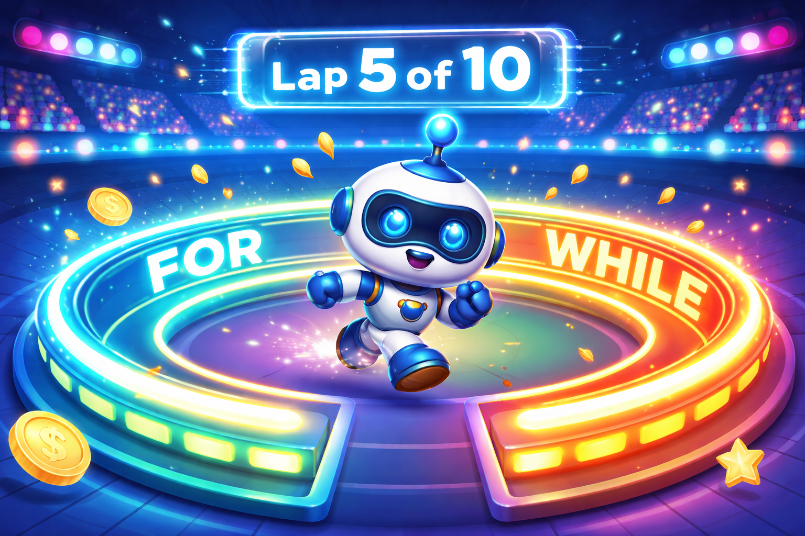

# [Циклы](../../1.2_natural_sciences/why_science_help_understand_world/patterns.md): [повторение](../../4.1_rules_of_study/how_to_memorize/articles/povtorenie.md) действий — или как научить компьютер делать скучную [работу](../../8.2_future/choosing_a_career_path/articles/interview.md)



Представь, что учитель физкультуры дал тебе задание: пробежать 10 кругов вокруг школы. Или мама попросила тебя съесть 5 ложек каши. Каждый раз ты делаешь одно и то же [действие](../../2.1_society/cause_and_effect_relationships/articles/personal_choice.md), пока не выполнишь [условие](6_control_flow.md) (не добежишь десятый круг или не доешь кашу). 

В программировании это называется **циклами**. Вместо того чтобы писать в коде «выведи [текст](../../4.1_rules_of_study/how_to_learn_effectively/articles/reading_skills.md)» десять раз подряд, мы просто говорим компьютеру: «Сделай это 10 раз». 

Давай разберемся, как это работает в языке [C](../../2.1_society/how_and_where_find_friends/articles/sora_drug.md)++! 🚀

---

## Что такое цикл и зачем он нужен?

Цикл — это специальная конструкция, которая заставляет [блок](2_syntax.md) кода выполняться многократно. Каждое такое повторение программисты называют красивым словом — **итерация**.

Зачем они нужны?
- Чтобы не писать длинный и одинаковый [код](1_introduction.md).
- Чтобы обрабатывать списки данных (например, [список](10_arrays.md) твоих друзей в игре).
- Чтобы [программа](../../5.1_technology_and_digital_literacy/operating system/articles/process.md) работала до тех пор, пока ты не нажмёшь кнопку «[Выход](../../3.2 healthy lifestyle/how to act in a dangerous situation/articles/building-evacuation.md)».

> [!NOTE]
> Компьютеры обожают циклы! Они никогда не устают, не жалуются и выполняют миллионы повторений за одну секунду.

---

## [Виды](../../3.1_healthy_lifestyle/pervaya_pomoshch/ushibi_porezy_ozhogi/08_porezy_sadiny_vidy.md) циклов в C++

В C++ есть три основных «начальника», которые умеют запускать повторения. Мы разберем каждый из них.

1. [Цикл while](#цикл-while-пока-условие-верно)
2. [Цикл do-while](#цикл-do-while-сначала-делай-потом-думай)
3. [Цикл for](#цикл-for-самый-аккуратный-счетчик)

---

## Цикл while: «Пока условие верно»

Этот цикл работает очень просто: он проверяет условие, и если оно «правда» (**true**), то выполняет код внутри. Если условие всё еще правда — выполняет снова. И так до бесконечности, пока условие не станет «ложью» (**false**).

**[Аналогия](../../1.2_natural_sciences/physics_in_everyday_life/Q46344.md):** Пока в пакете есть конфеты — бери конфету и ешь её.

```c++
#include <iostream>

int main() {
    int candies = 5; // У нас есть 5 конфет

    // Пока количество конфет больше нуля
    while (candies > 0) {
        std::cout << "Я ем конфету. Осталось: " << candies << std::endl;
        candies = candies - 1; // Уменьшаем количество конфет
    }

    std::cout << "Ой, конфеты закончились!" << std::endl;
    return 0;
}
```

> [!WARNING]
> Если ты забудешь уменьшать количество конфет (`candies = candies - 1`), то условие всегда будет верным. Твой компьютер попадет в **бесконечный цикл** и может «зависнуть»!

---

## Цикл do-while: «Сначала делай, потом думай»

Этот цикл очень похож на `while`, но с одним важным отличием. Он сначала выполняет код один раз, а **только потом** проверяет условие.

**Аналогия:** Сначала откуси яблоко, а потом посмотри, не кислое ли оно. Если не кислое — кусай дальше.

```c++
#include <iostream>

int main() {
    int energy = 0; // Энергии совсем нет

    do {
        std::cout << "Я пытаюсь прыгнуть!" << std::endl;
        energy--; // Тратим энергию, которой и так нет
    } while (energy > 0); 

    std::cout << "Больше прыгать не могу." << std::endl;
    return 0;
}
```
Даже если `energy` равно 0, программа всё равно выведет «Я пытаюсь прыгнуть!» один раз.

---

## Цикл for: самый аккуратный счетчик

Цикл `for` — это любимчик программистов. Он позволяет уместить всё (создание переменной, условие и изменение переменной) в одну строчку. Его чаще всего используют, когда мы точно знаем, сколько раз нужно повторить действие.

**[Синтаксис](2_syntax.md) выглядит так:**
`for (начало; условие; шаг) { ... }`

```c++
#include <iostream>

int main() {
    // 1. Создаем переменную i = 1
    // 2. Проверяем, что i <= 3
    // 3. После каждого круга увеличиваем i на 1 (i++)
    for (int i = 1; i <= 3; i++) {
        std::cout << "Круг номер " << i << " пройден!" << std::endl;
    }

    return 0;
}
```

### Как расшифровать эту магию?
- `int i = 1` — это наш счетчик. Мы начинаем с единицы.
- `i <= 3` — мы будем бегать, пока `i` не станет больше 3.
- `i++` — это сокращение от `i = i + 1`. Мы добавляем единичку после каждого круга.

---

## Управление циклами: Break и Continue

Иногда нам нужно выпрыгнуть из цикла раньше времени или пропустить какой-то [шаг](../../1.2_natural_sciences/physics_in_everyday_life/Q36253.md). Для этого есть две команды:

1. **`break`** — «Хватит! Остановись!». Полностью прерывает цикл.
   *Пример:* Ты бежишь марафон, но вдруг увидел палатку с бесплатным мороженым и решил закончить забег.
2. **`continue`** — «Пропусти это и беги дальше». Пропускает текущую итерацию и переходит к следующей.
   *Пример:* Ты прыгаешь через лужи. Если перед тобой сухая дорога — ты просто идешь, если лужа — прыгаешь (пропускаешь обычный шаг).

```c++
for (int i = 1; i <= 5; i++) {
    if (i == 3) {
        std::cout << "Число 3 мы пропустим!" << std::endl;
        continue; // Переходим сразу к i = 4
    }
    std::cout << "Число: " << i << std::endl;
}
```

---

## [Сравнение](5_operators.md) циклов (Таблица)

Чтобы тебе было легче выбрать, какой цикл использовать, посмотри на эту таблицу:

| Название | Когда использовать? | Главная фишка |
| :--- | :---: | ---: |
| **While** | Когда не знаем точно, сколько будет повторений | Сначала проверяет, можно ли идти |
| **Do-while** | Когда действие нужно сделать хотя бы 1 раз | Проверяет условие в самом конце |
| **For** | Когда точно знаем количество шагов | Всё управление в одной строке |

---

## Полезные [советы](../../7.2 Media, leisure and hobbies /useful_and_interesting_leisure/articles/mistakes_in_choosing_hobby.md) для начинающих

> [!TIP]
> Используй переменную с именем `i` (от слова *index*) для простых счетчиков в циклах `for`. Это традиция, которую соблюдают программисты во всем мире!

- **Следи за границами.** Если ты хочешь 10 повторений, проверь, с чего ты начинаешь: с 0 или с 1. Если начнешь с 0 и закончишь на `i < 10`, это будет ровно 10 раз.
- **Не делай бесконечных циклов.** Если твоя программа «замерла» и ничего не выводит, скорее всего, твой цикл зациклился. Нажми `Ctrl + C` в консоли, чтобы остановить её.
- **Вложенные циклы.** Можно ставить цикл внутри другого цикла! Это как [часы](../../1.2_natural_sciences/physics_in_everyday_life/Q20702.md): минутная стрелка делает полный круг (цикл), пока часовая сдвигается всего на одно деление.

---

## Пример: Рисуем квадрат из звездочек

Давай объединим знания и попросим компьютер нарисовать нам маленький квадратик. Для этого мы положим один цикл `for` внутрь другого.

```c++
#include <iostream>

int main() {
    int size = 4; // Размер стороны квадрата

    for (int i = 0; i < size; i++) { // Цикл для строк
        for (int j = 0; j < size; j++) { // Цикл для столбцов
            std::cout << "* ";
        }
        std::cout << std::endl; // Переход на новую строку
    }

    return 0;
}
```

**[Результат](../../1.2_natural_sciences/why_science_help_understand_world/experimental_science.md) будет таким:**
```
* * * * 
* * * * 
* * * * 
* * * * 
```

---

## Подведём итоги

Теперь ты знаешь, что циклы — это суперсила, которая избавляет программиста от рутины. С их помощью можно создавать игры, рисовать графику и обрабатывать огромные [базы данных](../../7.1_art/modern_technological_art/articles/2.2_heath_bunting.md).

Попробуй сам! Напиши программу, которая выводит все четные числа от 2 до 20. Это отличная тренировка.

**Удачи в изучении C++!** 🐾

---
[Вернуться к списку статей](./article_index_information_media_literacy.md)

---
[Автор](../../4.2_thinking_and_working_information/how_to_search_information/articles/copypaste.md): Кривошапкин Егор;  
*[Ресурсы](../../2.1_society/cause_and_effect_relationships/articles/ecological_footprint.md): [LLM](../../7.1_art/modern_technological_art/README.md) - Gemini*