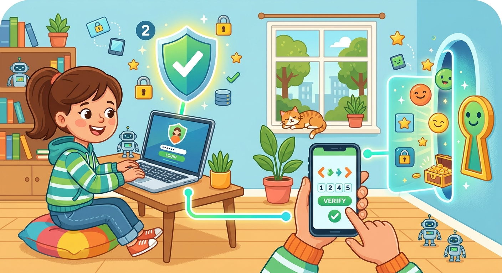

# Двухфакторная [аутентификация](../../../5.1_technology_and_digital_literacy/information and media literacy/пароли_и_двухфакторная_защита.md)

**ID:** 2fa  
**WikiData:** [Q17086335](https://www.wikidata.org/wiki/Q17086335)  
**Раздел:** 5.2. [Кибербезопасность](../../../4.2_thinking_and_working_information/how_to_search_information/articles/digital_footprint.md) и [поведение](../../../1.2_natural_sciences/neurobiology_for_teens/articles/06_phineas_gage.md) в сети  

💡 **Коротко:** Дополнительный [уровень](../../../../8.1_entertainment/articles/gamification.md) защиты аккаунта, требующий два разных способа подтверждения личности.

## Введение

Представь, что для входа в самое надежное банковское хранилище в мире недостаточно просто знать секретный [цифровой](../../../7.1_art/musical_instruments/articles/synthesizer.md) [код](../../cpp_fundamentals/1_introduction.md) от тяжелой металлической двери. Охранная система попросит тебя еще и приложить уникальную пластиковую карточку, которая есть только у тебя. Именно так работает двухфакторная аутентификация (или 2FA) в интернете. Она требует от тебя доказательств двух совершенно разных типов, чтобы [сервер](../../../5.1_technology_and_digital_literacy/how_internet_works/articles/http_https/http_https.md) мог окончательно убедиться, что [аккаунт](../../../5.1_technology_and_digital_literacy/information and media literacy/информационная_безопасность_для_детей.md) открываешь именно ты, а не мошенник с другого конца света.

## Два мощных рубежа обороны

Кибербезопасность строится на так называемых "факторах" — [том](../../../7.1_art/musical_instruments/articles/drums.md), что может подтвердить твою [личность](../../../1.2_natural_sciences/neurobiology_for_teens/articles/06_phineas_gage.md).

- **Фактор знания (Что ты знаешь):** Это твой [логин](login.md) и [пароль](password.md). Это [первый шаг](../../../1.2_natural_sciences/physics_in_everyday_life/Q26540.md) проверки. Ты хранишь эту информацию в уме или в надежном [менеджере паролей](password_manager.md).
- **Фактор владения (Что у тебя есть):** Это второй [шаг](../../../1.2_natural_sciences/physics_in_everyday_life/Q36253.md). Система просит ввести временный шестизначный код. Этот код может прийти в виде обычного SMS-сообщения на твой телефон, или он безостановочно генерируется каждые 30 секунд в специальном приложении-аутентификаторе (например, Google Authenticator). Также бывают специальные физические USB-ключи.
- **Фактор свойства (Кем ты являешься):** В самых современных смартфонах и ноутбуках это [биометрия](../../../7.1_art/modern_technological_art/articles/3.2_surveillance_art.md) — отпечаток твоего пальца или трехмерный сканер лица.

## Примеры из жизни

Давай разберем ситуацию, которая может случиться с каждым:

- **Вход с чужого компьютера:** Ты пришел в гости к другу и решил зайти в свой аккаунт Steam или Google, чтобы показать ему классную игру или смешное [видео](../../../5.1_technology_and_digital_literacy/information and media literacy/оценка_качества_изображений_и_видео.md). Ты вводишь свой длинный [пароль](../../../3.2 healthy lifestyle/how to act in a dangerous situation/articles/internet-safety.md). Внезапно система останавливает тебя и пишет: "Мы отправили код подтверждения на ваш телефон". Ты достаешь свой телефон, смотришь код и вводишь его.
- **[Защита](../../../5.1_technology_and_digital_literacy/how_internet_works/articles/dns/cdn.md) от кражи:** А теперь представь, что на компьютере друга был установлен зловредный [вирус](virus.md), который украл твой пароль. [Хакер](hacker.md) попытается войти в твой аккаунт ночью. Но система снова попросит код с телефона! Поскольку твой телефон лежит у тебя на тумбочке, [хакер](../../../5.1_technology_and_digital_literacy/how_internet_works/articles/wifi/security.md) ничего не сможет сделать, и твой аккаунт останется в безопасности.
- **Резервные коды:** Если ты потеряешь телефон, системы вроде Google позволяют распечатать заранее [список](../../cpp_fundamentals/10_arrays.md) из восьми резервных кодов. Их нужно спрятать дома в ящике стола на самый крайний случай.

## Почему одного пароля мало?

Использование только одного пароля делает твой [профиль](../../../5.1_technology_and_digital_literacy/information and media literacy/цифровая_репутация.md) крайне уязвимым. [Базы данных](../../../7.1_art/modern_technological_art/articles/2.2_heath_bunting.md) различных сайтов (форумов, магазинов) регулярно утекают в [сеть](../../../5.1_technology_and_digital_literacy/how_internet_works/articles/history/internet_history.md) не по вине пользователей. Если [хакер](hacker.md) найдет твой пароль в такой украденной базе, он немедленно сможет войти в аккаунт. Но если включена 2FA, взломщик остановится на втором шаге.

## [Заключение](../../../1.2_natural_sciences/physics_in_everyday_life/Q2225.md)

Двухфакторная аутентификация — это мощнейший современный инструмент для сохранения твоей [приватности](privacy.md). Вместе с хорошим паролем она защитит тебя, даже если ты случайно откроешь [фишинговое](phishing.md) письмо или попадёшься на [вирус](virus.md). Всегда используй 2FA там, где это возможно, проверяй наличие на сайтах и регулярно делай [резервные копии](backup.md).
---
[Автор](../../../4.2_thinking_and_working_information/how_to_search_information/articles/copypaste.md): Радион Никита, использовано: Gemini 3.1 Pro, Nano Banana 2
