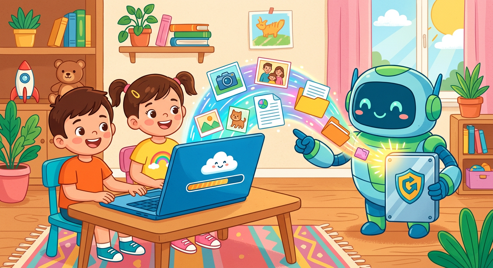

# Резервное копирование

**ID:** backup  
**WikiData:** [Q194274](https://www.wikidata.org/wiki/Q194274)  
**Раздел:** 5.2. [Кибербезопасность](../../../4.2_thinking_and_working_information/how_to_search_information/articles/digital_footprint.md) и [поведение](../../../1.2_natural_sciences/neurobiology_for_teens/articles/06_phineas_gage.md) в сети  

💡 **Коротко:** [Процесс](../../../5.1_technology_and_digital_literacy/operating system/articles/process.md) создания копии данных на дополнительном носителе для их восстановления в случае утраты.

## Введение

В цифровом мире [техника](../../../1.2_natural_sciences/physics_in_everyday_life/Q133673.md) может в любой момент сломаться, дорогой телефон может потеряться в школе или упасть в воду, а крайне важные файлы могут быть безвозвратно уничтожены сбоем системы. Резервное копирование (или бэкап) — это процесс создания точной [цифровой](../../../7.1_art/musical_instruments/articles/synthesizer.md) копии твоих драгоценных данных, которая действует как волшебная машина времени, позволяя легко восстановить всю утраченную информацию после любых непредвиденных катастроф.

## Золотое [правило](../../../1.2_natural_sciences/why_science_help_understand_world/patterns.md) хранения

Настоящие профессионалы в сложной IT-сфере абсолютно всегда используют золотое правило "3-2-1". Согласно этой проверенной [стратегии](../../../../8.1_self_understanding/articles/overcoming.md) безопасности, твоя важная [информация](../../../5.1_technology_and_digital_literacy/information and media literacy/как_устроена_современная_информационная_среда.md) всегда должна существовать [минимум](../../../1.2_natural_sciences/physics_in_everyday_life/Q136980.md) в трех независимых экземплярах: один рабочий оригинал и две резервные копии. Хранить эти копии нужно на двух совершенно разных типах носителей (например, на локальном жестком диске компьютера и на отдельной съемной флешке), и одна из этих копий обязательно должна физически находиться вне твоего дома или офиса — например, в защищенном облачном хранилище в интернете. Существуют также разные форматы копирования: "полный" бэкап (копирует всё) и "инкрементальный", который работает быстрее, так как копирует только то, что изменилось с прошлого раза.

## Примеры из жизни

Резервные копии могут спасти тебе массу нервов:

- **Школьные проекты:** Ты писал огромный [реферат](../../../4.2_thinking_and_working_information/how_to_search_information/articles/copypaste.md) по истории целую неделю. Вдруг в доме отключили [свет](../../../1.2_natural_sciences/physics_in_everyday_life/Q1.md), и компьютер выключился, а жесткий [диск](../../../5.1_technology_and_digital_literacy/operating system/articles/file_system.md) сломался. Если у тебя не было копии в облаке (например, на Google Диске) или на флешке, всю [работу](../../../8.2_future/choosing_a_career_path/articles/interview.md) придется переделывать с нуля.
- **Фотографии и сохранения:** Если телефон упал и разбился, все твои фотографии за последние годы исчезнут навсегда. Но если телефон каждую ночь делал бэкап в [облако](../../../1.2_natural_sciences/physics_in_everyday_life/Q182453.md), тебе нужно будет просто ввести [пароль](../../../3.2 healthy lifestyle/how to act in a dangerous situation/articles/internet-safety.md) на новом устройстве, и все [фото](../../../5.1_technology_and_digital_literacy/information and media literacy/проверка_фото_на_манипуляции.md) вернутся обратно!

## От чего еще спасает бэкап

Наличие свежей и актуальной копии данных — это твое самое главное и единственное стопроцентное [спасение](../../../7.2 Media, leisure and hobbies/Computer games/articles/how_it_all_started/crisis_and_resurrection.md) от страшных программ-вымогателей (ransomware). Если хитрый [хакер](hacker.md) проберется в систему и полностью зашифрует твои файлы с помощью зловредного [вируса](virus.md) (который мог случайно попасть на ПК через открытый [фишинг](phishing.md) или ссылку для [спама](spam.md)) и затем потребует огромные [деньги](../../../2.1_society/cause_and_effect_relationships/articles/economic_chains.md) за их расшифровку, ты сможешь просто отформатировать жесткий диск и абсолютно бесплатно вернуть все свои рабочие [данные](../../../2.1_society/cause_and_effect_relationships/articles/ai_causality.md) из свежего бэкапа.

## [Заключение](../../../1.2_natural_sciences/physics_in_everyday_life/Q2225.md)

Резервное копирование — это твоя надежная страховка от любых цифровых бед. Для защиты ценных архивов используй очень сложный [пароль](password.md) в [менеджере паролей](password_manager.md) и включай [2FA](2fa.md) для облака. Никогда не отдавай свой [логин](login.md) мошенникам и [внимательно](../../../4.1_rules_of_study/how_to_memorize/articles/vnimanie.md) следи за своим [цифровым следом](digital_footprint.md). Всегда используй [VPN](vpn.md) и проверяй наличие [HTTPS](https.md) при передаче архивов по сети, проводи [обновления](update.md) и ни в коем случае не отключай [антивирус](antivirus.md), чтобы сохранить свою [приватность](privacy.md).
---
[Автор](../../../4.2_thinking_and_working_information/how_to_search_information/articles/copypaste.md): Федорова Екатерина, использовано: Gemini 3.1 Pro, Nano Banana 2
