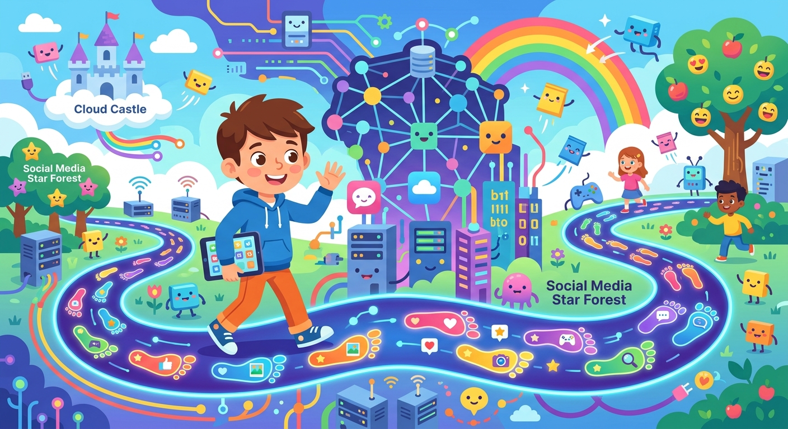

# [Цифровой след](../../../4.2_thinking_and_working_information/how_to_search_information/articles/digital_footprint.md)

**ID:** digital_footprint  
**WikiData:** [Q845916](https://www.wikidata.org/wiki/Q845916)
**Раздел:** 5.2. [Кибербезопасность](../../../4.2_thinking_and_working_information/how_to_search_information/articles/digital_footprint.md) и [поведение](../../../1.2_natural_sciences/neurobiology_for_teens/articles/06_phineas_gage.md) в сети  

💡 **Коротко:** Совокупность данных об активности пользователя, которые он оставляет в интернете.

## Введение

Каждый раз, когда ты открываешь [браузер](../../../5.1_technology_and_digital_literacy/how_internet_works/articles/http_https/http_https.md) и заходишь в [интернет](../../../1.2_natural_sciences/physics_in_everyday_life/Q26540.md), ты оставляешь за собой длинную информационную цепочку, подобно глубоким следам на свежем зимнем снегу. Эта накопленная [информация](../../../5.1_technology_and_digital_literacy/information and media literacy/как_устроена_современная_информационная_среда.md) называется цифровым следом (или иногда [цифровой](../../../7.1_art/musical_instruments/articles/synthesizer.md) тенью). Он в деталях отражает всю твою онлайн-активность за многие годы и формирует твою публичную репутацию в глобальной сети.

## Два типа твоей информации

Все [данные](../../../2.1_society/cause_and_effect_relationships/articles/ai_causality.md), которые непрерывно собираются в интернете мощными серверами, делятся на две большие и важные категории:

- **[Активный след](../../../4.2_thinking_and_working_information/how_to_search_information/articles/digital_footprint.md):** Это то, что ты делаешь сам и совершенно осознанно. Сюда входят твои текстовые посты, загруженные фотографии, отправленные личные [сообщения](../../../5.1_technology_and_digital_literacy/operating system/articles/IPC.md), оставленные [комментарии](../../../4.2_thinking_and_working_information/how_to_search_information/articles/cooperative_work.md) на YouTube и открытое использование своего [логина](login.md) на различных развлекательных сайтах.
- **[Пассивный след](../../../4.2_thinking_and_working_information/how_to_search_information/articles/digital_footprint.md):** Информация, которая собирается машинами без твоего ведома. Сайты молча фиксируют твое географическое [местоположение](../../../5.1_technology_and_digital_literacy/information and media literacy/геолокация_и_проверка_контекста.md), [тип](../../cpp_fundamentals/13_struct.md) [устройства](../../../5.1_technology_and_digital_literacy/operating system/articles/HAL.md), с которого ты зашел, и подробную историю твоего поиска. Специальные компании (брокеры данных) объединяют эти мелкие кусочки, создавая твой подробный поведенческий [профиль](../../../5.1_technology_and_digital_literacy/information and media literacy/цифровая_репутация.md), чтобы потом показывать тебе целевую рекламу.

## Примеры из жизни

[Понимание](../../../2.1_society/cause_and_effect_relationships/articles/empathy_causality.md) своего следа очень важно для твоего будущего:

- **Гневные комментарии:** Представь, что ты поссорился с кем-то в игре и написал много обидных слов в [чат](../../../7.2 Media, leisure and hobbies/Computer games/articles/useful_tips/toxic_players.md). Даже если ты потом остынешь и удалишь свои сообщения, кто-то мог сделать скриншот, или [сервер](../../../5.1_technology_and_digital_literacy/how_internet_works/articles/http_https/http_https.md) игры сохранил логи чата. Это навсегда останется частью твоего цифрового портрета.
- **Фотографии:** Если ты выкладываешь в открытый профиль фотографии, где видно название твоей школы или номер машины родителей, ты раскрываешь конфиденциальную информацию. Злоумышленники могут использовать ее, чтобы узнать, где ты живешь.

## Интернет ничего не забывает

Главная проблема цифрового следа — его поразительная [долговечность](../../../6.1_Independent_living_and_daily_living_skills/reasonable_spending/articles/quality.md). То, что хоть раз опубликовано в сети, практически невозможно удалить навсегда. Твои посты могут быть автоматически сохранены в архивах, а фотографии скачаны другими людьми. Хитрый [хакер](hacker.md) может [внимательно](../../../4.1_rules_of_study/how_to_memorize/articles/vnimanie.md) изучить твои [интересы](../../../2.1_society/cause_and_effect_relationships/articles/conflict_roots.md), чтобы создать идеальное и вызывающее [доверие](../../../1.2_natural_sciences/neurobiology_for_teens/articles/17_hugs_oxytocin.md) письмо-ловушку для [фишинга](phishing.md) или заразить твой компьютер через адресный [спам](spam.md).

## [Заключение](../../../1.2_natural_sciences/physics_in_everyday_life/Q2225.md)

Чтобы надежно защитить свою [приватность](privacy.md), относись к публикации информации максимально ответственно. Используй [VPN](vpn.md) для скрытия своего реального IP-адреса и обращай [внимание](../../../1.2_natural_sciences/neurobiology_for_teens/articles/16_love_chemistry.md) на настройки [приватности](privacy.md). Доверь свои сложные [пароли](password.md) только современному [менеджеру паролей](password_manager.md) с активированной [2FA](2fa.md). И крепко держи оборону с помощью постоянно работающего [антивируса](antivirus.md), регулярного [обновления](update.md) и своевременного [резервного копирования](backup.md).
---
[Автор](../../../4.2_thinking_and_working_information/how_to_search_information/articles/copypaste.md): Соловьева [Надежда](../../../4.2_thinking_and_working_information/critical_thinking/articles/influence_of_emotions.md), использовано: Gemini 3.1 Pro, Nano Banana 2
