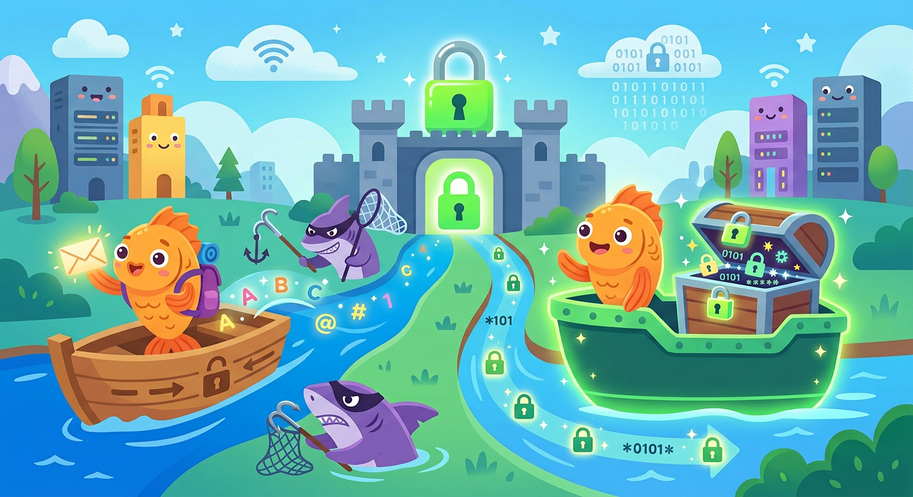

# [HTTPS](../../../5.1_technology_and_digital_literacy/how_internet_works/articles/http_https/http_https.md)

**ID:** https  
**WikiData:** [Q44484](https://www.wikidata.org/wiki/Q44484)  
**Раздел:** 5.2. [Кибербезопасность](../../../4.2_thinking_and_working_information/how_to_search_information/articles/digital_footprint.md) и [поведение](../../../1.2_natural_sciences/neurobiology_for_teens/articles/06_phineas_gage.md) в сети  

💡 **Коротко:** [Протокол](../../../5.1_technology_and_digital_literacy/how_internet_works/articles/http_https/http_https.md) безопасной передачи данных, поддерживающий [шифрование](../../../5.1_technology_and_digital_literacy/how_internet_works/articles/http_https/http_https.md) информации.

## Введение

Когда ты заходишь на любой веб-сайт, твой компьютер постоянно обменивается с ним пакетами данных. Если использовать старые протоколы связи (например, обычный [HTTP](../../../5.1_technology_and_digital_literacy/how_internet_works/articles/http_https/http_https.md)), эти [данные](../../../2.1_society/cause_and_effect_relationships/articles/ai_causality.md) передаются по проводам в совершенно открытом виде, как простой [текст](../../../4.1_rules_of_study/how_to_learn_effectively/articles/reading_skills.md) на бумажной почтовой открытке. Любой технически подкованный [человек](../../../1.2_natural_sciences/physics_in_everyday_life/Q45003.md) в сети может их прочитать. HTTPS (которое обозначается буквами HTTPS) надежно зашифровывает этот [процесс](../../../5.1_technology_and_digital_literacy/operating system/articles/process.md) обмена, мгновенно превращая хрупкую открытку в неразрушимый металлический сейф.

## Как работает передача зашифрованных данных

Защищенный протокол HTTPS использует специальные, очень сложные математические [алгоритмы](../../../4.2_thinking_and_working_information/how_to_search_information/articles/buble_filter.md) ([SSL](../../../5.1_technology_and_digital_literacy/how_internet_works/articles/http_https/http_https.md)/[TLS](../../../5.1_technology_and_digital_literacy/how_internet_works/articles/http_https/http_https.md)). Когда ты вводишь свой секретный [логин](login.md) и длинный [пароль](password.md) на сайте банка или почты, они не летят через [интернет](../../../1.2_natural_sciences/physics_in_everyday_life/Q26540.md) открытым текстом. Они мгновенно превращаются в абсолютно хаотичный и нечитаемый набор символов. Даже если опытный [хакер](hacker.md) сможет перехватить этот радиосигнал в общественной сети [Wi-Fi](../../../5.1_technology_and_digital_literacy/how_internet_works/articles/history/internet_at_home.md), он никак не сможет его расшифровать без специального секретного ключа, который хранится исключительно у владельца сервера. Твоя [приватность](privacy.md) остается в полной сохранности.

## Примеры из жизни

Внимательность к адресной строке спасает от многих бед:

- **Покупки в интернете:** Если ты хочешь купить новую игру или книгу, и сайт просит ввести данные банковской карты родителей, сначала посмотри на начало адреса. Если там написано просто http:// (без буквы S на конце) и [браузер](../../../5.1_technology_and_digital_literacy/how_internet_works/articles/http_https/http_https.md) пишет "Не защищено", немедленно уходи с этого сайта! Твои данные могут украсть.
- **Вход в [соцсети](../../../2.1_society/how_and_where_find_friends/articles/tcifrovaya_druzhba.md):** Все крупные [социальные сети](../../../3.1_healthy lifestyle/vrednye_privychki/articles/Social_media.md) (ВКонтакте, Telegram Web) всегда используют защищенное [соединение](../../../5.1_technology_and_digital_literacy/how_internet_works/articles/tcp_udp/tcp_udp.md). Если при вводе пароля ты не видишь замочка в браузере, скорее всего, ты попал на фальшивый сайт мошенников.

## Уровни доверия и [замочек](../../../5.1_technology_and_digital_literacy/how_internet_works/articles/http_https/http_https.md)

Владельцы интернет-ресурсов покупают специальные цифровые сертификаты, чтобы активировать этот протокол:

- **DV (Domain Validation):** Это самый простой и дешевый [сертификат](../../../5.1_technology_and_digital_literacy/how_internet_works/articles/http_https/http_https.md). Он доказывает лишь то, что [связь](../../../1.2_natural_sciences/physics_in_everyday_life/Q12969754.md) с сайтом зашифрована. Злоумышленники сегодня очень часто и бесплатно получают такие сертификаты для своих поддельных сайтов с [фишингом](phishing.md), поэтому просто зеленый замочек сам по себе больше не гарантирует полную [безопасность](../../../1.2_natural_sciences/neurobiology_for_teens/articles/17_hugs_oxytocin.md)!
- **OV и EV:** Расширенные и строгие сертификаты. Чтобы их получить, компания обязана документально доказать специальным органам, что она реально существует в физическом мире.

## [Заключение](../../../1.2_natural_sciences/physics_in_everyday_life/Q2225.md)

[Проверка](../../../1.2_natural_sciences/why_science_help_understand_world/scientific_method.md) наличия HTTPS перед вводом данных — это твое базовое [правило](../../../1.2_natural_sciences/why_science_help_understand_world/patterns.md). Однако никогда не расслабляйся: не открывай подозрительный электронный [спам](spam.md) и используй [VPN](vpn.md) в кафе. Для полной и безоговорочной защиты аккаунтов необходимы [менеджер паролей](password_manager.md) и настроенная [2FA](2fa.md). И, конечно, твой компьютер всегда должны защищать от проникновения [вирусов](virus.md) [антивирус](antivirus.md), своевременное [обновление](update.md), контроль [цифрового следа](digital_footprint.md) и регулярное [резервное копирование](backup.md).
---
[Автор](../../../4.2_thinking_and_working_information/how_to_search_information/articles/copypaste.md): Федорова Екатерина, использовано: Gemini 3.1 Pro, Nano Banana 2
