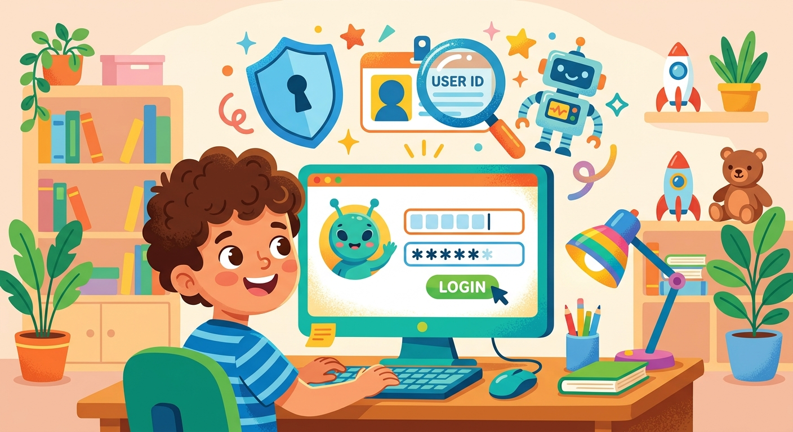

# Логин

**ID:** login  
**WikiData:** [Q16572632](https://www.wikidata.org/wiki/Q16572632)  
**Раздел:** 5.2. [Кибербезопасность](../../../4.2_thinking_and_working_information/how_to_search_information/articles/digital_footprint.md) и [поведение](../../../1.2_natural_sciences/neurobiology_for_teens/articles/06_phineas_gage.md) в сети  

💡 **Коротко:** Уникальное имя пользователя для идентификации в компьютерной системе.

## Введение

Когда ты приходишь в новую спортивную секцию или кружок, ты первым делом называешь свое имя, чтобы [тренер](../../../7.2 Media, leisure and hobbies/Computer games/articles/game_culture/esports.md) и другие ребята могли с тобой познакомиться и обращаться к тебе. В огромной сети [интернет](../../../1.2_natural_sciences/physics_in_everyday_life/Q26540.md) сайты и [серверы](../../../5.1_technology_and_digital_literacy/operating system/articles/operating_system.md) делают то же самое, но вместо обычного имени они используют специальный термин — логин. Это твоя личная виртуальная визитная карточка, по которой сложная система мгновенно узнает тебя среди миллионов других активных пользователей со всего мира. Без него [сервер](../../../5.1_technology_and_digital_literacy/how_internet_works/articles/http_https/http_https.md) просто не поймет, чью именно информацию нужно загрузить на [экран](../../../3.1. healthy lifestyle/Sleep, nutrition, and adolescent energy/articles/gadgets_blue_light_sleep.md).

## Твое лицо в цифровом мире

В отличие от ключей безопасности, логин не является строгим государственным секретом. Очень часто другие пользователи могут открыто видеть его. Именно поэтому логин формирует начальную, но очень важную часть твоего [цифрового следа](digital_footprint.md).

Чаще всего в качестве логина крупные [сервисы](../../../4.1_rules_of_study/how_to_learn_effectively/articles/digital_tools.md) (такие как Google, Apple или Steam) просят использовать [адрес](../../../5.1_technology_and_digital_literacy/how_internet_works/articles/ip_mac/ip_and_mac.md) электронной почты или номер мобильного телефона, так как они гарантированно уникальны в мировом масштабе. Ни у кого другого не может быть такого же номера телефона! Важно понимать базовую вещь: [знание](../../../1.2_natural_sciences/why_science_help_understand_world/science.md) одного лишь логина ничего не дает злоумышленнику. Чтобы открыть виртуальную дверь и войти в [аккаунт](../../../5.1_technology_and_digital_literacy/information and media literacy/информационная_безопасность_для_детей.md), система в обязательном порядке потребует твой секретный [пароль](password.md).

## Примеры из жизни

Давай посмотрим, как разные типы логинов работают в твоих повседневных цифровых делах:

- **Никнеймы в играх:** Когда ты играешь в [онлайн-игры](../../../5.1_technology_and_digital_literacy/how_internet_works/articles/tcp_udp/tcp_udp.md), твой логин (или никнейм) виден всем игрокам на сервере. Если ты назовешь себя "Ivan_Ivanov_2014_Moscow", ты сразу выдашь всем незнакомцам свое имя, год рождения и [город](../../../3.2 healthy lifestyle/how to act in a dangerous situation/articles/lost-in-city.md) проживания. Это огромный [риск](../../../1.2_natural_sciences/neurobiology_for_teens/articles/05_teen_brain.md) для твоей безопасности! Лучше использовать выдуманные имена, вроде "CosmicNinja99".
- **Школьные порталы:** В электронном дневнике твой логин обычно привязан к твоей настоящей фамилии, потому что это закрытая государственная система.
- **[Социальные сети](../../../3.1_healthy lifestyle/vrednye_privychki/articles/Social_media.md):** Если твой публичный логин-никнейм совпадает с твоим адресом электронной почты, ты делаешь отличный подарок мошенникам. Они начнут присылать на этот адрес тонны рекламного [спама](spam.md).

## Опасные [привычки](../../../1.2_natural_sciences/neurobiology_for_teens/articles/11_reward_system.md) пользователей

Многие люди, даже взрослые, совершают типичные и очень опасные [ошибки](../../../3.1_healthy_lifestyle/pervaya_pomoshch/ushibi_porezy_ozhogi/07_ushib_chego_nelzya.md) при выборе своих сетевых идентификаторов. Использование настоящих данных сильно нарушает базовую [приватность](privacy.md). Оставляя свой почтовый логин на сомнительных форумах или под видеороликами, пользователи сами приглашают угрозы. [Анализ](../../../1.2_natural_sciences/why_science_help_understand_world/research.md) взломов показывает, что одной из самых распространенных пар данных в мире до сих пор остается нелепая комбинация логина «login» и пароля «parol». Такие аккаунты взламываются автоматическими ботами за доли секунды.

## [Заключение](../../../1.2_natural_sciences/physics_in_everyday_life/Q2225.md)

Помни, что твой логин — это лишь половина замка. Чтобы не забыть свои [данные](../../../2.1_society/cause_and_effect_relationships/articles/ai_causality.md) от десятков сайтов, храни их в защищенном [менеджере паролей](password_manager.md) и абсолютно всегда настраивай [двухфакторную аутентификацию](2fa.md). И будь предельно осторожен: [мошенники](../../../3.2 healthy lifestyle/how to act in a dangerous situation/articles/phishing-links.md) часто присылают письма от имени администрации известных сервисов, пытаясь провести хитрую атаку с использованием социальной инженерии и [фишинга](phishing.md).
---
[Автор](../../../4.2_thinking_and_working_information/how_to_search_information/articles/copypaste.md): Нургалиев Даниэль, использовано: Gemini 3.1 Pro, Nano Banana 2
