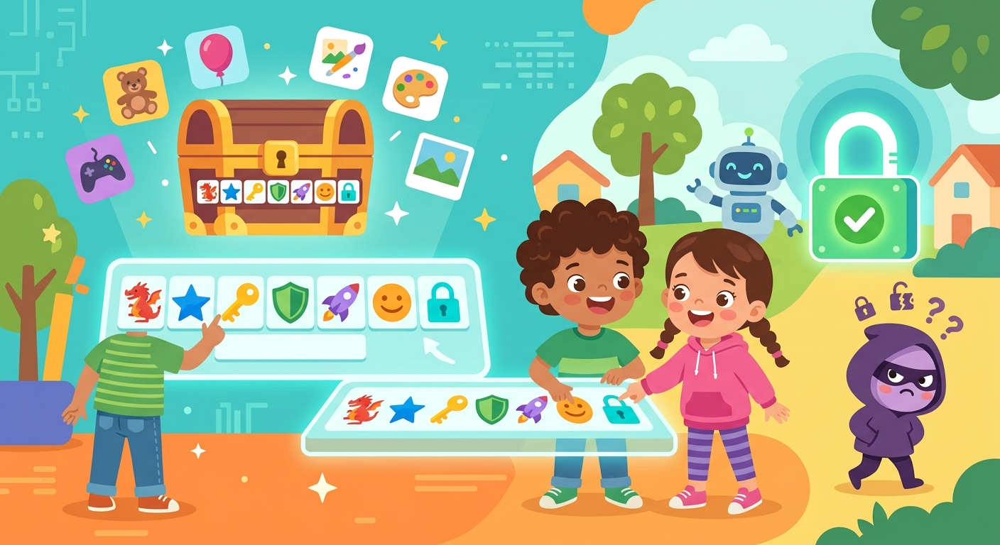

# [Пароль](../../../3.2 healthy lifestyle/how to act in a dangerous situation/articles/internet-safety.md)

**ID:** password  
**WikiData:** [Q161157](https://www.wikidata.org/wiki/Q161157)  
**Раздел:** 5.2. [Кибербезопасность](../../../4.2_thinking_and_working_information/how_to_search_information/articles/digital_footprint.md) и [поведение](../../../1.2_natural_sciences/neurobiology_for_teens/articles/06_phineas_gage.md) в сети  

💡 **Коротко:** Секретный набор символов для подтверждения личности и защиты данных.

## Введение

Сегодня мы подробно поговорим о [том](../../../7.1_art/musical_instruments/articles/drums.md), что такое пароль. В реальном мире у тебя есть ключи от квартиры, чтобы никто [чужой](../../../3.2 healthy lifestyle/how to act in a dangerous situation/articles/stranger-safety.md) не смог зайти внутрь и взять твои вещи. В интернете — это твой уникальный секретный [цифровой](../../../7.1_art/musical_instruments/articles/synthesizer.md) [ключ](../../../5.1_technology_and_digital_literacy/how_internet_works/articles/http_https/tls.md). Он защищает твои виртуальные двери от посторонних лиц и программ-взломщиков. В цифровом пространстве он всегда работает в строгой паре с твоим публичным именем — [логином](login.md). Эта пара данных необходима, чтобы доказать компьютеру или серверу, что ты — это действительно ты, и обеспечить твою полную [безопасность](../../../1.2_natural_sciences/neurobiology_for_teens/articles/17_hugs_oxytocin.md).

## Анатомия надежного ключа

Создание по-настоящему хорошего пароля — это настоящая математическая [наука](../../../1.2_natural_sciences/physics_in_everyday_life/Q238323.md). Если использовать простые словарные слова (например, "кошка" или "машина"), компьютерная [программа](../../../5.1_technology_and_digital_literacy/operating system/articles/process.md) злоумышленника сможет подобрать их за доли секунды методом простого перебора. Чтобы твой пароль стал настоящей броней, он должен отвечать нескольким строгим правилам кибербезопасности:

- **[Длина](../../../1.2_natural_sciences/physics_in_everyday_life/Q25358.md):** Эксперты настоятельно советуют использовать пароли длиной не менее 12-15 символов. Чем больше букв, тем математически сложнее угадать правильную комбинацию.
- **Разнообразие:** Обязательно используй заглавные и строчные буквы, случайные цифры и специальные символы (например, !, @, #, $).
- **Отсутствие логики:** Избегай словарных слов и дат рождения. Идеальный пароль выглядит как абсолютно бессмысленный набор символов, который для тебя генерирует специальный [менеджер паролей](password_manager.md).

## Примеры из жизни

Давай представим, как это работает в твоей повседневной жизни. У тебя наверняка есть аккаунты в популярных играх вроде [Minecraft](../../../5.1_technology_and_digital_literacy/how_internet_works/articles/tcp_udp/online_games.md) или Roblox, электронный дневник и электронная почта.

- **[Защита](../../../5.1_technology_and_digital_literacy/how_internet_works/articles/dns/cdn.md) инвентаря:** Если ты используешь легкий пароль вроде "12345" в своей любимой онлайн-игре, злой [хакер](hacker.md) легко зайдет в твой [профиль](../../../5.1_technology_and_digital_literacy/information and media literacy/цифровая_репутация.md) и заберет все редкие предметы, которые ты копил месяцами.
- **[Опасность](../../../3.1_healthy_lifestyle/pervaya_pomoshch/ushibi_porezy_ozhogi/06_ushib_kogda_vrach.md) одинаковых ключей:** Если у тебя один и тот же пароль от игровой платформы и от электронной почты, [взлом](../../../5.1_technology_and_digital_literacy/how_internet_works/articles/wifi/security.md) одной слабой игры приведет к тому, что мошенник получит доступ к твоей личной переписке.
- **Секретность:** Никогда не говори свой пароль даже лучшим друзьям в школе. Друг может случайно зайти с чужого компьютера, забыть выйти из аккаунта, и твои [данные](../../../2.1_society/cause_and_effect_relationships/articles/ai_causality.md) попадут в чужие руки.

## Историческая справка

[История](../../../1.2_natural_sciences/physics_in_everyday_life/Q11469.md) секретных слов началась за тысячелетия до появления компьютеров. Еще римские легионеры использовали пароли, вырезанные на глиняных табличках, для прохода в военный лагерь. Во втором веке до нашей эры появились так называемые «магические квадраты», самый известный из которых — древний латинский палиндром «SATOR AREPO TENET [OPERA](../../../5.1_technology_and_digital_literacy/how_internet_works/articles/web_basics/browser.md) ROTAS».

Когда в 1960-е годы появились первые огромные ЭВМ размером с целую комнату, пароли стали использовать для ограничения доступа к вычислительным мощностям. К сожалению, люди склонны лениться: несмотря на все строгие предупреждения специалистов по безопасности, цифровая комбинация «12345» и слово «admin» до сих пор остаются самыми частыми причинами массовых взломов.

## [Заключение](../../../1.2_natural_sciences/physics_in_everyday_life/Q2225.md)

Твой пароль — это всегда первая и самая главная линия обороны в интернете. Никогда не передавай его через [сообщения](../../../5.1_technology_and_digital_literacy/operating system/articles/IPC.md), чтобы не стать жертвой [фишинга](phishing.md) или не поймать опасный [вирус](virus.md). Регулярное [обновление](update.md), обязательная [двухфакторная аутентификация](2fa.md) и использование зашифрованного [VPN](vpn.md) помогут сохранить твои секреты в полной и безоговорочной безопасности.
---
[Автор](../../../4.2_thinking_and_working_information/how_to_search_information/articles/copypaste.md): Нургалиев Даниэль, использовано: Gemini 3.1 Pro, Nano Banana 2
