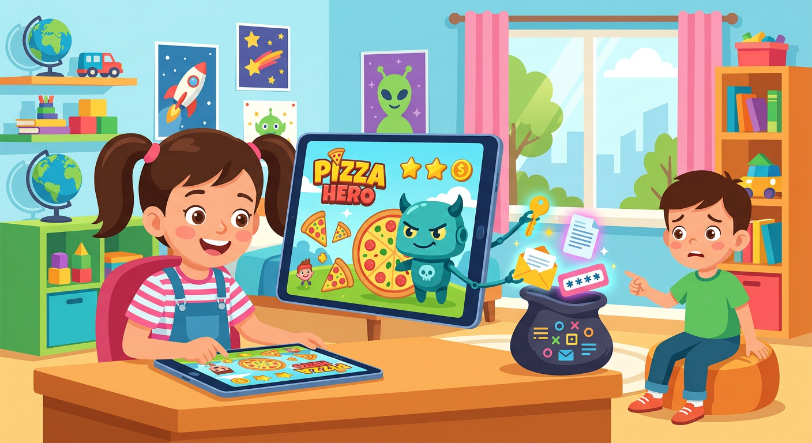

# Троянская [программа](../../../5.1_technology_and_digital_literacy/operating system/articles/process.md)

**ID:** trojan  
**WikiData:** [Q14001](https://www.wikidata.org/wiki/Q14001)  
**Раздел:** 5.2. [Кибербезопасность](../../../4.2_thinking_and_working_information/how_to_search_information/articles/digital_footprint.md) и [поведение](../../../1.2_natural_sciences/neurobiology_for_teens/articles/06_phineas_gage.md) в сети  

💡 **Коротко:** Опасная программа-шпион, которая прячется внутри полезной игры или [приложения](../../../4.1_rules_of_study/how_to_learn_effectively/articles/digital_tools.md), чтобы украсть [данные](../../../2.1_society/cause_and_effect_relationships/articles/ai_causality.md).

## Введение

Ты наверняка слышал легенду о Троянском коне — огромной деревянной статуе, внутри которой спрятались воины, чтобы проникнуть в неприступный [город](../../../3.2 healthy lifestyle/how to act in a dangerous situation/articles/lost-in-city.md). В компьютерном мире троян (или троянская программа) работает точно так же. Это зловредная программа, которая притворяется чем-то полезным и интересным: бесплатной игрой, читом или крутой картинкой. Но как только ты скачиваешь и запускаешь её, она тайно открывает двери в твой компьютер для злоумышленников.

## Как работает эта ловушка

В отличие от обычного [вируса](virus.md), троян не умеет размножаться сам по себе. Он полностью полагается на обман и доверчивость пользователя. Создатели троянов используют хитрые уловки:

- **Маскировка:** Они прячут вредоносный [код](../../cpp_fundamentals/1_introduction.md) внутри обычных файлов (например, в документе Word или установщике игры).
- **Тихая [работа](../../../1.2_natural_sciences/physics_in_everyday_life/Q11382.md):** Попав в систему, троян может месяцами сидеть тихо, собирая твои [пароли](password.md) и [логины](login.md).
- **Удаленный доступ:** Некоторые трояны позволяют [хакеру](hacker.md) полностью управлять твоим компьютером через [интернет](../../../1.2_natural_sciences/physics_in_everyday_life/Q26540.md), включать веб-камеру или удалять файлы.

## Примеры из жизни

Трояны очень часто нацелены именно на детей и подростков, потому что они любят скачивать бесплатные вещи из интернета:

- **Фальшивые читы:** Ты находишь в интернете программу, которая обещает бесконечные [деньги](../../../2.1_society/cause_and_effect_relationships/articles/economic_chains.md) в Roblox или [Minecraft](../../../5.1_technology_and_digital_literacy/how_internet_works/articles/tcp_udp/online_games.md). Ты скачиваешь её, запускаешь, но вместо читов получаешь троян, который крадет твой игровой [аккаунт](../../../5.1_technology_and_digital_literacy/information and media literacy/информационная_безопасность_для_детей.md).
- **Взломанные игры:** Скачивая платную игру бесплатно с подозрительного сайта (торрента), ты рискуешь вместе с игрой установить скрытого шпиона, который будет следить за твоими действиями.
- **Опасные ссылки:** Друг присылает тебе в мессенджере ссылку с текстом "Смотри, какая смешная фотка!". Ты кликаешь, скачиваешь [файл](../../../5.1_technology_and_digital_literacy/operating system/articles/file_system.md), и твой телефон заражается трояном, который начинает рассылать [спам](spam.md) всем твоим контактам.

## [Заключение](../../../1.2_natural_sciences/physics_in_everyday_life/Q2225.md)

Троян — это мастер маскировки в цифровом мире. Чтобы не попасться на его удочку, никогда не скачивай программы с неизвестных сайтов и не открывай подозрительные файлы, даже если их прислали [друзья](../../../4.1_rules_of_study/how_to_learn_effectively/articles/peer_learning.md). Обязательно используй надежный [антивирус](antivirus.md) и регулярно делай [обновление](update.md) системы, чтобы закрыть все лазейки для киберпреступников.
---
[Автор](../../../4.2_thinking_and_working_information/how_to_search_information/articles/copypaste.md): Явметдинов Максим, использовано: Gemini 3.1 Pro, Nano Banana 2
