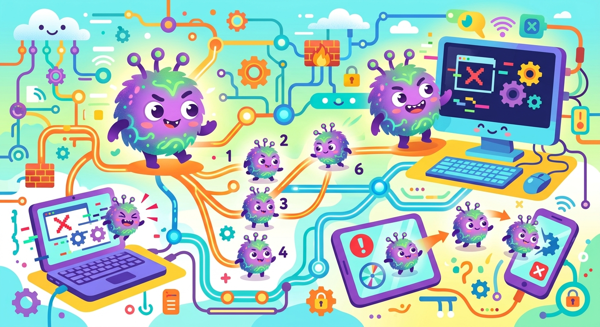

# Компьютерный вирус

**ID:** virus  
**WikiData:** [Q485](https://www.wikidata.org/wiki/Q485)  
**Раздел:** 5.2. [Кибербезопасность](../../../4.2_thinking_and_working_information/how_to_search_information/articles/digital_footprint.md) и [поведение](../../../1.2_natural_sciences/neurobiology_for_teens/articles/06_phineas_gage.md) в сети  

💡 **Коротко:** Вредоносная [программа](../../../5.1_technology_and_digital_literacy/operating system/articles/process.md), способная к саморазмножению и нарушению [работы](../../../8.2_future/choosing_a_career_path/articles/interview.md) [устройства](../../../5.1_technology_and_digital_literacy/operating system/articles/HAL.md).

## Введение

Как настоящие биологические вирусы вызывают опасные болезни у людей, так и компьютерные вирусы серьезно нарушают [работу](../../../8.2_future/choosing_a_career_path/articles/interview.md) сложной вычислительной [техники](../../../8.2_future_and_path_choice/articles/03_stress_management.md). Это не просто "глюки" системы, а специально написанные зловредные программы. Они тайно внедряются в операционную систему твоего устройства для кражи данных, уничтожения важных файлов или постоянной слежки за твоими действиями.

## Жизненный цикл цифрового вредителя

Чтобы нанести реальный [вред](../../../3.1. healthy lifestyle/Sleep, nutrition, and adolescent energy/articles/the_energy_trap.md), вирусу необходимо пройти несколько последовательных стадий внутри системы:

1. **Проникновение:** Вирус попадает на твое [устройство](../../../1.2_natural_sciences/physics_in_everyday_life/Q178032.md) под видом полезного файла (например, программы для учебы), скачанного с неизвестного сайта, или прячется в приложении к электронному письму со [вложением](phishing.md) во [время](../../../1.2_natural_sciences/physics_in_everyday_life/Q20702.md) атаки через [фишинг](phishing.md).
2. **Активация и [размножение](../../../1.2_natural_sciences/why_science_help_understand_world/organism.md):** Когда пользователь ничего не подозревая запускает [файл](../../../5.1_technology_and_digital_literacy/operating system/articles/file_system.md), вирус мгновенно начинает создавать тысячи своих копий, заражая чистые системные процессы и документы.
3. **[Действие](../../../2.1_society/cause_and_effect_relationships/articles/personal_choice.md):** [Программа-шпион](trojan.md) начинает воровать твои [логины](login.md) и [пароли](password.md), собирать твой [цифровой след](digital_footprint.md) или полностью шифровать файлы на диске, требуя выкуп для создавшего ее [хакера](hacker.md).

## Примеры из жизни

Чаще всего устройства заражаются из-за невнимательности:

- **Бесплатные игры и читы:** Представь, что ты захотел скачать новую платную игру бесплатно или найти чит-коды для автоприцеливания. Очень часто в таких пиратских файлах прячутся "трояны" (вид вирусов). Как только ты запустишь установщик, вирус начнет ломать твой компьютер изнутри.
- **Подозрительные ссылки:** Тебе в мессенджере приходит [сообщение](../../../3.2 healthy lifestyle/how to act in a dangerous situation/articles/phishing-links.md) от неизвестного номера: "Посмотри, кто выложил твои фотки!". Внутри будет [ссылка](../../../4.2_thinking_and_working_information/how_to_search_information/articles/copypaste.md). Если нажать на нее, на телефон может скачаться программа-шпион.

## Эпидемии прошлого

Сам научный термин «вирус» в компьютерной среде впервые применил американский [студент](../../../8.2_future/choosing_a_career_path/articles/university.md) Фред Коэн 11 ноября 1983 года. Он провел [эксперимент](../../../1.2_natural_sciences/physics_in_everyday_life/Q1293220.md) и научно доказал, что [цифровой](../../../7.1_art/musical_instruments/articles/synthesizer.md) программный [код](../../cpp_fundamentals/1_introduction.md) может вести себя точно как живой природный патоген — быстро размножаться и заражать новые вычислительные системы. С бурным развитием интернета вирусы стали настоящей глобальной угрозой. Например, вирус под названием «ILOVEYOU» в 2000 году рассылался под видом электронного любовного послания и заразил десятки миллионов компьютеров по всей планете, а сетевой червь «Mydoom» в 2004 году полностью парализовал работу электронной почты в мировом масштабе.

## [Заключение](../../../1.2_natural_sciences/physics_in_everyday_life/Q2225.md)

[Защита](../../../5.1_technology_and_digital_literacy/how_internet_works/articles/dns/cdn.md) от цифровых инфекций требует максимальной бдительности, регулярного [обновления](update.md) и обязательного наличия включенного [антивируса](antivirus.md). Если вредоносная программа всё же повредит системные файлы, спасти их поможет только заранее настроенное [резервное копирование](backup.md). Чтобы сохранить свою [приватность](privacy.md), всегда используй [VPN](vpn.md) и [менеджер паролей](password_manager.md).
---
[Автор](../../../4.2_thinking_and_working_information/how_to_search_information/articles/copypaste.md): Радион Никита, использовано: Gemini 3.1 Pro, Nano Banana 2
