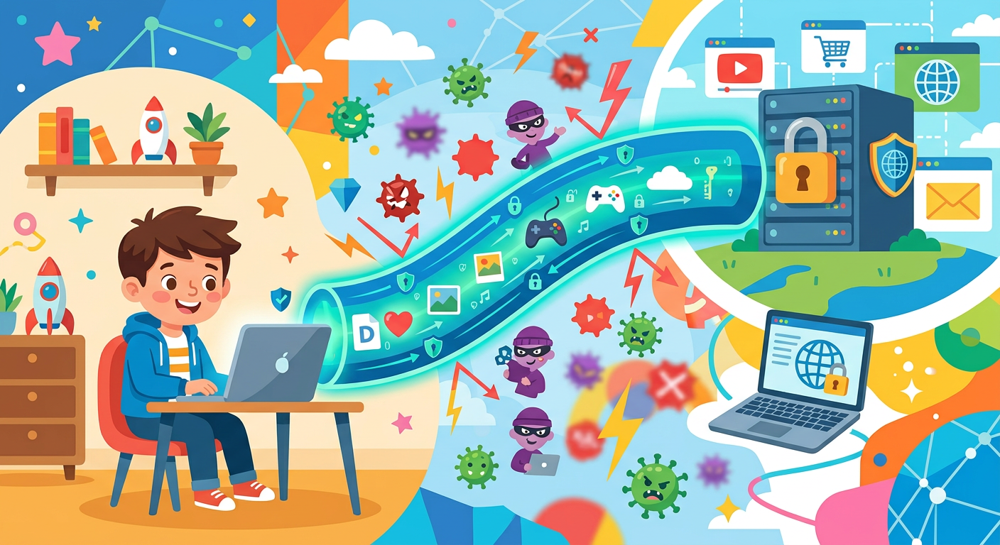

# [VPN](../../../4.2_thinking_and_working_information/how_to_search_information/articles/vpn_dns_proxy_anonymity_and_security.md)

**ID:** vpn  
**WikiData:** [Q170963](https://www.wikidata.org/wiki/Q170963)  
**Раздел:** 5.2. [Кибербезопасность](../../../4.2_thinking_and_working_information/how_to_search_information/articles/digital_footprint.md) и [поведение](../../../1.2_natural_sciences/neurobiology_for_teens/articles/06_phineas_gage.md) в сети  

💡 **Коротко:** Технология защищенного и зашифрованного подключения к сети поверх интернета.

## Введение

Представь, что [интернет](../../../1.2_natural_sciences/physics_in_everyday_life/Q26540.md) — это огромная прозрачная пластиковая [труба](../../../7.1_art/musical_instruments/articles/trumpet.md), по которой на огромной скорости передаются твои электронные письма, и любой прохожий может легко заглянуть внутрь и прочитать их. Сложная технология VPN (виртуальная частная [сеть](../../../5.1_technology_and_digital_literacy/how_internet_works/articles/history/internet_history.md)) создает внутри этой прозрачной [трубы](../../../5.1_technology_and_digital_literacy/operating system/articles/IPC.md) абсолютно непрозрачный, бронированный [цифровой](../../../7.1_art/musical_instruments/articles/synthesizer.md) туннель, полностью скрывая твой интернет-трафик от любых посторонних [глаз](../../../1.2_natural_sciences/physics_in_everyday_life/Q467980.md) и перехватчиков.

## Принцип [работы](../../../8.2_future/choosing_a_career_path/articles/interview.md) криптографического туннеля

Использование виртуальной частной сети дает грамотному пользователю два главных преимущества в области безопасности:

1. **Мощное [шифрование](../../../5.1_technology_and_digital_literacy/how_internet_works/articles/http_https/http_https.md):** При включении VPN вся исходящая от твоего [устройства](../../../5.1_technology_and_digital_literacy/operating system/articles/HAL.md) [информация](../../../5.1_technology_and_digital_literacy/information and media literacy/как_устроена_современная_информационная_среда.md) превращается в сложнейший математический шифр. Если ты подключился к бесплатному общественному [Wi-Fi](../../../5.1_technology_and_digital_literacy/how_internet_works/articles/history/internet_at_home.md) в кафе или торговом центре, коварный [хакер](hacker.md) за соседним столиком со специальным оборудованием никак не сможет перехватить твой [логин](login.md) или [пароль](password.md). Для него эти [данные](../../../2.1_society/cause_and_effect_relationships/articles/ai_causality.md) будут выглядеть как случайный набор символов.
2. **Маскировка:** VPN-сервер физически подменяет твой реальный [IP-адрес](../../../5.1_technology_and_digital_literacy/how_internet_works/articles/ip_mac/ip_and_mac.md). Владельцы сайтов будут думать, что ты находишься в другой стране или городе, что помогает существенно сократить твой пассивный [цифровой след](digital_footprint.md) и сохранить истинную [приватность](privacy.md).

## Примеры из жизни

Зачем VPN может понадобиться именно тебе:

- **[Безопасность](../../../1.2_natural_sciences/neurobiology_for_teens/articles/17_hugs_oxytocin.md) в кафе:** Ты сидишь в пиццерии после школы и подключаешься к бесплатному открытому Wi-Fi (без пароля), чтобы зайти в любимую социальную сеть. Открытые сети очень уязвимы. Если ты не включишь VPN, кто угодно в этом кафе сможет перехватить твои [сообщения](../../../5.1_technology_and_digital_literacy/operating system/articles/IPC.md) или узнать, какие сайты ты посещаешь.
- **Скрытие местоположения:** Иногда [онлайн-игры](../../../5.1_technology_and_digital_literacy/how_internet_works/articles/tcp_udp/tcp_udp.md) или [сервисы](../../../4.1_rules_of_study/how_to_learn_effectively/articles/digital_tools.md) собирают слишком много данных о [том](../../../7.1_art/musical_instruments/articles/drums.md), из какого ты города. Включение VPN позволяет скрыть эту информацию от любопытных глаз корпораций.

## Корпоративные корни

Интересный исторический [факт](../../../1.2_natural_sciences/why_science_help_understand_world/science.md): изначально технология VPN создавалась инженерами вовсе не для обхода блокировок или скрытности обычных пользователей в интернете. Она была специально разработана для крупных корпораций и банков, чтобы их сотрудники могли абсолютно безопасно подключаться к закрытым внутренним рабочим серверам и базам данных, находясь дома или в служебных командировках.

## [Заключение](../../../1.2_natural_sciences/physics_in_everyday_life/Q2225.md)

Помни, что VPN — это невероятно важный инструмент безопасности, но он должен работать в команде. Он совершенно не защитит, если ты по ошибке сам скачаешь [вирус](virus.md) из [фишинговой](phishing.md) ссылки или добровольно отдашь данные мошенникам через [спам](spam.md). Обязательно обращай [внимание](../../../1.2_natural_sciences/neurobiology_for_teens/articles/16_love_chemistry.md) на [HTTPS](https.md). Храни пароли в [менеджере паролей](password_manager.md) с [2FA](2fa.md). И, конечно, не забывай про [работу](../../../8.2_future/choosing_a_career_path/articles/interview.md) [антивируса](antivirus.md), регулярное [обновление](update.md) и создание [резервных копий](backup.md) важных файлов.
---
[Автор](../../../4.2_thinking_and_working_information/how_to_search_information/articles/copypaste.md): Соловьева [Надежда](../../../4.2_thinking_and_working_information/critical_thinking/articles/influence_of_emotions.md), использовано: Gemini 3.1 Pro, Nano Banana 2
