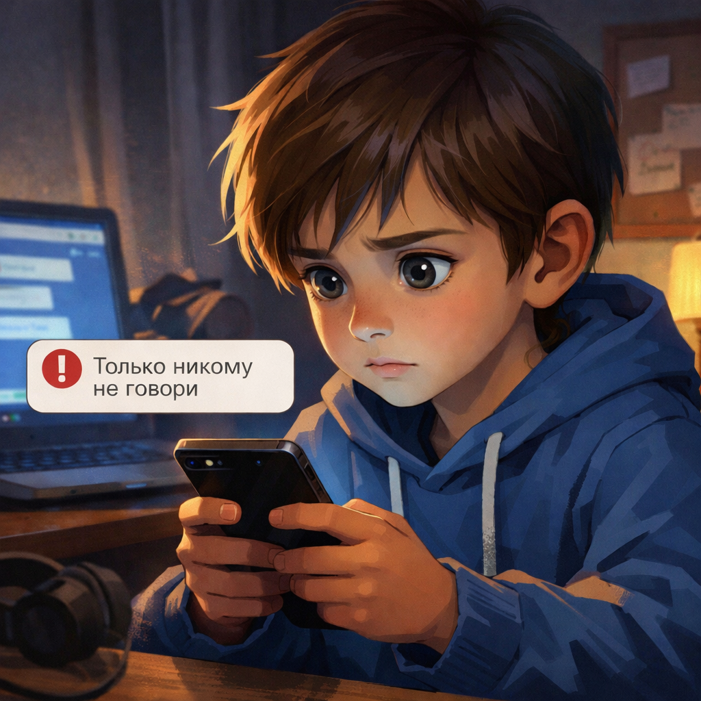

# Как общаться с незнакомцами в интернете

В интернете легко встретить новых людей: в игре, в чате, в комментариях или в социальной сети. Это интересно, но важно помнить простое правило: **незнакомец в интернете всё равно остаётся незнакомцем**, даже если пишет очень мило.

> 💡 В интернете не всегда видно, кто перед тобой на самом деле.

## Почему нужна осторожность? ⚠️

Не все люди в интернете хотят плохого. Но иногда встречаются те, кто:

- выманивает личные данные
- просит пароль или код
- пытается запугать
- зовёт что-то делать втайне от взрослых

> ⚠️ В интернете работают те же правила осторожности, что и в обычной жизни.

## Когда стоит насторожиться 🚩

Будь внимательнее, если человек:

- слишком быстро называет тебя другом
- расспрашивает про адрес, школу или телефон
- просит держать переписку в секрете
- обижается, давит или пугает
- просит фото, деньги, пароль или код

> 🚩 Если внутри стало тревожно, лучше сразу остановиться.

## Что нельзя рассказывать ❌

Незнакомым людям нельзя писать:

- домашний адрес
- номер телефона
- название школы и класс
- пароли и коды
- когда ты дома один
- фото документов и карт

> 🔒 Личные данные нужно беречь так же, как ключи от дома.

## Как общаться безопасно ✅

- будь вежливым, но не слишком доверчивым
- не отвечай на странные вопросы
- не отправляй личные фото
- не переходи без причины в другой чат
- если неприятно, прекращай разговор

**Твоя безопасность важнее чужой обиды**.

## Что делать, если человек ведёт себя странно 🛑

1. Не продолжай переписку.
2. Заблокируй человека.
3. Покажи сообщения взрослому.
4. Если нужно, пожалуйся в игре, чате или соцсети.

> 🛑 Лучше вовремя остановиться, чем потом исправлять большую проблему.

Важно помнить, что нельзя делиться личными данными — подробнее в статье [Какие личные данные нельзя раздавать всем подряд](./personal_data_not_for_everyone.md).

## Главная мысль 💡

В интернете можно общаться и дружить, но делать это нужно осторожно. Не доверяй незнакомцам слишком быстро, не делись личными данными и обращайся к взрослому, если разговор стал странным или пугающим.

---

**Автор:** Руснак Александр

*Ресурсы: LLM - ChatGPT; Генерация изображений - Sora*
