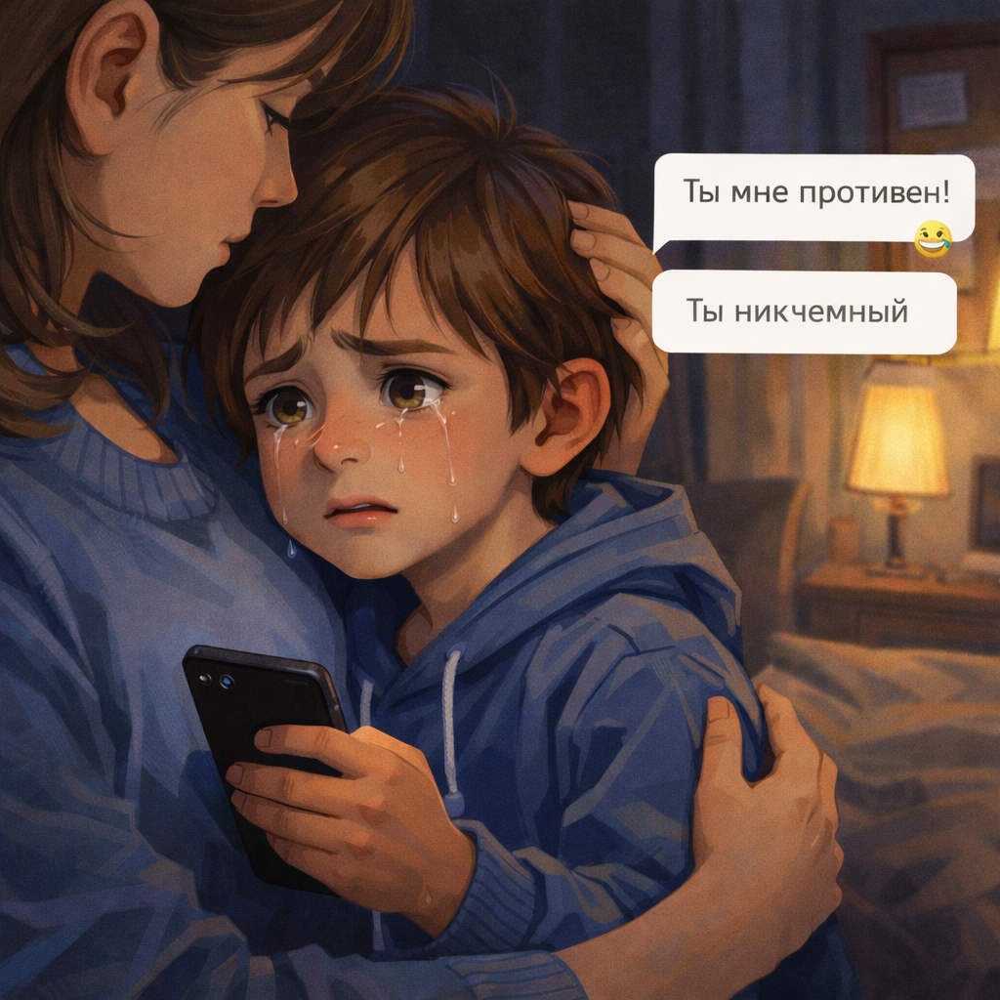

# Кибербуллинг: что делать, если в интернете обижают

Интернет нужен для общения, игр и учёбы. Но иногда там встречается *кибербуллинг* - травля в сети. Это когда человека обзывают, высмеивают, пугают или специально стараются сделать ему больно через сообщения, комментарии и чаты.

> 💡 Кибербуллинг - это настоящая травля, даже если она происходит онлайн.

## Как понять, что это кибербуллинг? 🕵️

Обычно кибербуллинг повторяется. Например, если:

- тебя постоянно обзывают в чате
- над тобой смеются в комментариях
- выкладывают обидные картинки или фото
- специально дразнят в игре или группе

> 🚩 Если обидные действия повторяются, это уже не "шутка".

## Что важно помнить ❤️

Если тебя обижают, **ты не виноват**. Виноват тот, кто решил делать зло.

> ❤️ Проблема не в тебе, а в плохом поведении другого человека.

## Что не нужно делать ❌

- не ругаться в ответ
- не угрожать
- не удалять сразу все сообщения

> ⚠️ Не отвечай злом на зло и не стирай важные доказательства.

## Что нужно сделать ✅

1. Сохрани доказательства: скриншоты, сообщения, имя аккаунта.
2. Заблокируй обидчика.
3. Пожалуйся в игре, мессенджере или соцсети.
4. Обязательно расскажи взрослому.

> ✅ Самое важное - не оставаться с травлей один на один.

## Почему важно сказать взрослому 🧑‍🤝‍🧑

Можно обратиться к родителям, учителю, школьному психологу или другому взрослому, которому ты доверяешь.

> 🧑‍🤝‍🧑 Просить помощи - это не слабость, а умный шаг.

Чаще всего такие ситуации происходят в соцсетях и чатах — подробнее в статье [Безопасность в социальных сетях и мессенджерах](./social_networks_and_messengers_safety.md).

## Главная мысль 💡

Кибербуллинг нельзя терпеть молча. Если тебя обижают в интернете, не отвечай злом, сохрани доказательства, останови общение и расскажи взрослому. Ты не обязан справляться с этим в одиночку.

---

**Автор:** Фокин Леонид

*Ресурсы: LLM - ChatGPT; Генерация изображений - Sora*

