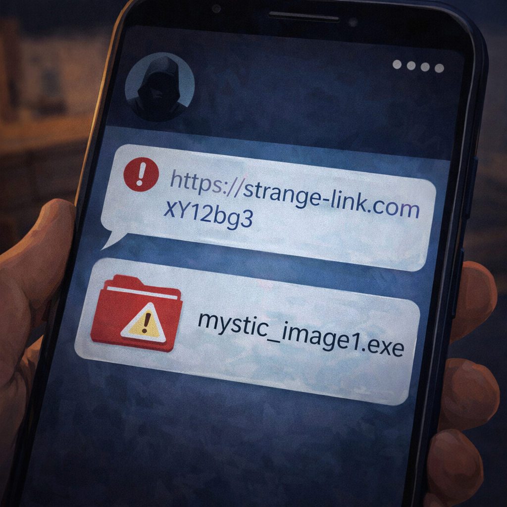

# Опасные ссылки и вложения: почему нельзя нажимать всё подряд

В интернете ссылки и файлы встречаются повсюду: в письмах, сообщениях, играх и рекламе. Но не каждая ссылка безопасна. Иногда за ней прячется ловушка, а в файле может скрываться вредная программа.

Снаружи такая ссылка часто выглядит безобидно. Она может обещать *подарок, редкий приз, бесплатную игру или важную новость* 🎁📩. Но внутри может оказаться совсем не то, что обещали.

> 💡 В интернете опасность часто выглядит красиво и заманчиво.

## Почему ссылка может быть опасной? 🕵️

Представь коробку с ярким бантом. Снаружи кажется, что там подарок. Но если открыть, внутри может быть неприятность. Подозрительная ссылка работает почти так же.

Опасно, если:

- тебе пишут: *"Срочно нажми!"*
- обещают приз или деньги просто так
- ссылка пришла от незнакомца
- друг отправил странное сообщение не своим обычным стилем
- файл имеет непонятное название

> 🚩 Если тебя торопят, пугают или слишком сильно заманивают, это тревожный знак.

## Что может случиться после клика ⚠️

Если открыть опасную ссылку или файл, можно:

- заразить устройство вирусом
- потерять пароль
- отдать мошенникам доступ к аккаунту
- попасть на поддельный сайт

Это похоже на ситуацию, когда ты открыл дверь незнакомцу, не спросив, кто он. Сначала кажется, что ничего страшного, а потом начинаются проблемы.

> ⚠️ Один неосторожный клик иногда открывает путь к большой проблеме.

## Как поступать правильно ✅

Есть простое правило: **сначала подумай, потом нажимай**.

Лучше делать так:

- не открывать подозрительные ссылки
- не скачивать неизвестные файлы
- перепроверять странные сообщения от друзей
- спрашивать взрослого, если есть сомнения

> ✅ Осторожность перед кликом часто защищает лучше любой программы.

Через такие ссылки на устройство могут попасть вирусы — подробнее в статье [Что такое вирусы и как они попадают на устройство](./what_are_viruses_and_how_they_spread.md).

## Главная мысль 💡

Ссылка или файл могут выглядеть как подарок, но оказаться ловушкой. Если что-то кажется странным, лучше остановиться и проверить, чем потом чинить устройство и восстанавливать аккаунт.

---

**Автор:** Хныченко Артём

*Ресурсы: LLM - ChatGPT; Генерация изображений - Sora*

