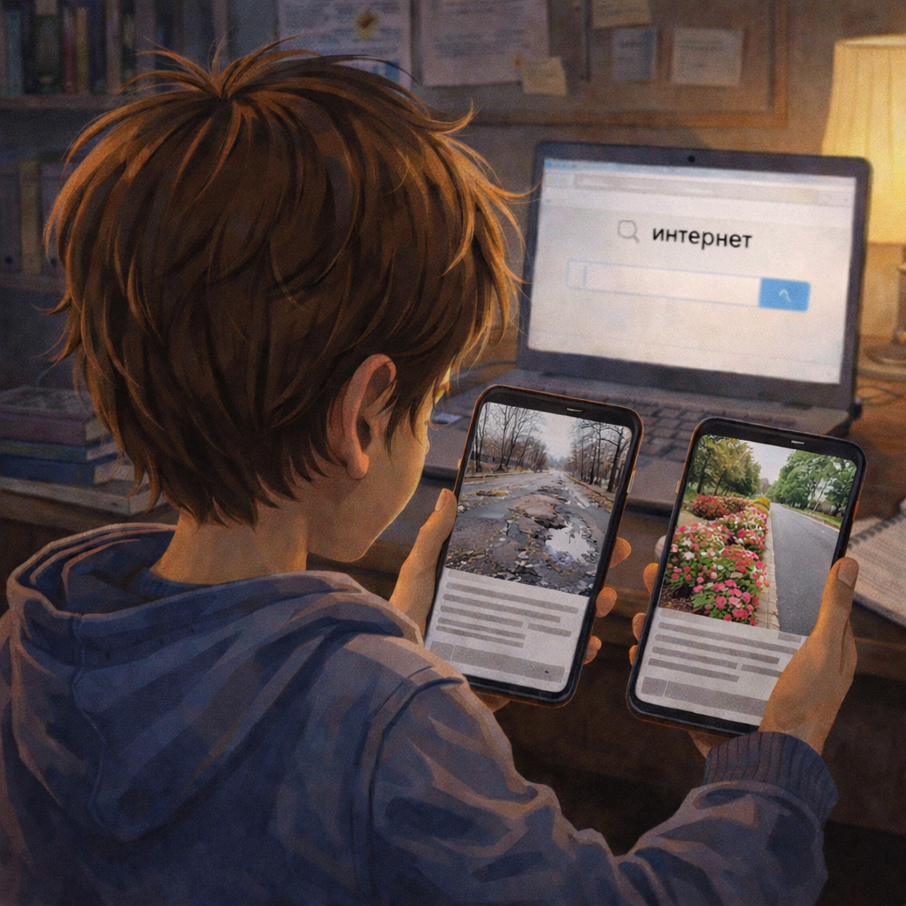

# Фейки и ложная информация: как проверять то, что прочитал

В интернете можно найти много полезного, но не всё там правда. Иногда люди ошибаются, а иногда специально придумывают *фейки* - ложные сообщения, которые должны напугать, удивить или обмануть.

Такая информация часто выглядит ярко и очень уверенно. Из-за этого хочется поверить сразу.

> 💡 Не всё, что написано уверенно и громко, является правдой.

## Как выглядит фейк? 🕵️

Нужно насторожиться, если:

- заголовок слишком громкий
- обещают *"секретную правду"*
- сообщение вызывает сильный страх или злость
- непонятно, кто это написал
- нет нормального источника

Фейк похож на слух во дворе: один придумал, второй пересказал, третий добавил от себя - и вот уже все обсуждают то, чего могло вообще не быть.

> 🚩 Если новость слишком сильно давит на эмоции, её особенно важно проверить.

## Почему фейки опасны? ⚠️

Если верить всему подряд, можно:

- испугаться без причины
- переслать ложь друзьям
- случайно помочь мошенникам

Ложная информация бегает по сети быстро. Один человек переслал другому, другой - третьему, и фейк полетел дальше.

> ⚠️ Фейк становится сильнее каждый раз, когда его пересылают без проверки.

## Как проверять информацию ✅

Есть несколько простых шагов:

1. Не верь сразу.
2. Посмотри, кто это написал.
3. Проверь, есть ли такая же информация на других надёжных сайтах.
4. Если сомневаешься, спроси взрослого.

Это похоже на проверку еды: если что-то выглядит странно, ты не станешь сразу это есть. С новостью так же - сначала проверка, потом доверие.

> ✅ Умный человек в интернете не тот, кто верит быстрее всех, а тот, кто умеет проверять.

Иногда фейки используют мошенники — об этом подробнее в статье [Кто такие интернет-мошенники и как они обманывают людей](./internet_scammers_and_tricks.md).

## Главная мысль 💡

Фейки любят спешку и невнимательность. Лучше потратить немного времени на проверку, чем случайно поверить лжи и передать её дальше.

---

**Автор:** Хныченко Артём

*Ресурсы: LLM - ChatGPT; Генерация изображений - Sora*

