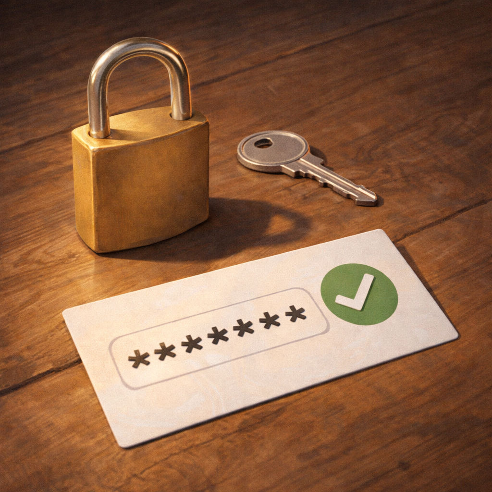

# Как придумать хороший пароль и где его хранить

Пароль - это ключ от твоего аккаунта 🔑 Он защищает почту, игры, мессенджеры и другие важные вещи. Если пароль слишком простой, злоумышленник может подобрать его и открыть "дверь" без разрешения.

> 💡 Хороший пароль нужен не для красоты, а для защиты твоего цифрового пространства.

## Почему простой пароль плохой? 🕵️

Некоторые пароли угадываются очень легко:

- `123456`
- `qwerty`
- имя
- дата рождения

Такие варианты первыми пробуют мошенники и специальные программы.

Это как закрыть дверь не на замок, а на слабую верёвочку. С виду дверь вроде закрыта, но на деле защита почти не работает.

> 🚩 Если пароль легко запомнить всем, его легко подобрать и злоумышленнику.

## Каким должен быть хороший пароль? ✅

Надёжный пароль обычно:

- достаточно длинный
- не связан с твоими личными данными
- не повторяется на всех сайтах
- не слишком простой для угадывания

Полезно брать не одно слово, а длинную необычную фразу. Такой пароль сложнее подобрать, но легче помнить тебе самому.

> ✅ Чем пароль длиннее и необычнее, тем крепче "замок" на аккаунте.

## Где нельзя хранить пароль? ❌

Плохо, если пароль лежит:

- на бумажке рядом с компьютером
- в сообщении другу
- в простой заметке без защиты

Представь, что ты спрятал ключ от дома под коврик у двери. Это вроде бы "тайник", но очень плохой. С паролями так же.

> ❌ Пароль должен быть спрятан так, чтобы его не нашёл посторонний.

Даже самый хороший пароль стоит дополнительно защищать — подробнее в статье [Что такое двухфакторная защита и зачем она нужна](./two_factor_protection.md).

## Главная мысль 💡

Хороший пароль - это важная защита, а не скучная формальность. Чем надёжнее твой цифровой ключ, тем труднее чужому человеку попасть в твой аккаунт.

---

**Автор:** Фокин Леонид

*Ресурсы: LLM - ChatGPT; Генерация изображений - Sora*
