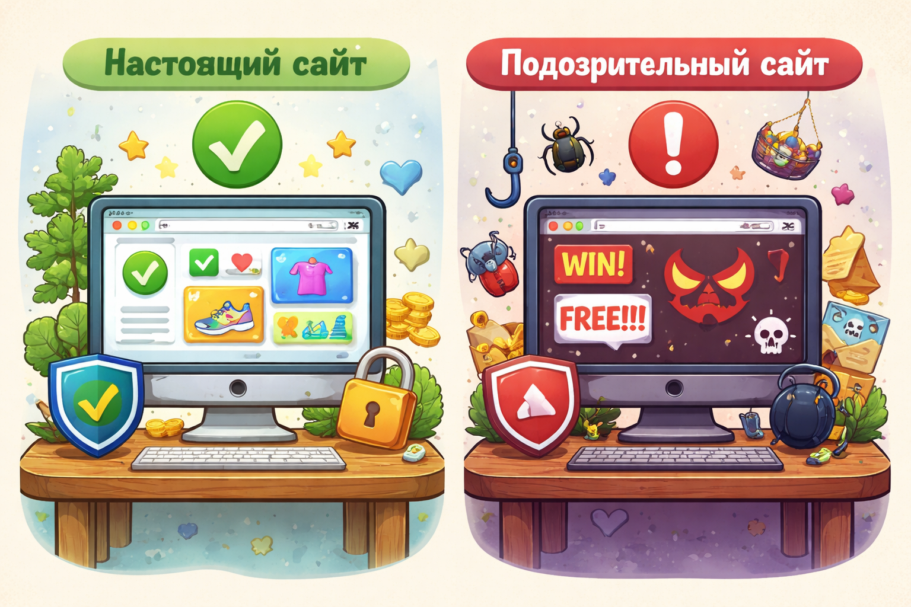

# Как распознать подозрительный сайт

Некоторые сайты только притворяются настоящими. Они могут быть похожи на магазин, игру, почту или известный сервис, но на самом деле нужны для обмана. Такие страницы стараются выманить пароль, личные данные или деньги.

> 💡 Поддельный сайт часто выглядит как настоящий, но работает совсем не для тебя.

## Почему это опасно? ⚠️

Поддельный сайт может быть очень похож на нормальный. Из-за этого человек думает, что всё в порядке, и сам вводит важную информацию.

Это как поддельная дверь в знакомом доме: с виду похоже, а за ней совсем не то место.

> ⚠️ Опасность в том, что фальшивый сайт часто выглядит убедительно.

## На что смотреть? 🕵️

Есть несколько тревожных признаков:

- странный адрес сайта
- ошибки в словах
- слишком яркие обещания
- просьба ввести лишние данные
- кривой или подозрительный вид страницы

> 🚩 Если сайт пугает, торопит или обещает чудо, нужно насторожиться.

## Что делать, если сайт кажется странным? ✅

Лучше сразу остановиться:

- не вводи пароль
- не указывай номер карты
- не оставляй личные данные
- закрой страницу
- покажи сайт взрослому

Это похоже на переход по тонкому льду: если уже видишь трещины, лучше не идти дальше.

> ✅ Если есть сомнение, лучше закрыть страницу и проверить.

Часто такие сайты связаны с опасными ссылками — подробнее читай в статье [Опасные ссылки и вложения: почему нельзя нажимать всё подряд](./dangerous_links_and_attachments.md).

## Главная мысль 💡

Подозрительный сайт опасен не потому, что он кричит о своей опасности, а потому что старается выглядеть обычным. Поэтому внимательность здесь важнее спешки.

---

**Автор:** Земсков Павел

_Ресурсы: LLM - ChatGPT; Генерация изображений - DALL-E_
