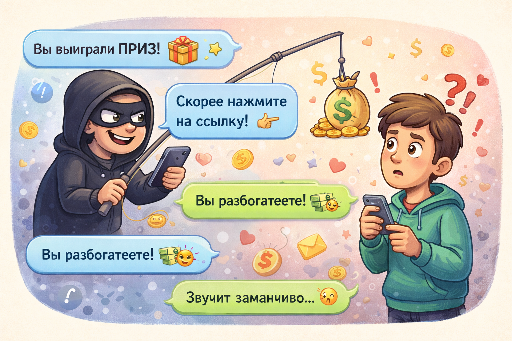

# Кто такие интернет-мошенники и как они обманывают людей

Интернет-мошенники - это люди, которые стараются получить чужие деньги, пароли или данные с помощью обмана. Они редко говорят прямо. Обычно они придумывают уловки, чтобы человек сам поверил им и сделал то, что нужно мошеннику.

> 💡 Мошенник побеждает не силой, а хитростью.

## Какие уловки встречаются чаще всего? 🎭

Вот знакомые примеры:

- *"Ты выиграл приз!"*
- *"Срочно переведи деньги!"*
- *"Скажи код из сообщения!"*
- *"Я из службы поддержки, назови пароль!"*

Это похоже на фокусника, только вместо весёлого трюка здесь обман. Мошенник старается отвлечь внимание красивыми словами, чтобы ты не заметил опасность.

> 🚩 Если тебя слишком сильно торопят, пугают или соблазняют подарком, стоит насторожиться.

## Почему люди попадаются? ⚠️

Мошенники любят играть на эмоциях. Они давят на страх, жадность, удивление или спешку. Когда человек волнуется, он меньше думает.

> ⚠️ Спешка - лучший помощник мошенника.

## Как защититься? ✅

Есть несколько простых правил:

- не верь неожиданным подаркам
- не называй коды и пароли
- не переводи деньги без взрослых
- всегда проверяй, кто тебе пишет

> ✅ Спокойствие и проверка помогают лучше, чем попытка угадать "на глаз".

Мошенники часто используют поддельные сайты и ссылки — подробнее об этом в статье [Как распознать подозрительный сайт](./how_to_recognize_suspicious_site.md).

## Главная мысль 💡

Мошенники рассчитывают, что человек поверит слишком быстро. Поэтому лучшая защита - не спешить, всё перепроверять и не делать ничего важного без уверенности.

---

**Автор:** Земсков Павел

*Ресурсы: LLM - ChatGPT; Генерация изображений - DALL-E*