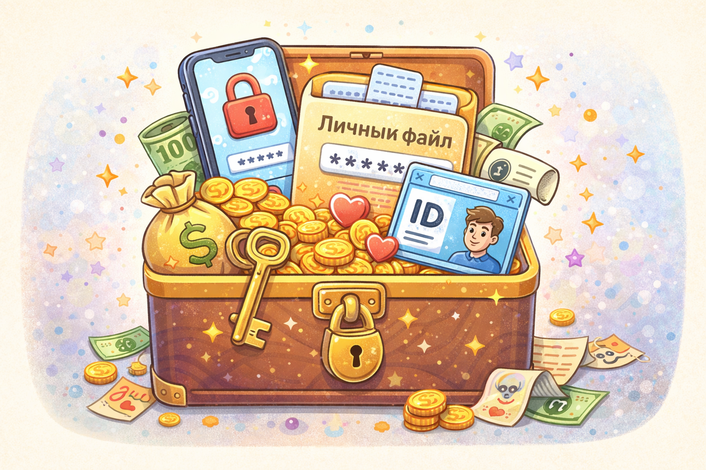

# Какие личные данные нельзя раздавать всем подряд

Личные данные - это информация о тебе: имя, адрес, номер телефона, школа, фотографии документов и многое другое. В интернете такие данные нужно беречь особенно внимательно.

> 💡 Личные данные - это не мелочь, а важная часть твоей безопасности.

## Почему личные данные важны? 🕵️

Они помогают понять, кто ты и где тебя можно найти. Если такие сведения попадут не в те руки, их могут использовать для обмана или вреда.

Личные данные можно сравнить с ключами от дома или паролем от сейфа. Их не показывают всем подряд.

> 🔒 Чем меньше лишнего о тебе знают незнакомцы, тем безопаснее.

## Что особенно нельзя сообщать? ❌

Нельзя просто так писать или отправлять:

- домашний адрес
- номер телефона
- школу и класс
- пароли и коды
- фото документов

> ❌ Всё, что помогает тебя найти, узнать или выдать себя за тебя, нужно беречь.

## О чём можно говорить осторожно? ✅

Обычно безопаснее рассказывать о хобби, любимых книгах, играх и фильмах. Но даже тут не нужно добавлять слишком много личных подробностей.

Это как разговор с новым человеком на детской площадке: можно обсудить мяч или игру, но не обязательно сразу рассказывать, где ты живёшь.

> ✅ Делиться интересами можно, а вот личными "ключами" от своей жизни - нет.

Чтобы лучше защитить свои данные, важно использовать надёжные пароли — об этом рассказано в статье [Как придумать хороший пароль и где его хранить](./good_password_and_storage.md).

## Главная мысль 💡

Личные данные нужно охранять так же внимательно, как важные вещи дома. В интернете полезно делиться интересами, но не тем, что может поставить тебя под угрозу.

---

**Автор:** Хныченко Артём

*Ресурсы: LLM - ChatGPT; Генерация изображений - DALL-E*