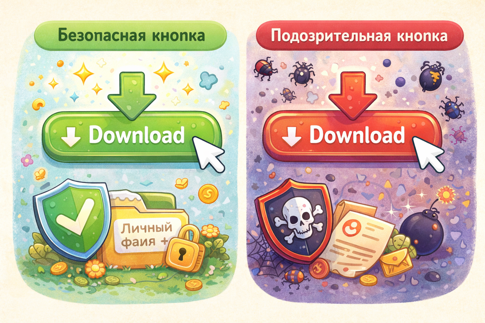

# Как безопасно скачивать игры, программы и приложения

В интернете много игр, программ и приложений. Но скачивать их нужно аккуратно. Не каждая кнопка *"Скачать"* безопасна, и не каждый сайт говорит правду.

> 💡 Безопасное скачивание начинается не с кнопки, а с проверки.

## Почему скачивание бывает опасным? ⚠️

Иногда вместе с игрой или программой на устройство попадает вирус. А ещё бывают поддельные приложения, которые только притворяются настоящими.

Это как брать еду с незнакомого стола: сначала нужно понять, можно ли ей доверять.

> ⚠️ Опасность бывает не только в самой программе, но и в том, откуда ты её берёшь.

## Где лучше скачивать? ✅

Самый безопасный путь:

- официальный магазин приложений
- официальный сайт игры или программы
- помощь взрослого при установке

> ✅ Официальный источник - это как проверенный магазин, а не случайная коробка на улице.

## Где лучше не скачивать? 🚩

Нужно насторожиться, если:

- ссылка пришла в чате
- сайт незнакомый
- обещают *"взломанную"* игру бесплатно
- на странице слишком много странной рекламы

> 🚩 Чем громче обещание "бесплатно и без правил", тем выше риск ловушки.

Также важно уметь отличать поддельные сайты — подробнее в статье [Как распознать подозрительный сайт](./how_to_recognize_suspicious_site.md).

## Главная мысль 💡

Скачивать нужно не быстро, а внимательно. Лучше потратить минуту на проверку, чем потом долго разбираться с вирусами и проблемами на устройстве.

---

**Автор:** Фокин Леонид

*Ресурсы: LLM - ChatGPT; Генерация изображений - DALL-E*