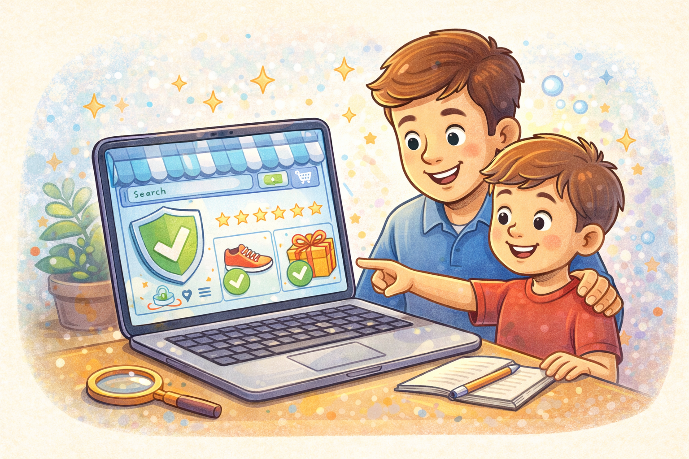

# Безопасные онлайн-покупки: как не потерять деньги

Покупать в интернете удобно: можно выбрать вещь дома и быстро оформить заказ. Но в сети встречаются и поддельные магазины. Они могут взять деньги и ничего не отправить.

> 💡 Красивый сайт и кнопка "Купить" ещё не делают магазин честным.

## Почему магазин нужно проверять? 🕵️

Не каждый сайт с товарами настоящий. Иногда мошенники делают красивую страницу только для того, чтобы выманить оплату.

Это похоже на прилавок из картона: издалека выглядит как настоящий магазин, а если подойти ближе, оказывается обманкой.

> ⚠️ Поддельный магазин старается выглядеть убедительно, чтобы ты не заметил подвоха.

## Что проверять перед покупкой? ✅

Перед заказом полезно посмотреть:

- известный это магазин или нет
- нет ли ошибок в адресе сайта
- не выглядит ли цена слишком сказочной
- есть ли понятные отзывы

> ✅ Если что-то кажется слишком выгодным, это повод быть ещё внимательнее.

## Что ребёнку нельзя делать одному? ❌

Ребёнку не стоит самому:

- вводить данные банковской карты
- покупать на незнакомом сайте
- спешить из-за надписей вроде *"только сегодня"*

> ❌ Интернет-покупки лучше делать вместе со взрослым.

Перед покупкой важно убедиться, что сайт настоящий — подробнее в статье [Как распознать подозрительный сайт](./how_to_recognize_suspicious_site.md).

## Главная мысль 💡

Онлайн-покупки могут быть удобными и безопасными, если не спешить и всё проверять. В интернете осторожность бережёт деньги так же, как крышка бережёт банку от проливания.

---

**Автор:** Ермеков Георгий

*Ресурсы: LLM - ChatGPT; Генерация изображений - DALL-E*