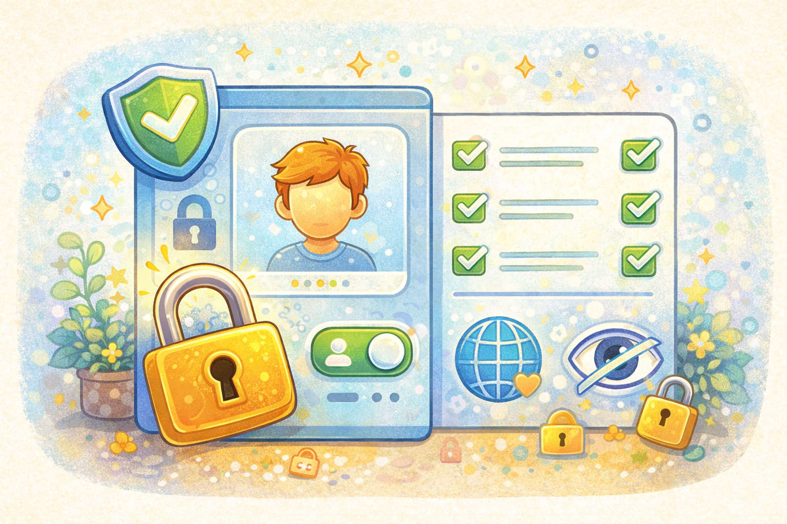

# Безопасность в социальных сетях и мессенджерах

Социальные сети и мессенджеры помогают общаться с друзьями, делиться новостями и узнавать что-то новое 📱💬. Но там важно помнить о безопасности. Всё, что ты пишешь и выкладываешь, может увидеть не только тот, кому это предназначалось.

> 💡 Профиль в соцсети - это почти как твоя комната: не каждому стоит давать туда свободный вход.

## Почему нужно настраивать профиль? 🔒

Если профиль открыт для всех, незнакомые люди могут смотреть твои фото, писать тебе и собирать информацию о тебе.

Поэтому важно:

- закрывать профиль от незнакомцев
- убирать лишние личные данные
- разрешать писать только тем, кого знаешь

> 🔒 Настройки приватности - это замок на двери твоего цифрового пространства.

## Чего делать не стоит? ❌

Есть вещи, которые в соцсетях и мессенджерах лучше не делать:

- отправлять пароль
- выкладывать адрес и номер телефона
- принимать в друзья всех подряд
- пересылать очень личные фото

> ❌ Не каждый, кто стучится в друзья, должен попадать внутрь.

## Если пришло странное сообщение 🚩

Иногда сообщение приходит будто бы от знакомого человека, но выглядит странно. В таком случае:

- не спеши отвечать
- не нажимай на ссылки
- проверь, точно ли это знакомый
- если сообщение пугает или смущает, расскажи взрослому

Это похоже на телефонный звонок от "друга", у которого вдруг стал совсем чужой голос.

> 🚩 Если сообщение странное, лучше сначала проверить, а не доверять сразу.

Особенно важно быть осторожным при общении с незнакомыми людьми — об этом в статье [Как общаться с незнакомцами в интернете](./communicating_with_strangers_online.md).

## Главная мысль 💡

Соцсети и мессенджеры могут быть удобными и безопасными, если пользоваться ими внимательно. Лишние данные, открытый профиль и спешка делают тебя уязвимее, а аккуратность - защищает.

---

**Автор:** Ермеков Георгий

_Ресурсы: LLM - ChatGPT; Генерация изображений - DALL-E_
