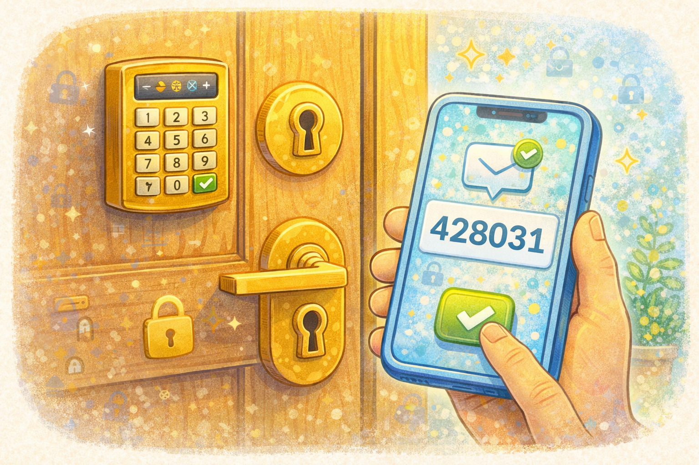

# Что такое двухфакторная защита и зачем она нужна

Иногда одного пароля мало, чтобы хорошо защитить аккаунт. Поэтому существует _двухфакторная защита_. Это дополнительная проверка, которая помогает убедиться, что входишь именно ты.

> 💡 Двухфакторная защита - это как второй замок на двери аккаунта.

## Как это работает? 🕵️

Сначала человек вводит пароль. Потом сервис просит ещё один код. Он может прийти в сообщении или появиться в специальном приложении.

Представь дверь с двумя замками. Один замок - это пароль. Второй - специальный код подтверждения. Даже если кто-то узнает первый ключ, второй всё равно не даст пройти дальше.

> 🔐 Один пароль - хорошо, а пароль плюс код - намного надёжнее.

## Почему это полезно? ✅

Если пароль украли или подсмотрели, двухфакторная защита всё равно может спасти аккаунт. Злоумышленнику не хватит одного только пароля.

> ✅ Дополнительная проверка нужна не потому, что тебе не доверяют, а потому, что так безопаснее.

## Что важно помнить? ⚠️

- код подтверждения нельзя никому сообщать
- если кто-то просит такой код, это тревожный знак
- лучше включать такую защиту там, где это возможно

> ⚠️ Код подтверждения - такой же секрет, как и пароль.

Двухфакторная защита особенно важна, если пароль могут попытаться украсть, например через поддельные сайты — об этом в статье [Как распознать подозрительный сайт](./how_to_recognize_suspicious_site.md).

## Главная мысль 💡

Двухфакторная защита делает аккаунт крепче. Это простой способ добавить ещё один слой безопасности и не пускать чужих внутрь.

---

**Автор:** Ермеков Георгий

_Ресурсы: LLM - ChatGPT; Генерация изображений - DALL-E_
