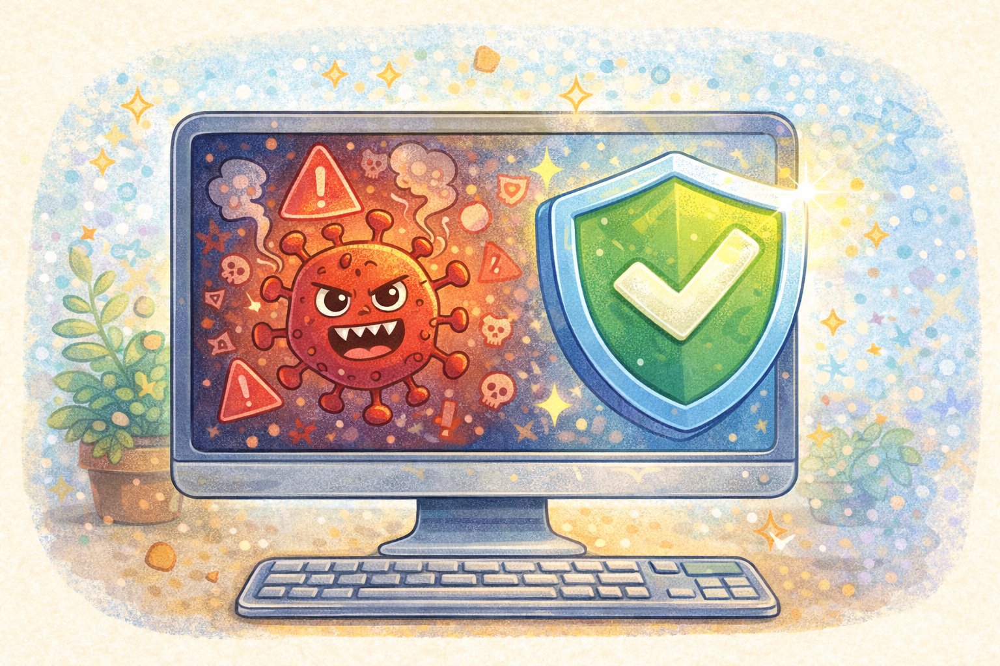

# Что такое вирусы и как они попадают на устройство

Компьютерный вирус - это вредная программа. Она может мешать устройству работать, портить файлы или красть важные данные. Вирусы не появляются сами по себе: обычно они попадают на устройство из-за неосторожных действий.

> 💡 Вирус редко приходит "сам". Чаще всего его впускают по ошибке.

## Как вирусы попадают внутрь? 🕵️

Чаще всего это происходит через:

- подозрительные ссылки
- неизвестные файлы
- скачивание с плохих сайтов
- поддельные приложения

Это похоже на грязь на обуви. Если зайти в дом, не посмотрев под ноги, можно принести внутрь неприятность. В интернете роль такой "грязи" играют опасные файлы и ссылки.

> 🚩 Вирусы часто заходят туда, где человек слишком поспешил или не проверил источник.

## Что может случиться после заражения? ⚠️

Вирус может:

- замедлить работу устройства
- показывать странную рекламу
- испортить или удалить файлы
- украсть пароль

> ⚠️ Вредная программа может испортить не только устройство, но и твои данные.

## Как уменьшить риск? ✅

Полезно соблюдать простые правила:

- скачивать только из проверенных мест
- не открывать подозрительные файлы
- обновлять устройство
- быть внимательным к ссылкам и установкам

> ✅ Осторожность человека - это первая защита от вирусов.

Часто вирусы попадают при скачивании программ — об этом рассказано в статье [Как безопасно скачивать игры, программы и приложения](./safe_downloads_games_programs_apps.md).

## Главная мысль 💡

Вирусы опасны, но часто их можно не пустить на устройство, если не открывать всё подряд и внимательно относиться к скачиванию и ссылкам.

---

**Автор:** Руснак Александр

_Ресурсы: LLM - ChatGPT; Генерация изображений - DALL-E_
