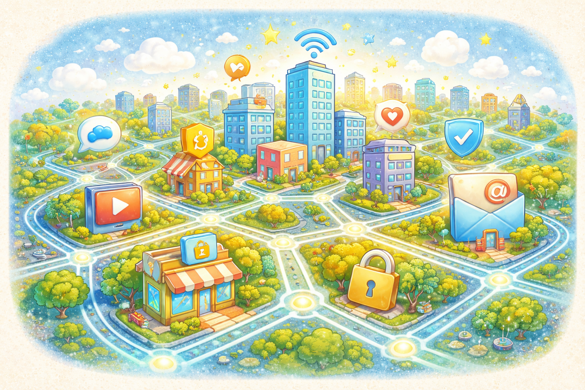

# Что такое интернет и почему в нём нужна осторожность

Интернет - это огромная сеть, которая соединяет людей, сайты, игры, видео и сообщения. С его помощью можно учиться, смотреть полезные материалы, играть и общаться с друзьями. Он открывает много возможностей, но вместе с этим требует осторожности.

> 💡 Интернет похож на большой город: в нём много интересного, но без правил там небезопасно.

## Почему интернет полезен? 🌟

Интернет помогает:

- узнавать новое
- общаться с семьёй и друзьями
- находить интересные игры, видео и книги
- быстро искать ответы на вопросы

> 🌟 Интернет может быть отличным помощником, если пользоваться им разумно.

## Почему в нём нужна осторожность? ⚠️

В сети встречаются:

- мошенники
- фейки
- вирусы
- грубые и злые люди

Если идти по незнакомому городу, ты не будешь разговаривать со всеми подряд и заходить в каждую дверь. В интернете действует то же правило.

> ⚠️ Полезность интернета не отменяет того, что в нём бывают опасности.

## Какие правила самые важные? ✅

Есть несколько простых правил, которые стоит помнить каждый день:

- не рассказывай лишнее о себе
- не верь всему сразу
- не нажимай подозрительные ссылки
- если что-то смущает, скажи взрослому

> ✅ Простые правила безопасности помогают избежать больших проблем.

Подробнее о том, какие данные нельзя раскрывать, читай в статье [Какие личные данные нельзя раздавать всем подряд](./personal_data_not_for_everyone.md).

## Главная мысль 💡

Интернет сам по себе не плохой и не хороший. Всё зависит от того, как человек им пользуется. Если быть внимательным и осторожным, он станет полезным помощником, а не источником проблем.

---

**Автор:** Руснак Александр

_Ресурсы: LLM - ChatGPT; Генерация изображений - DALL-E_
