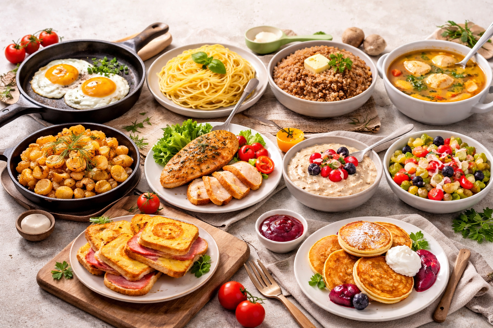

# 10 блюд, которые должен уметь готовить каждый :cooking: :star2:

Умение готовить базовые блюда — это не просто *навык выживания*, это ваш билет к независимости и вкусному питанию в **любой** ситуации. Никаких сложных техник или редких ингредиентов из слез единорога — только понятные и доступные рецепты, которые легко освоить! :muscle:

<!--- Добавлено больше поясняющих комментариев по желанию пользователя и сохранена навигация --->

*Иногда кажется, что кулинария — это магия, но на самом деле это просто правильная последовательность действий.* :magic_wand:

### Оглавление
1. [Яичница-глазунья](#1-яичница-глазунья-egg)
1. [Идеальные макароны](#2-идеальные-макароны-spaghetti)
1. [Рассыпчатая гречка](#3-рассыпчатая-гречка-seedling)
1. [Куриный бульон](#4-простой-куриный-бульон-poultry_leg)
1. [Жареная картошка](#5-домашняя-жареная-картошка-potato)
1. [Запеченная куриная грудка](#6-сочная-запеченная-курица-meat_on_bone)
1. [Овсяная каша](#7-овсяная-каша-на-завтрак-bowl_with_spoon)
1. [Базовый овощной салат](#8-базовый-овощной-салат-tomato)
1. [Горячие бутерброды](#9-горячие-бутерброды-в-духовке-sandwich)
1. [Простые оладьи](#10-простые-оладьи-pancakes)

---

### 1. Яичница-глазунья :egg:
Самый базовый завтрак, который должен уметь каждый студент или занятой человек. :alarm_clock:
- Разогрейте сковороду на среднем огне, добавьте немного масла (сливочного или растительного).
  - *Лайфхак:* сливочное масло дает лучший вкус!
- Аккуратно разбейте яйца так, чтобы не повредить желток.
- Жарьте 2-3 минуты, пока белок полностью не побелеет, а желток сохранит дрожащую текстуру.

> [!TIP]
> Чтобы желток остался жидким, не накрывайте сковороду крышкой. Если любите полностью прожаренную — накройте крышкой на последние 30 секунд. :fried_egg:

### 2. Идеальные макароны :spaghetti:
Главное правило итальянцев — макароны не должны перевариваться (состояние *al dente*). ~~Слипшаяся масса нам не нужна!~~
1. Вскипятите много воды (примерно 1 литр на 100 г пасты).
1. Обильно посолите воду — она должна быть "как морская". :ocean:
1. Забросьте макароны.
1. Варите ровно столько минут, сколько указано на упаковке (обычно 8-10 минут).

### 3. Рассыпчатая гречка :seedling:
Идеальный и супер-полезный гарнир на все времена.
- Пропорция воды и крупы — строго **2:1**. (Т.е. на 1 стакан гречки — 2 стакана воды).
- Засыпьте тщательно промытую гречку в кипящую подсоленную воду.
- Убавьте огонь до минимума, накройте крышкой и варите 15-20 минут.

> [!CAUTION]
> Не перемешивайте гречку в процессе варки! Она должна готовиться на пару, который скапливается под крышкой. :no_entry_sign:

### 4. Простой куриный бульон :poultry_leg:
Основа для десятков супов и лучшее лекарство от любой простуды. :pill:
> Положите курицу (лучше на кости, например, бедра или крылышки) в холодную воду.
> > Использование холодной воды вытянет максимальный вкус из мяса в бульон! :bulb:

> [!IMPORTANT]
> Обязательно снимайте шумовкой серую пенку, которая образуется при закипании, иначе бульон будет мутным!

После закипания убавьте огонь до минимума, бросьте луковицу в шелухе (она даст золотистый цвет) и морковку. Варите на слабом огне около часа.

### 5. Домашняя жареная картошка :potato:
Секрет той самой хрустящей корочки невероятно прост:
- Нарежьте картофель брусочками.
- Обязательно обсушите его бумажным полотенцем от лишней влаги. :droplet:
- Жарьте на хорошо разогретом масле небольшими порциями.
- ~~Солите в начале~~ Солите *только* в самом конце приготовления! Иначе картошка даст сок и превратится в кашу.

### 6. Сочная запеченная курица :meat_on_bone:
Многие жалуются на пересушенную куриную грудку. Чтобы этого избежать, используем правильный маринад:
1. Замаринуйте кусочки птицы в смеси масла, соли, паприки и чеснока на 15-20 минут.
1. Выложите на противень. *Для сочности можно завернуть в фольгу*.
1. Запекайте в духовке при 200°C всего 20-30 минут в зависимости от размера кусков.

### 7. Овсяная каша на завтрак :bowl_with_spoon:
Быстрый и питательный старт дня. Забудьте о пакетиках с искусственными ароматизаторами! :x:
- На 1 часть геркулеса (традиционного, долгого приготовления) возьмите 3 части жидкости (молоко или вода).
- Варите на медленном огне 10-15 минут, периодически помешивая.
- В конце добавьте щепотку соли, сахар и небольшой кусочек сливочного масла.

### 8. Базовый овощной салат :tomato:
Никаких сложных рецептов, просто свежесть и польза:
- Нарежьте огурцы, помидоры, редис и любую зелень (укроп, петрушку, зеленый лук).
- Заправьте оливковым маслом или хорошей жирной сметаной. :green_salad:
- Посолите и поперчите перед самой подачей.

> [!NOTE]
> Комбинируйте разные виды салатных листьев (айсберг, руккола, шпинат) для интересного вкуса и текстуры.

### 9. Горячие бутерброды в духовке :sandwich:
Отличный и супер-быстрый перекус для вечеринки или просмотра фильма. :popcorn:
1. Намажьте ломтики хлеба майонезом, кетчупом или горчицей.
1. Положите колбасу или ветчину, кружочек помидора.
1. Обильно посыпьте сверху тертым сыром (подойдет любой полутвердый).
1. Запекайте 10 минут при 180°C, пока сыр не расплавится и не приобретет золотистую корочку. 

### 10. Простые оладьи :pancakes:
Идеальное решение для уютного выходного дня. :coffee:
Вам понадобится базовая пропорция:
- 1 стакан кефира (лучше теплого)
- 1 яйцо
- 2 ст. ложки сахара и чуть-чуть соли
- 1 стакан муки (около 150 г)
- 0.5 ч. ложки соды для пышности!

\\\python
# Шуточный алгоритм идеальных оладий
def cook_pancakes(ingredients):
    if "кефир" in ingredients and "сода" in ingredients:
        mix(ingredients)
        fry_on_pan(sides=2, until="золотистый цвет")
        return "Вкусные пышные оладьи!"
    else:
        return "Кажется, чего-то не хватает!"
\\\

Тщательно перемешайте и жарьте на разогретой сковороде с растительным маслом с двух сторон.

---
### Сводная таблица блюд
| Блюдо | Время подготовки | Общее время | Сложность | Повод |
|:------|:----------------:|:-----------:|----------:|:-----:|
| Яичница | 1 мин | 5 мин | :star: | Быстрый завтрак |
| Идеальные макароны | 2 мин | 15 мин | :star: | Быстрый обед/ужин |
| Куриный бульон | 10 мин | 1 ч 20 мин | :star::star: | Болезнь, зимний день |
| Жар. картошка | 10 мин | 30 мин | :star::star: | Вкусный ужин |
| Овсяная кашка | 2 мин | 15 мин | :star: | Полезный завтрак |
| Салат | 5 мин | 5 мин | :star: | Легкий перекус / гарнир |
| Гор. бутерброды | 5 мин | 15 мин | :star: | Вечер кино |
| Оладьи | 10 мин | 20-30 мин | :star::star: | Уютные выходные |

---
**Авторы:** Демин Иван
**Слов:** 868
**Дата генерации:** 2026-03-19  
**Сервис генерации:** Gemini 3.1 Pro
