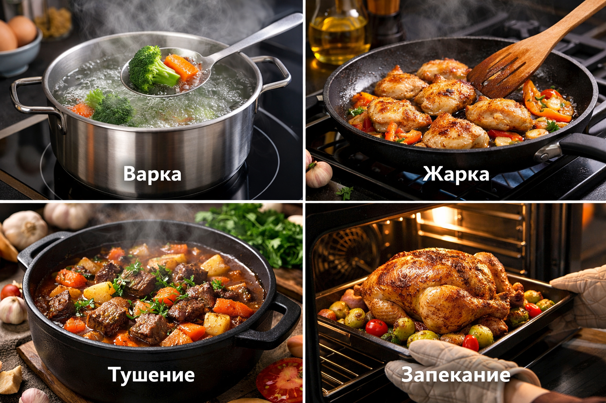

# Базовые техники тепловой обработки :fire:

Кулинария — это искусство, а понимание процессов — ключ к созданию шедевров. В этой статье мы разберем основные способы приготовления продуктов: варку, жарку, тушение и запекание, чтобы вы всегда знали, **что** и *когда* применять.

<!--- Внутренняя навигация для удобства --->
### Оглавление
1. [Варка](#варка)
1. [Жарка](#жарка)
1. [Тушение](#тушение)
1. [Запекание](#запекание)
1. [Сравнение методов](#сравнение-методов)

---

### Варка
**Варка** — это процесс приготовления пищи в кипящей жидкости, чаще всего в воде или бульоне при температуре около 100°C. Главное преимущество этого метода — отсутствие необходимости добавлять большое количество жиров.

> [!NOTE]
> Варка идеально подходит для приготовления супов, пасты, круп, яиц и легких овощных гарниров.

- **Достоинства:** Низкая калорийность, легкость приготовления.
- **Недостатки:** Часть водорастворимых витаминов (например, С и группы В) уходит в воду.

### Жарка
*Жарка* подразумевает приготовление продуктов при высокой температуре (обычно 140–200°C) с использованием жира или масла. Именно она отвечает за ту самую аппетитную хрустящую корочку — результат реакции Майяра.

> [!WARNING]
> Будьте осторожны с брызгами! Никогда не бросайте мокрые продукты в сильно разогретое масло.

Бывает нескольких видов:
- Легкая обжарка (соте)
- Жарка во фритюре
- Жарка на гриле или сковороде 

### Тушение
~~Просто свалить всё в кастрюлю~~ — нет, **тушение** — это настоящая магия! Этот метод комбинирует легкую обжарку для запечатывания вкусов и последующую долгую варку в небольшом количестве жидкости под закрытой крышкой.

> [!TIP]
> Это идеальный способ сделать жесткие куски мяса (например, говяжью лопатку) невероятно мягкими и тающими во рту, так как коллаген при долгом тушении переходит в желатин.

### Запекание
Запекание происходит за счет воздействия горячего сухого воздуха. Традиционно применяется в духовках и печах. Температура обычно варьируется от 160°C до 250°C.

> [!IMPORTANT]
> Всегда предварительно разогревайте духовку перед тем, как ставить туда блюдо, чтобы процесс приготовления начался равномерно.

### Сравнение методов

Для наглядности, вот таблица основных различий:

| Техника | Средняя температура | Рабочая среда | Для чего применять |
|:--------|:-------------------:|:-------------:|-------------------:|
| Варка   | 100°C              | Жидкость     | Бульоны, макароны, злаки, варка яиц |
| Жарка   | 150-200°C          | Масло/Жир    | Стейки, яичница, картофель |
| Тушение | 85-95°C            | Пар и жидкость| Рагу, жесткое мясо, гуляш, овощи |
| Запекание| 160-250°C         | Сухой горячий воздух | Хлебобулочные изделия, цельная птица |

---
**Авторы:** Демин Иван
**Слов:** 235
**Дата генерации:** 2026-03-19  
**Сервис генерации:** Gemini 3.1 Pro
