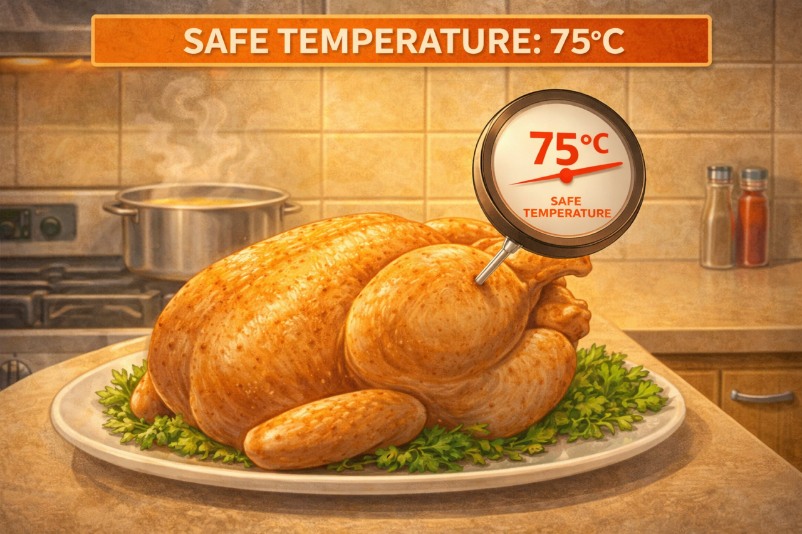

# Безопасная [температура приготовления](cooking_techniques.md): как не съесть сырое внутри

[Еда](../../../3.1. healthy lifestyle/Sleep, nutrition, and adolescent energy/articles/stress_and_food.md) может выглядеть готовой снаружи, но быть опасной внутри. Единственный способ убедиться — [температура](../../../1.1_structure_of_the_world/matter/articles/07_gases.md).

---

## 🌡️ Почему это важно?

[Бактерии](hand_hygiene.md) погибают только при определённой температуре.

> *Пример:* Курица поджарилась снаружи, но внутри осталась розовой — это [риск](../../../1.2_natural_sciences/neurobiology_for_teens/articles/05_teen_brain.md) сальмонеллы.

---

## 🍗 Безопасные температуры

| Продукт | Температура |
|---|---|
| Курица | 75°[C](../../../2.1_society/how_and_where_find_friends/articles/sora_drug.md) |
| Фарш | 70°C |
| Говядина (цельная) | 63°C |
| Рыба | 63°C |
| Яйца | до полной готовности |

---

## 🌡️ Как измерять

### 🔥 Кулинарный термометр

1. Вставь в самую толстую часть
2. Не касайся кости
3. Подожди 2-3 секунды

[!IMPORTANT]
Это самый точный способ проверки.

---

## 👀 Визуально — ненадёжно

- [Цвет](../../../1.2_natural_sciences/physics_in_everyday_life/Q1075.md) не гарантирует [безопасность](../../../1.2_natural_sciences/neurobiology_for_teens/articles/17_hugs_oxytocin.md)
- Сок может быть прозрачным, но бактерии остаются

---

## 🚫 Частые [ошибки](../../../3.1_healthy_lifestyle/pervaya_pomoshch/ushibi_porezy_ozhogi/07_ushib_chego_nelzya.md)

| [Ошибка](../../../5.1_technology_and_digital_literacy/how_internet_works/articles/http_https/http_https.md) | Чем опасно | Как правильно |
|---|---|---|
| Ориентироваться на цвет | Можно ошибиться | Использовать термометр |
| Быстро снять с огня | Не убиты бактерии | Довести до температуры |
| Не проверять середину | Внутри сыро | Проверять центр |

---

## ⏱️ Важное [правило](../../../1.2_natural_sciences/why_science_help_understand_world/patterns.md)

После приготовления не оставляй еду при комнатной температуре более 2 часов.

---

## ✅ Мини-чек-лист

1. Проверил температуру
2. Использовал термометр
3. Не ориентировался только на внешний вид

---

## 💬 Запомни

Готовность — это не цвет, а температура.

**Если нет термометра — есть риск.**

---

## 📚 Почитай также

- [Перекрёстное загрязнение](./cross_contamination.md)
- [Хранение продуктов](./safe_product_storage.md)

---
**Авторы:** Лернер Феликс
**Слов:** ~600
**Дата генерации:** 2026-03-19
**Сервис генерации:** GPT-5.3
