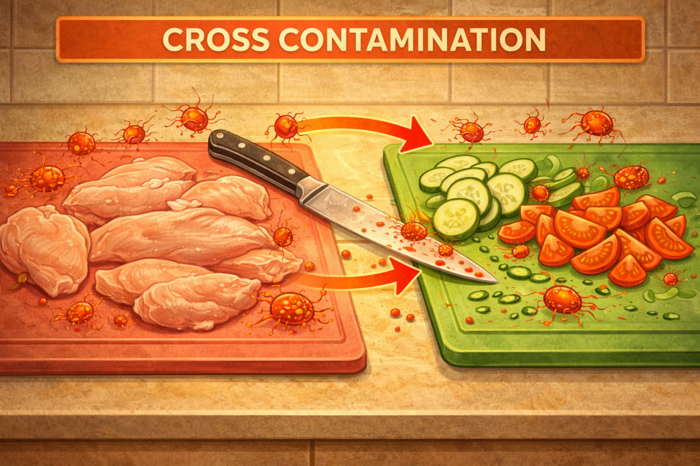

# Перекрёстное загрязнение продуктов: невидимая угроза на кухне

Ты не видишь бактерии, но они легко перемещаются по кухне — с ножа на овощи, с мяса на руки, с доски на салат. Это называется перекрёстным загрязнением.

---

## 🤔 Что это такое?

Перекрёстное загрязнение — это перенос бактерий с одного продукта на другой.

> *Пример:* Сначала нарезал курицу, потом тем же ножом огурец. Визуально всё нормально, но бактерии уже в салате.

---

## 🦠 Почему это опасно?

Сырые продукты (особенно мясо и рыба) могут содержать:

- сальмонеллу
- кишечную палочку
- кампилобактер

При попадании в готовую еду они вызывают отравление.

---

## 🔄 Как происходит заражение

1. Сырое мясо → нож
2. Нож → овощи
3. Овощи → организм

---

## 🛑 Основные правила

### 🔪 Разделяй инструменты

- Отдельные ножи
- Отдельные доски
- Отдельные контейнеры

### 🧼 Мой всё после сырого

- Нож
- Руки
- Поверхность

### 🧊 Правильное хранение

- Сырое — **внизу холодильника**
- Готовое — выше

[!WARNING]
Сок от мяса может капнуть на другие продукты — это одна из главных причин заражения.

---

## 🚫 Частые ошибки

| Ошибка | Чем опасно | Как правильно |
|---|---|---|
| Один нож для всего | Перенос бактерий | Разделяй |
| Не мыть руки после мяса | Заражение других продуктов | Мыть сразу |
| Хранить мясо сверху | Сок капает вниз | Хранить внизу |

---

## 🧠 Важный момент

Термическая обработка убивает бактерии, но если они уже попали в салат — ты их съешь.

---

## ✅ Мини-чек-лист

1. Разные доски
2. Мыть руки
3. Не смешивать сырое и готовое
4. Следить за холодильником

---

## 💬 Запомни

Перекрёстное загрязнение — это самая частая ошибка на кухне.

**Ты не видишь бактерии — но они уже там.**

---

## 📚 Почитай также

- [Гигиена рук](./hand_hygiene.md)
- [Хранение продуктов](./safe_product_storage.md)

---
**Авторы:** Лернер Феликс
**Слов:** ~600
**Дата генерации:** 2026-03-19
**Сервис генерации:** GPT-5.3
