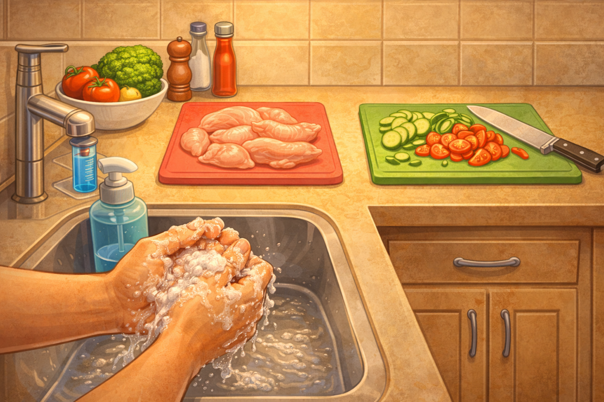

# Гигиена рук и рабочей поверхности: как не занести бактерии в еду

Ты можешь купить свежие [продукты](../../../3.1. healthy lifestyle/Sleep, nutrition, and adolescent energy/articles/healthy_school_snacks.md) и готовить по лучшим рецептам, но если руки грязные, а доска после сырого мяса — [результат](../../../1.2_natural_sciences/why_science_help_understand_world/experimental_science.md) может быть опасным. Большинство бытовых пищевых отравлений начинается именно с плохой гигиены.

---

## 🤔 Почему это важно?

На руках и поверхностях постоянно живут бактерии. Среди них могут быть опасные: сальмонелла, кишечная палочка и другие.

> *Пример:* Ты нарезал сырую курицу, быстро ополоснул руки водой и пошёл резать салат. Бактерии уже перешли на овощи — и теперь [еда](../../../3.1. healthy lifestyle/Sleep, nutrition, and adolescent energy/articles/stress_and_food.md) может стать причиной отравления.

---

## 🧼 Когда обязательно мыть руки

Мой руки **каждый раз**, когда:

1. Перед началом готовки
2. После [работы](../../../8.2_future/choosing_a_career_path/articles/interview.md) с сырым мясом, рыбой, яйцами
3. После туалета
4. После телефона или компьютера
5. После кашля, чихания
6. После мусора или грязной посуды

[!IMPORTANT]
Если сомневаешься — лучше помыть руки ещё раз.

---

## ✋ Как правильно мыть руки

1. Намочи руки тёплой водой
2. Нанеси мыло
3. Три не менее **20 секунд** (ладони, пальцы, [ногти](../../../3.1_healthy lifestyle/vrednye_privychki/articles/nailbiting.md), между пальцами)
4. Смой водой
5. Вытри чистым полотенцем или бумажной салфеткой

---

## 🧽 Чистота рабочей поверхности

### 🪵 Разделочные доски

- Для мяса — отдельная доска
- Для овощей — отдельная
- Для готовой еды — отдельная

[!WARNING]
Никогда не режь салат на доске после сырого мяса без обработки.

### 🧴 Чем обрабатывать

- Горячая [вода](../../../3.1. healthy lifestyle/Sleep, nutrition, and adolescent energy/articles/drinking_regime.md) + средство для посуды
- Кипяток (если можно)
- Уксус или слабый [раствор](../../../1.2_natural_sciences/why_science_help_understand_world/chemistry.md) соды

---

## 🧼 Столешницы и кухонные поверхности

| Что делать | Почему это важно |
|---|---|
| Протирать перед готовкой | Убираешь бактерии |
| Протирать после сырых продуктов | Убираешь возможное заражение |
| Использовать чистые губки | Грязная губка = [источник](../../../5.1_technology_and_digital_literacy/information and media literacy/дезинформация_и_фейки.md) бактерий |

---

## 🚫 Частые [ошибки](../../../3.1_healthy_lifestyle/pervaya_pomoshch/ushibi_porezy_ozhogi/07_ushib_chego_nelzya.md)

| [Ошибка](../../../5.1_technology_and_digital_literacy/how_internet_works/articles/http_https/http_https.md) | Чем опасно | Как правильно |
|---|---|---|
| Быстро сполоснуть руки водой | Бактерии остаются | Используй мыло и 20 секунд |
| Одна доска для всего | Перекрёстное заражение | Разделяй продукты |
| Грязная губка | Распространяет бактерии | Меняй или дезинфицируй |

---

## ✅ Мини-чек-лист

1. Помыл руки перед готовкой
2. Используешь разные доски
3. Протёр [поверхность](../../../1.2_natural_sciences/physics_in_everyday_life/Q35197.md)
4. Не трогаешь еду грязными руками

---

## 💬 Запомни

Чистые руки — это самая простая [защита](../../../5.1_technology_and_digital_literacy/how_internet_works/articles/dns/cdn.md) от отравления.

**Грязные руки превращают любую еду в [риск](../../../1.2_natural_sciences/neurobiology_for_teens/articles/05_teen_brain.md).**

---

## 📚 Почитай также

- [Статью про хранение продуктов](./safe_product_storage.md)
- [Статью про ножи](./knife_safety.md)

---
**Авторы:** Лернер Феликс
**Слов:** ~600
**Дата генерации:** 2026-03-19
**Сервис генерации:** GPT-5.3
