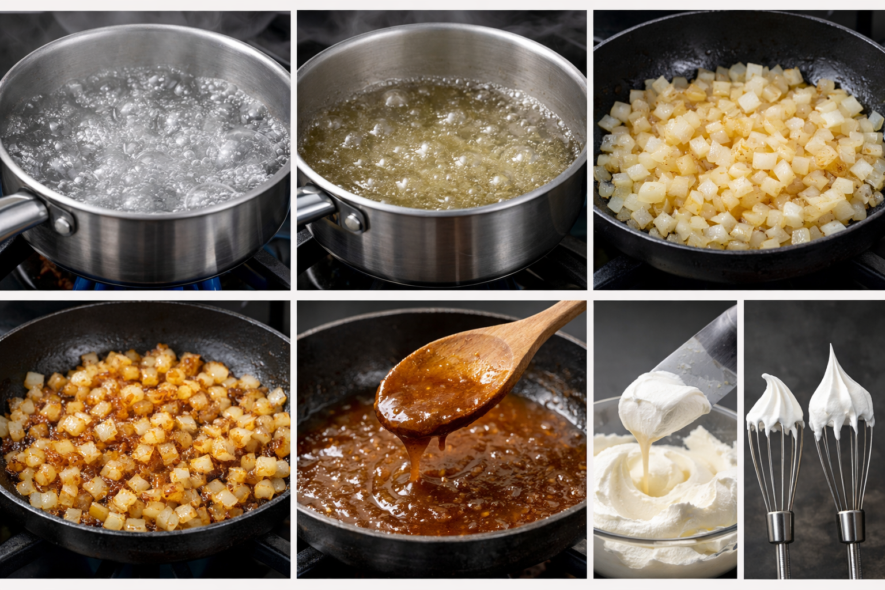

# Как читать рецепт и не ошибиться :memo: :fork_and_knife:



Рецепт — это инструкция, но написана она «кухонным языком»: там много сокращений, условностей и шагов, которые автор считает очевидными. Если читать рецепт правильно, вы экономите время, продукты и нервы — и реже получаете пересоленную пасту, сырую курицу или подгоревший пирог. :relieved:

<!--- Цель статьи: научить читать рецепты как алгоритм, а не как художественный текст --->

*Полезная привычка:* относитесь к рецепту как к мини-проекту: сначала быстро «сканируем», потом готовим. :mag_right:

### Оглавление
1. [Что проверить до старта](#что-проверить-до-старта-eyes)
1. [Термины и формулировки](#термины-и-формулировки-bookmark_tabs)
1. [Единицы измерения и пересчёты](#единицы-измерения-и-пересчёты-scales)
1. [Последовательность шагов: логика и тайминг](#последовательность-шагов-логика-и-тайминг-triangular_flag_on_post)
1. [Мини-разбор рецепта: как «перевести» шаги](#мини-разбор-рецепта-как-перевести-шаги-mag)
1. [Типичные ошибки и как их избежать](#типичные-ошибки-и-как-их-избежать-no_entry_sign)
1. [Мини-чек-лист перед готовкой](#мини-чек-лист-перед-готовкой-white_check_mark)
1. [Почитай также](#почитай-также-books)

---

### Что проверить до старта :eyes:
Перед тем как включать плиту, прочитайте рецепт целиком от начала до конца. Да, даже если он короткий.

Проверьте 5 вещей:
1. **Ингредиенты:** всё ли есть в наличии (и в нужном количестве).
2. **Инвентарь:** сковорода/форма нужного размера, тёрка, венчик, блендер, дуршлаг.
3. **Время:** активное (резать/мешать) и пассивное (тушится/выпекается/настаивается).
4. **Температуры:** духовка, масло, вода — где важно «разогреть заранее».
5. **Точки контроля:** где нужно ориентироваться не на минуту, а на признак (цвет, густота, «до мягкости»).

> [!NOTE]
> Фраза «готовьте 10 минут» часто означает «примерно 10 минут, пока не станет так-то». Окружение (плита, посуда, размер кусочков) меняет скорость.

---

### Термины и формулировки :bookmark_tabs:
Одна из главных причин ошибок — неправильная интерпретация слов. Ниже — самые частые термины и что от вас хотят.

| Термин/фраза | Что это значит на практике | На что смотреть |
|:--|:--|:--|
| **Довести до кипения** | Жидкость начала активно пузыриться | Появились крупные пузырьки по всей поверхности |
| **Томить** | Готовить на очень слабом огне, почти без кипения | Едва заметные пузырьки, «шевеление» |
| **Пассеровать** | Готовить лук/овощи в небольшом количестве масла *без* сильной корочки | Мягкость, прозрачность, лёгкий аромат |
| **Обжарить до золотистого** | Дать цвет и аромат на более высоком огне | Золотистый оттенок, но не «чёрное» |
| **Уварить** | Выпарить часть жидкости, чтобы стало гуще/концентрированнее | Объём уменьшился, соус покрывает ложку |
| **Вмешать** | Добавить аккуратно, чтобы не «выбить» воздух | Движения снизу вверх, без интенсивного взбивания |
| **Взбить до мягких/жёстких пиков** | Стадии взбитых сливок/белков | Пики держат форму с разной «жёсткостью» |

> > *Важно:* если встречаете незнакомое слово, лучше потратить 30 секунд на уточнение, чем 30 минут на спасение блюда.

---

### Единицы измерения и пересчёты :scales:
Рецепты бывают «точные» (в граммах) и «бытовые» (ложки, стаканы, «щепотка»). Самый надёжный вариант — весы: они снимают половину неопределённости.

> [!TIP]
> Если есть кухонные весы — используйте их для муки, сахара, круп, масла. Для жидкостей удобны мерный стакан и правило: **1 мл воды ≈ 1 г**, но для масла/молока это уже не 1:1.

**Частые обозначения:**
- `г`, `кг` — масса
- `мл`, `л` — объём
- `ч. л.` — чайная ложка
- `ст. л.` — столовая ложка
- `по вкусу` — добавляйте постепенно и пробуйте

Таблица ориентиров по объёму:

| Мера | Объём (примерно) | Комментарий |
|:--|:--:|:--|
| 1 ч. л. | 5 мл | Для соли/специй — лучше «без горки» |
| 1 ст. л. | 15 мл | Для масла удобно считать ложками |
| 1 стакан | 200–250 мл | В разных рецептах бывает по-разному |

> [!CAUTION]
> «1 стакан муки» у двух людей — это разные граммы: кто-то набирает рыхло, кто-то утрамбовывает. В таких местах лучше перейти на граммы или хотя бы *не утрамбовывать*.

---

### Последовательность шагов: логика и тайминг :triangular_flag_on_post:
Большинство рецептов устроено как цепочка: некоторые шаги нельзя переставлять.

**Простой принцип:** сначала подготовка, потом термообработка, потом финальные добавки.

1. **Подготовка (mise en place):** помыть, нарезать, отмерить.
2. **Разогрев:** духовка, вода, сковорода.
3. **Основной процесс:** варка/жарка/тушение/выпечка.
4. **Доведение до вкуса:** соль, кислота (лимон/уксус), специи, зелень.
5. **Отдых блюда:** некоторым вещам нужно постоять (мясо после запекания, каши под крышкой, тесто после замеса).

> [!WARNING]
> Для сырого мяса/птицы используйте отдельную доску и нож. Не кладите готовую еду на тарелку, где лежала сырая курица. Это не «занудство», а базовая безопасность.

---

### Мини-разбор рецепта: как «перевести» шаги :mag:
Возьмём типичный шаг и разберём, что он *подразумевает*.

> «Обжарьте лук до прозрачности, добавьте чеснок на 30 секунд, затем влейте томаты и уварите 10 минут»

Перевод на понятный язык:
- **«До прозрачности»** = на среднем огне, в небольшом количестве масла, без сильной корочки.
- **«Чеснок на 30 секунд»** = быстро прогреть, чтобы пошёл аромат, но не сжечь.
- **«Уварите 10 минут»** = не просто ждать: держать слабое кипение и периодически помешивать; ориентир — соус стал гуще.

И ещё один пример с «неявным» шагом:
> «Запекайте 25 минут при 180°C»
> > Это предполагает, что **духовка разогрета заранее**, а форма стоит *внутри* уже горячей камеры.

---

### Типичные ошибки и как их избежать :no_entry_sign:
| Ошибка | Почему это происходит | Как избежать |
|:--|:--|:--|
| Готовят, не читая рецепт до конца | В середине внезапно «остудить 1 час» | Сначала быстрый просмотр, потом старт |
| Солят «по вкусу» сразу много | Хотят «как в кафе» с первого раза | Солите постепенно и пробуйте |
| Путают объём и массу | «200 мл муки» звучит странно, но так пишут | Для сыпучих — граммы, для жидкостей — мл |
| Ставят еду на холодную сковороду | Боятся перегреть масло | Разогрев — часть рецепта: проверяйте температуру |
| Режут крупно/мелко не как в рецепте | Кажется, что «не важно» | Размер влияет на время: мелко готовится быстрее |

> [!IMPORTANT]
> Если рецепт кажется слишком «плавающим», добавьте себе подсказки: «лук — 5 минут до мягкости», «соус — до густоты сметаны», «курица — до прозрачного сока». Это нормально.

---

### Мини-чек-лист перед готовкой :white_check_mark:
1. Прочитал рецепт целиком и понял, **где** я могу ошибиться.
2. Отмерил ингредиенты и подготовил рабочее место.
3. Проверил посуду и размеры (сковорода/форма/кастрюля).
4. Понял, какие шаги идут строго по порядку, а какие можно параллелить.
5. Знаю ключевые термины и ориентиры готовности.

```python
# Мини-помощник: как масштабировать рецепт (например, в 1.5 раза)
# В граммах/миллилитрах масштабировать удобно, а «2 яйца» придётся округлять.

recipe = {
    "мука_г": 200,
    "молоко_мл": 300,
    "сахар_г": 40,
}

factor = 1.5
scaled = {k: round(v * factor) for k, v in recipe.items()}
print(scaled)
```

---

### Почитай также :books:
- [Базовые техники тепловой обработки](./cooking_techniques.md)
- [Правила работы с ножами](./knife_safety.md)
- [Пожарная безопасность на кухне](./kitchen_fire_safety.md)
- [Безопасное хранение продуктов](./safe_product_storage.md)

---
**Авторы:** Демин Иван  
**Слов:** 986  
**Дата генерации:** 2026-03-19  
**Сервис генерации:** GPT-5.2
