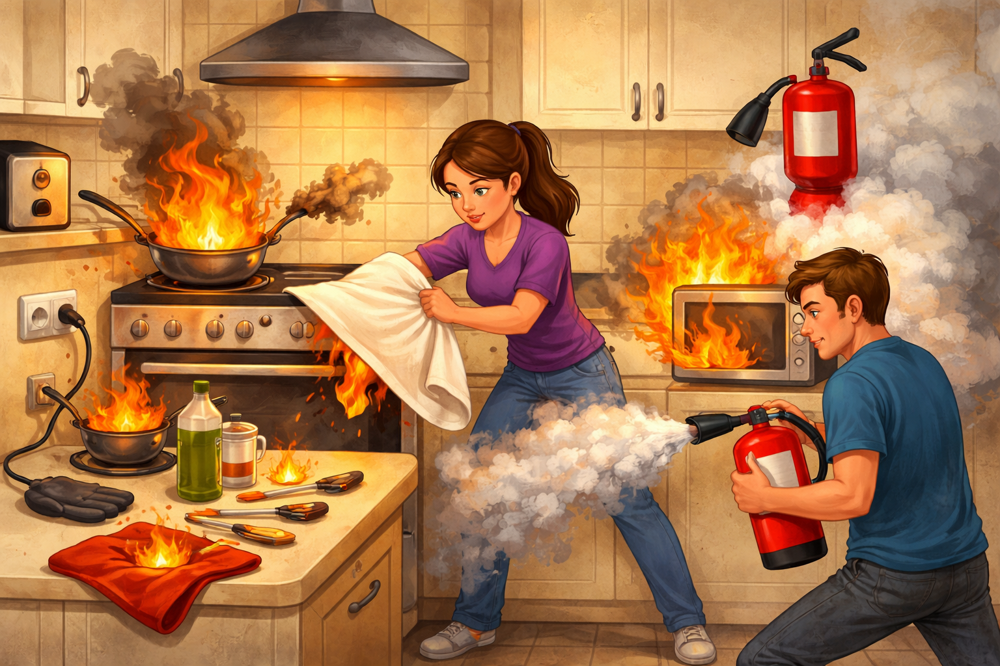

# Правила пожарной безопасности на кухне: как не устроить пожар из-за одной сковородки

Ты когда-нибудь замечал, как легко отвлечься, пока на плите закипает вода или жарится яичница? Одно уведомление в телефоне, короткий ролик в TikTok, и вот уже по кухне расползается запах гари. Кухня — это место уюта и вкусной еды, но именно здесь по статистике происходит большинство домашних пожаров.

---

## 🛡️ Что сделать до начала готовки

Перед тем как включить плиту, потрать 30-60 секунд на проверку кухни:

1. Убери с плиты и рядом с ней всё лишнее: упаковки, салфетки, полотенца, прихватки.
2. Проверь, что ручки сковородок повернуты внутрь, а не в проход.
3. Надень удобную одежду: без свободных рукавов и длинных шнурков.
4. Держи крышку от сковороды рядом, чтобы в опасный момент не искать ее по шкафам.

---

## 🧯 Главные источники опасности на кухне

### 🍳 Плита — сердце кухни и главная угроза
Неважно, какая у тебя плита: газовая, электрическая или индукционная. Любая из них вырабатывает достаточно тепла, чтобы устроить пожар. Самая частая причина возгораний — это **оставленная без присмотра еда**.

> > *Пример:* Ты поставил разогреваться масло на сковороде и пошёл на минуту в комнату ответить на сообщение. Масло перегрелось, начало дымить и вспыхнуло само по себе. Это называется температурой самовоспламенения.

### 🔌 Электроприборы и розетки
Микроволновки, чайники, тостеры, блендеры — всё это потребляет много электроэнергии. Если несколько мощных приборов включены в одну розетку или удлинитель, проводка может перегреться и загореться.

### 🔥 Открытый огонь и легковоспламеняющиеся вещи
Газовые конфорки — это открытое пламя. Если рядом с ними висит красивое кухонное полотенце, лежат бумажные салфетки или стоят пластиковые бутылки с маслом — одно неосторожное движение может привести к катастрофе.

Если используешь газовую плиту, следи не только за пламенем, но и за запахом газа. При подозрении на утечку не зажигай огонь, не включай свет и электроприборы, открой окна и перекрой газовый кран.

---

## 🚫 Частые ошибки (и как их избежать)

| Ошибка | Почему это опасно | Как сделать правильно |
|-------|------------------|---------------|
| **Оставлять еду на плите и уходить** | Масло или еда могут загореться всего за пару минут | Если нужно выйти из кухни — выключи конфорку или попроси кого-то присмотреть |
| **Готовить в просторной одежде с длинными рукавами** | Свисающие рукава легко задевают огонь на газовой плите | Закатай рукава или надень футболку перед тем, как подходить к плите |
| **Ручки сковородок торчат наружу** | Ты или кто-то другой может случайно задеть их и опрокинуть кипяток на себя | Всегда поворачивай ручки внутрь плиты, параллельно столешнице |
| **Складывать прихватки и полотенца возле конфорок** | От нагрева или случайной искры ткань легко вспыхнет | Храни текстиль на крючках подальше от нагревающихся поверхностей |

---

## 🚨 Что делать, если начался пожар?

Самое главное — **не паниковать**. От твоих первых действий зависит очень многое.

> [!WARNING]
> **ГЛАВНОЕ ПРАВИЛО:** Никогда не туши горящее масло водой! Вода тяжелее масла, она мгновенно опускается на дно раскаленной сковороды и превращается в пар. Этот пар с силой выталкивает горящее масло вверх, создавая огромный огненный столб.

### 🍳 Если загорелось масло в сковороде:
1. **Выключи плиту**, если можешь безопасно дотянуться до ручки.
2. **Накрой сковороду** плотной металлической крышкой, противнем или специальным противопожарным одеялом. Без кислорода огонь быстро погаснет.
3. **Не трогай сковороду!** Оставь её остывать там, где она стоит. Если ты попытаешься её перенести, горящее масло может расплескаться.

### ⚡ Если загорелся электроприбор (тостер или микроволновка):
1. Ни в коем случае не открывай дверцу микроволновки или духовки! Без притока свежего воздуха огонь затухнет сам.
2. Аккуратно **выдерни шнур из розетки** или отключи электричество на щитке, если розетка недоступна.

### 🧥 Если загорелась одежда:
1. Не беги - от этого пламя разгорается сильнее.
2. Остановись, упади на пол и перекатывайся, чтобы сбить пламя.
3. Попроси помочь накрыть тебя плотной тканью или противопожарным одеялом.
4. После тушения охлади обожженный участок прохладной водой 10-20 минут и при необходимости обратись к врачу.

### 🚪 Если огонь выходит из-под контроля:
Не пытайся спасти вещи или до последнего бороться с огнём, если он перекинулся на шторы или мебель. 
1. Немедленно покинь помещение.
2. Плотно закрой за собой дверь на кухню — это сильно замедлит распространение огня по квартире.
3. Вызови пожарных по телефону **101** или **112**.

Если квартира быстро задымляется, передвигайся ниже к полу: там воздух чище. Если огонь уже серьезный, приоритет один - быстро выйти и вызвать пожарных.

---

## ✅ Мини-чек-лист: как сделать кухню безопасной

1. **Протри плиту** — засохший жир отлично горит, держи поверхности в чистоте.
2. **Проверь розетки** — не включай микроволновку, чайник и тостер в один тройник.
3. **Очисти пространство вокруг плиты** — убери полотенца, бумагу и пластик подальше от конфорок.
4. **Запомни номера** — убедись, что ты и младшие сиблинги помните номер **112**.
5. **Проверь огнетушитель** — посмотри срок годности и где он лежит.
6. **Продумай выход** — путь к двери не должен быть заставлен коробками и мебелью.

---

## 💬 Запомни: безопасность важнее лайков

Кухня создана для творчества, но это творчество требует сосредоточенности. Ни одно видео или сообщение не стоит того, чтобы рисковать своим домом и здоровьем.

> **Отвлекся на секунду — потерял кухню. Будь внимателен!**

## 📚 Почитай также

- [Статью про безопасное хранение продуктов](./safe_product_storage.md)
- [Статью про правила работы с ножами](./knife_safety.md)
- [Статью про 10 блюд, которые должен уметь готовить каждый](./10_must_know_recipes.md)
- [Статью про базовые техники тепловой обработки](./cooking_techniques.md)
- [Статью про то, как читать рецепт и не ошибиться](./how_to_read_recipe.md)
- [Статью про минимальный набор кухонного инвентаря](./minimum_set_of_kitchen_utensils.md)
- [Статью про организацию рабочего места на кухне](./organizing_workspace_in_kitchen.md)
- [Статью про безопасное использование кухонной техники](./safe_use_of_kitchen_appliances.md)

---
**Авторы:** Шиширин Владислав  
**Слов:** 789  
**Дата генерации:** 2026-03-19  
**Сервис генерации:** Gemini 3.1 Pro
