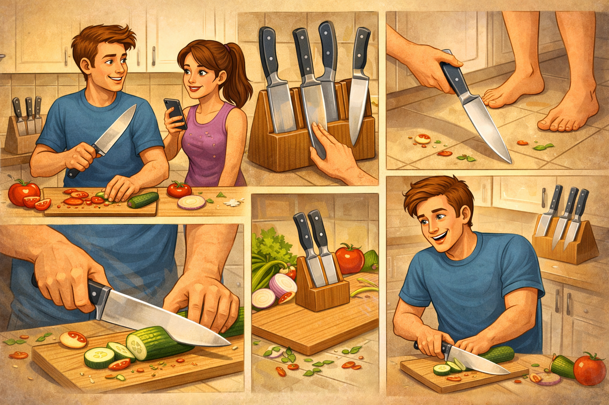

# [Правила](../../../2.1_society/cause_and_effect_relationships/articles/why_rules_work.md) [работы](../../../8.2_future/choosing_a_career_path/articles/interview.md) с ножами: как не потерять палец вместе с морковью



[Нож](minimum_set_of_kitchen_utensils.md) — это один из самых важных инструментов на кухне, но и один из самых опасных. По статистике, [порезы](safe_use_of_kitchen_appliances.md) ножом — это самая частая кухонная травма. Парадокс в [том](../../../7.1_art/musical_instruments/articles/drums.md), что острый нож намного безопаснее тупого: тупой нож требует больше [силы](../../../1.2_natural_sciences/physics_in_everyday_life/Q11423.md), скользит и [вероятность](../../../1.2_natural_sciences/physics_in_everyday_life/Q45003.md) пореза выше. Но чтобы работать с ножом без травм, нужно знать и соблюдать несколько простых правил.

---

## 🤕 Почему это важно?

[Порез](../../../3.1_healthy_lifestyle/pervaya_pomoshch/ushibi_porezy_ozhogi/08_porezy_sadiny_vidy.md) ножом может быть глубокий и кровоточивый, особенно если поранен палец, который ты держал во [время](../../../1.2_natural_sciences/physics_in_everyday_life/Q20702.md) неудачного движения. Если не оказать первую [помощь](../../../3.1_healthy_lifestyle/pervaya_pomoshch/ushibi_porezy_ozhogi/10_krovotechenie_chto_delat.md), кровь может не остановиться за долгое время, или начнётся инфекция. Кроме того, неправильная [техника](../../../1.2_natural_sciences/physics_in_everyday_life/Q133673.md) работы с ножом быстро уводит и утомляет руки, из-за чего [концентрация](../../../1.2_natural_sciences/physics_in_everyday_life/Q506710.md) падает и [риск](../../../1.2_natural_sciences/neurobiology_for_teens/articles/05_teen_brain.md) [травмы](../../../1.2_natural_sciences/physics_in_everyday_life/Q628858.md) растет.

---

## 🔪 Техника безопасной нарезки

### ✋ Как правильно держать нож

Держи нож так, чтобы рукоять была в твёрдом захвате, но не напряженно. Большой, указательный и средний палец обхватывают рукоять, безымянный и мизинец дополнительно поддерживают её внизу.

> > *Важно:* Никогда не держи нож с вытянутым указательным пальцем вверх по лезвию — это частая [причина](../../../2.1_society/cause_and_effect_relationships/articles/causality_base.md) серьёзных порезов.

### 🐾 Хватка "когтей" для продукта

Это главное [правило](../../../1.2_natural_sciences/why_science_help_understand_world/patterns.md), которое может спасти твои пальцы. Когда ты режешь овощ или фрукт, не кладешь пальцы плоско на [поверхность](../../../1.2_natural_sciences/physics_in_everyday_life/Q35197.md) продукта. Вместо этого согни пальцы так, чтобы они были похожи на когти кошки — выпуклые, а не плоские.

```
НЕПРАВИЛЬНО:          ПРАВИЛЬНО:
┌─ плоские пальцы    ┌─ согнутые, как когти
│  x x x              │  ㄱ ㄱ ㄱ
│  ─────              │  ─────
│                     │
ДА, порезаны пальцы   Пальцы защищены
```

Когда пальцы согнуты, лезвие ножа буквально не может достать до них — оно скользит по костяшкам пальцев.

### ↔️ Как режешь: движения лезвия

1. **Начальная позиция:** Нож лежит плоско на доске, острый край изгибается вверх (угол примерно 15-20 градусов от доски).
2. **[Движение](../../../1.2_natural_sciences/physics_in_everyday_life/Q11023.md) "вперед-назад":** Режь движением ножа вперед и назад, а не вверх и вниз. Это безопаснее и продукт режется ровнее.
3. **Придвигай продукт к себе:** Левая рука (если ты правша) "притягивает" продукт к лезвию, а правая работает ножом. Контролируй [расстояние](../../../1.2_natural_sciences/physics_in_everyday_life/Q11412.md) между пальцами и лезвием.

### ⛔ Никогда не режь "к себе"

Самый частый случай травмы: [человек](../../../1.2_natural_sciences/physics_in_everyday_life/Q45003.md) режет продукт движением от себя, нож вверх, и когда продукт вдруг поддаётся, лезвие летит прямо в ладонь или пальцы. Всегда режь либо вперед-назад (параллельно доске), либо от себя, но **никогда** к себе острием вверх.

---

## 🧲 Хранение ножей: [безопасность](../../../1.2_natural_sciences/neurobiology_for_teens/articles/17_hugs_oxytocin.md) для тебя и сохранность лезвия

### 📍 Где держать [ножи](organizing_workspace_in_kitchen.md)

- **Специальный [блок](../../../5.2_cybersecurity/cpp_fundamentals/2_syntax.md) для ножей** — идеальный вариант. Ножи в нём защищены, не портят друг друга и всегда под рукой.
- **Магнитная полоса на стене** — удобно и видно, какой нож где.
- **Ящик со специальными разделителями** — ножи в отдельных слотах, не скребутся друг о друга.
- **Чехлы для лезвий** — если ножи хранишь в ящике или берешь с собой.

> [!WARNING]
> Никогда не оставляй ножи в раковине, среди грязной посуды или просто в ящике стола в беспорядке. Во-первых, ты можешь случайно порезаться, доставая посуду. Во-вторых, лезвие тупится и может поржаветь.

### 🧼 Правильная мойка ножей

1. Мой нож отдельно от остальной посуды.
2. Клади нож на доску боком (лезвием вниз), не оставляй в воде вертикально.
3. Аккуратно протирай лезвие мягкой тряпкой или тряпкой с мыльной водой — движения вдоль лезвия, не поперек.
4. Вытирай полотенцем сразу после мойки.

---

## 🪒 Заточка ножей: когда и как

### ✅ Почему острый нож — это безопасно

Тупой нож требует больше силы при нажатии. Из-за этого:
- ты напрягаешь руку, быстро устаёшь,
- нож чаще скользит по продукту,
- если нож вдруг соскочит, он делает более опасный порез (потому что его нужно было придавить сильнее).

Острый нож, наоборот, режет легко и достаточно даже лёгкого нажатия.

### 🔎 [Признаки](../../../3.1_healthy_lifestyle/pervaya_pomoshch/ushibi_porezy_ozhogi/04_ushib_chto_eto_priznaki.md), что нож пора заточить

- Нож скользит по помидору вместо того, чтобы резать.
- Нужно давить сильно, чтобы нарезать хлеб.
- Режешь овощ, а он несколько раз "прыгает" на доске.

### 🛠️ [Методы](../../../4.1_rules_of_study/how_to_learn_effectively/articles/note_taking.md) заточки

| [Метод](../../../5.1_technology_and_digital_literacy/how_internet_works/articles/http_https/http_https.md) | Описание | Когда использовать |
|-------|---------|-------------------|
| **Мусат (хонинговальный стержень)** | Стальной стержень, восстанавливает остроту лезвия | Раз в 1-2 недели, если часто режешь |
| **Точильный камень** | Два разных абразива (грубый и мелкий) | Раз в месяц для полной заточки |
| **Точилка ([электрическая](../../../7.1_art/musical_instruments/articles/guitar.md) или механическая)** | Быстрый способ | Когда совсем затупился |
| **Сервис заточки** | Профессионалы | Раз в полгода-год, или если очень затупился |

> [!IMPORTANT]
> Заточку ножей можно доверить профессионалам, если ты не уверен, как это делать правильно. Неправильная заточка портит форму лезвия и делает нож опасным.

---

## 🩹 Что делать при порезе

Даже если ты соблюдаешь все правила, несчастные случаи бывают. Вот как действовать правильно.

### 📏 [Оценка](../../../4.1_rules_of_study/how_to_learn_effectively/articles/self_reflection.md) серьёзности

- **Поверхностный порез** (кровь выступила, но ранка неглубокая) — можно обработать дома.
- **Глубокий порез** (кровь течет, ощущается [боль](../../../1.2_natural_sciences/neurobiology_for_teens/articles/16_love_chemistry.md) в глубине, может быть видна жёлтая ткань) — срочно к врачу.
- **Порез с деталями** (часть пальца отвалилась, или кровь не прекращается через 10 минут) — вызывай **[103](../../../3.1_healthy_lifestyle/pervaya_pomoshch/ushibi_porezy_ozhogi/03_obschie_pravila_algorithm.md)** или **[112](../../../3.1_healthy_lifestyle/pervaya_pomoshch/ushibi_porezy_ozhogi/03_obschie_pravila_algorithm.md)**.

### 🚑 [Первая помощь](../../../3.1_healthy_lifestyle/pervaya_pomoshch/ushibi_porezy_ozhogi/01_chto_takoe_pervaya_pomoshch.md) при поверхностном порезе

1. **Остановись и успокойся.** Не паникуй, это важно.
2. **Вымой ранку чистой проточной водой** с мягким мылом, чтобы убрать [бактерии](hand_hygiene.md).
3. **Прижми ранку чистой тканью** на 5-10 минут, если кровь активно течет.
4. **Если кровь остановилась:** нанеси [антисептик](../../../3.1_healthy_lifestyle/pervaya_pomoshch/ushibi_porezy_ozhogi/12_porez_chego_nelzya.md) (хлоргексидин, перекись водорода или зеленка).
5. **Наклей [пластырь](../../../3.1_healthy_lifestyle/pervaya_pomoshch/ushibi_porezy_ozhogi/17_aptechka.md) или повязку**, если ранка глубокая или расположена в местах, где часто движется палец.

### 🚫 Важные "[нельзя](../../../3.1_healthy_lifestyle/pervaya_pomoshch/ushibi_porezy_ozhogi/07_ushib_chego_nelzya.md)"

- Не прижигай ранку спиртом дома — это может сделать хуже.
- Не оставляй глубокий порез на ночь без повязки.
- Не игнорируй признаки инфекции: покраснение, припухлость, гной, сильная боль через день-два после пореза.

> [!CAUTION]
> Если кровь не прекращается через 10 минут сильного прижатия, ранка глубокая более 0.5 см, или ты повредил сухожилие (не можешь шевелить пальцем) — это случай для травматолога. Звони **103** и объясни, что произошло.

---

## 🚫 Частые [ошибки](../../../3.1_healthy_lifestyle/pervaya_pomoshch/ushibi_porezy_ozhogi/07_ushib_chego_nelzya.md) (и как их избежать)

| [Ошибка](../../../5.1_technology_and_digital_literacy/how_internet_works/articles/http_https/http_https.md) | Чем это опасно | Как сделать правильно |
|---|---|---|
| **Держать пальцы плоско на продукте при нарезке** | Лезвие легко достает до пальцев | Согни пальцы "когтями" — костяшки защищены |
| **Резать продукт "к себе" острием вверх** | Если продукт поддаётся, нож летит прямо в тебя | Режь от себя или вперед-назад, параллельно доске |
| **Использовать тупой нож** | Требует больше силы, скользит, неконтролируемый | Заточи нож вовремя или доверь профессионалу |
| **Оставлять ножи в раковине или ящике без порядка** | Легко случайно порезаться при доставании | Храни в блоке, магнитной полосе или специальных чехлах |
| **Игнорировать глубокий порез и не показывать врачу** | Может начаться инфекция или произойти [кровотечение](../../../3.1_healthy_lifestyle/pervaya_pomoshch/ushibi_porezy_ozhogi/10_krovotechenie_chto_delat.md) | При сомнении обратись в поликлинику или [травмпункт](../../../3.1_healthy_lifestyle/pervaya_pomoshch/ushibi_porezy_ozhogi/06_ushib_kogda_vrach.md) |

---

## ✅ Мини-чек-лист безопасной работы с ножом

1. **Перед началом:** убедись, что нож острый, а доска стоит устойчиво.
2. **При нарезке:** пальцы "когтями", движения вперед-назад, [давление](../../../1.1_structure_of_the_world/matter/articles/07_gases.md) легкое.
3. **Никогда:** не режь к себе острием вверх, не отвлекайся, разговаривая.
4. **После работы:** сразу убери нож в безопасное место, помой и вытри.
5. **Заточка:** раз в 1-2 недели мусатом, раз в месяц точильным камнем или в сервисе.

---

## 💬 Запомни

Нож — это инструмент, а не игрушка. Он требует уважения и [внимания](../../../4.1_rules_of_study/how_to_memorize/articles/vnimanie.md). Правильная техника, острое лезвие и осознанность защищают лучше любой перчатки.

> **Острый нож в умелых руках — это безопасно. Тупой нож в любых руках — это риск.**

## 📚 Почитай также

- [Статью про пожарную безопасность на кухне](./kitchen_fire_safety.md)
- [Статью про безопасное хранение продуктов](./safe_product_storage.md)
- [Статью про 10 блюд, которые должен уметь готовить каждый](./10_must_know_recipes.md)
- [Статью про базовые техники тепловой обработки](./cooking_techniques.md)
- [Статью про то, как читать рецепт и не ошибиться](./how_to_read_recipe.md)
- [Статью про минимальный набор кухонного инвентаря](./minimum_set_of_kitchen_utensils.md)
- [Статью про организацию рабочего места на кухне](./organizing_workspace_in_kitchen.md)
- [Статью про безопасное использование кухонной техники](./safe_use_of_kitchen_appliances.md)

---
**Авторы:** Шиширин Владислав  
**Слов:** 1086  
**Дата генерации:** 2026-03-19  
**Сервис генерации:** Claude Haiku 4.5
