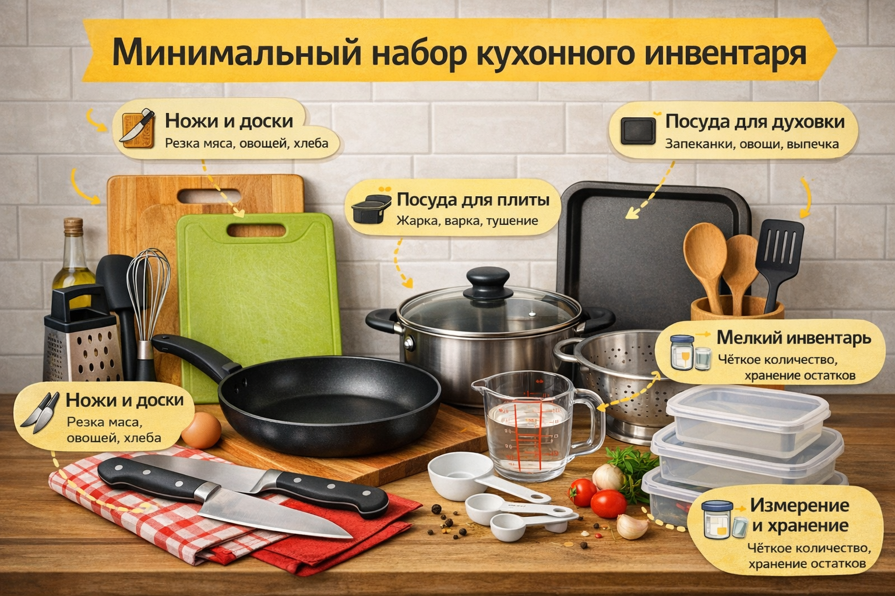

# Минимальный набор кухонного инвентаря — что реально нужно новичку и как выбрать качественные [инструменты](../../../1.2_natural_sciences/physics_in_everyday_life/Q36253.md)

## Введение

Когда только начинаешь готовить, легко потеряться среди бесконечных «обязательных» вещиц для кухни. Формы, девайсы, терки «для всего на свете» — кажется, без этого невозможно приготовить даже яичницу. На самом деле, для безопасной и удобной готовки новичку нужен очень небольшой, но продуманный набор вещей.

В этой статье разберём, какой минимальный [инвентарь](how_to_read_recipe.md) действительно нужен, чтобы:

- готовить простые и полезные блюда;
- не захламлять кухню лишними предметами;
- экономить [деньги](../../../2.1_society/cause_and_effect_relationships/articles/economic_chains.md);
- делать всё безопасно.

## [Принципы](../../../3.1_healthy_lifestyle/pervaya_pomoshch/ushibi_porezy_ozhogi/02_celi_pervoy_pomoshchi.md) минимального набора

Перед тем как что-то покупать, полезно [запомнить](../../../4.1_rules_of_study/how_to_memorize/articles/zapominanie.md) несколько простых правил:

- **Универсальность.** Один предмет должен решать как можно больше задач.
- **[Безопасность](../../../1.2_natural_sciences/neurobiology_for_teens/articles/17_hugs_oxytocin.md).** Никаких острых сколов, шатающихся ручек и токсичных покрытий.
- **Простота ухода.** Чем легче помыть и высушить вещь, тем меньше шансов, что её забросят в дальний ящик.
- **Размер под твою кухню.** Если плита маленькая и мало места, огромные кастрюли и сковороды будут только мешать.

## Что нужно новичку точно

Ниже — примерный [список](../../../5.2_cybersecurity/cpp_fundamentals/10_arrays.md) предметов, с которыми можно готовить большинство простых блюд дома.

### Обзор по группам

| Группа           | Что [минимум](../../../1.2_natural_sciences/physics_in_everyday_life/Q136980.md)                                          | Для чего нужно                                    |
|------------------|-------------------------------------------------------|---------------------------------------------------|
| [Ножи](organizing_workspace_in_kitchen.md) и доски     | 1 поварской нож, 1 маленький нож, 2 разделочные доски | Резка овощей, фруктов, хлеба, мяса                |
| Посуда для плиты | 1 кастрюля, 1 сковорода с крышкой                    | [Варка](cooking_techniques.md), [тушение](cooking_techniques.md), [жарка](cooking_techniques.md)                            |
| Посуда для запекания | 1 противень или [форма](../../../7.1_art/modern_technological_art/articles/4.5_algorithmic_craft.md) для духовки               | Запеканки, овощи, курица, выпечка                |
| Мелкий инвентарь | Лопатка, ложка, венчик/вилка, тёрка, дуршлаг        | Перемешивание, жарка, соусы, салаты              |
| [Измерение](../../../1.2_natural_sciences/physics_in_everyday_life/Q107715.md) и хранение | Мерный стакан/кружка, несколько контейнеров    | Точное количество продуктов, хранение остатков   |

Дальше разберём каждую группу подробнее.

### Ножи

Минимум, который действительно нужен:

- **Один средний поварской нож** ([длина](../../../1.2_natural_sciences/physics_in_everyday_life/Q25358.md) лезвия 16–20 см) — основная «рабочая лошадка».
- **Один маленький нож** для чистки и мелких задач (овощи, фрукты).

На что смотреть при выборе:

- лезвие из **нержавеющей стали**, ровное, без сколов;
- ручка удобно лежит в руке, не скользит, не болтается;
- нож сбалансирован — не ощущается слишком тяжёлым только в лезвии или только в ручке.

Если ножи не точить и бросать где попало, они становятся опаснее: тупое лезвие срывается и легче режет кожу. Поэтому даже минимальный набор ножей лучше иногда подтачивать.

### Разделочные доски

Минимум: **две доски**.

- Одна — для сырых продуктов (мясо, рыба, яйца).
- Другая — для всего остального (овощи, хлеб, сыр и т.д.).

Так меньше [риск](../../../1.2_natural_sciences/neurobiology_for_teens/articles/05_teen_brain.md) «перекинуть» [бактерии](hand_hygiene.md) с сырого мяса на готовую еду. Удобно, если доски отличаются цветом или рисунком.

Лучше выбирать:

- **пластиковые** или **деревянные** доски без трещин и сколов;
- размер, который уверенно помещается на стол и в раковину.

Стеклянные и каменные доски красиво смотрятся, но сильно тупят ножи и могут быть скользкими.

### Посуда для плиты

Для начала достаточно:

- **1 средняя кастрюля** (2–3 литра) — для супов, каш, пасты, варки овощей;
- **1 сковорода** среднего диаметра (22–26 см) с крышкой — для яичницы, блинов, овощей, котлет.

Важно:

- ручки не должны плавиться и сильно нагреваться;
- дно ровное, не деформированное — так [еда](../../../3.1. healthy lifestyle/Sleep, nutrition, and adolescent energy/articles/stress_and_food.md) не будет подгорать пятнами;
- если есть антипригарное [покрытие](../../../1.2_natural_sciences/physics_in_everyday_life/Q34442.md), оно должно быть ровным, без царапин.

### Посуда для духовки

Если дома есть духовка, достаточно **одного противня или формы**.

Подойдут:

- металлический противень с бортиками;
- жаропрочная стеклянная форма;
- керамическая форма среднего размера.

Такой посуды хватит для запечённых овощей, простой курицы, рыбы, запеканок и несложной выпечки.

### Мелкий инвентарь

То, что очень помогает каждый день:

- **кухонная лопатка** (силиконовая или деревянная) — чтобы переворачивать еду и не царапать покрытие;
- **большая ложка** или половник — для супов и соусов;
- **венчик** или просто удобная вилка — для соусов, омлетов, теста;
- **тёрка** с несколькими сторонами — для сыра, моркови, овощей;
- **дуршлаг** или сито — чтобы промывать крупы, [макароны](10_must_know_recipes.md), овощи.

### Измерение и хранение

Чтобы рецепты удавались, полезно иметь:

- **мерный стакан** или кружку с делениями (можно использовать обычный, если знаешь [объём](../../../1.2_natural_sciences/physics_in_everyday_life/Q39297.md));
- **2–3 контейнера с крышками** — для хранения остатков еды, нарезанных овощей, полуфабрикатов.

Это помогает меньше выбрасывать еду, планировать готовку и поддерживать [порядок](../../../1.2_natural_sciences/physics_in_everyday_life/Q45003.md) в холодильнике.

## Как выбирать качественный инвентарь

Даже минимальный набор лучше купить так, чтобы он прослужил несколько лет.

### Общие критерии

- **Никаких трещин, сколов и подозрительного запаха.** Если пластик пахнет резко — лучше не брать.
- **Ручки крепко держатся.** Потряси сковороду или кастрюлю в магазине — ничего не должно люфтить.
- **Указано, для каких плит подходит посуда.** Для индукции, газа, электрических плит требования отличаются.
- **Маркировка безопасности.** На упаковке может быть значок, что посуда подходит для контакта с пищей и выдерживает нужные температуры.

### Ножи

- Не гонись за «профессиональными» наборами — два хороших ножа лучше десяти дешёвых.
- Удобно, если нож продаётся с чехлом или есть безопасное место для хранения дома.

### Сковорода и кастрюля

- Если есть антипригарное покрытие, оно должно быть ровным, без светлых пятен и царапин.
- Слишком лёгкая сковорода часто быстро деформируется и подгорает.
- Прозрачная крышка помогает контролировать [процесс](../../../5.1_technology_and_digital_literacy/operating system/articles/process.md) и не открывать посуду лишний раз.

### Доски и мелкий инвентарь

- У досок должны быть **устойчивые ножки** или нескользящая [поверхность](../../../1.2_natural_sciences/physics_in_everyday_life/Q35197.md).
- Лопатки и ложки, которые контактируют с горячей посудой, не должны плавиться и темнеть.

## Что можно не покупать сразу

Существует [масса](../../../1.1_structure_of_the_world/matter/articles/01_matter.md) вещей, без которых можно спокойно обойтись на старте:

- [электрический](../../../3.1_healthy_lifestyle/pervaya_pomoshch/ushibi_porezy_ozhogi/15_ozhog_kogda_skoraya.md) нож, тостер, вафельница и подобные [гаджеты](../../../3.1. healthy lifestyle/Sleep, nutrition, and adolescent energy/articles/gadgets_blue_light_sleep.md);
- специальные ножи «для сыра», «для томатов», «для пиццы» — их спокойно заменят обычные;
- экзотические формы для выпечки, если ты пока не печёшь регулярно;
- «очень модные» девайсы, о которых ты узнал только из рекламы.

Если через пару месяцев ты поймёшь, что любишь печь вафли или хлеб, всегда можно докупить нужное именно тебе.

## Уход и безопасность

Даже самый хороший инвентарь перестаёт быть безопасным, если за ним не ухаживать.

- **Мой посуду сразу или как можно быстрее.** Остатки пищи портятся и могут стать источником бактерий.
- **Не оставляй ножи в раковине под водой.** Их не видно, легко порезаться.
- **Не режь на голом столе или стекле.** Так портятся и нож, и поверхность.
- **Не царапай антипригарное покрытие металлическими предметами.** Используй деревянную или силиконовую лопатку.
- **Храни ножи отдельно.** В подставке, на магнитной планке или в отдельном отсеке, чтобы не лезть рукой в «мешанину» острых предметов.

## [Заключение](../../../1.2_natural_sciences/physics_in_everyday_life/Q2225.md)

Минимальный набор кухонного инвентаря — это не огромный список дорогих предметов, а несколько продуманных вещей, которые помогают готовить просто, безопасно и без хаоса. Двух ножей, пары досок, одной кастрюли, одной сковороды и нескольких мелких инструментов достаточно, чтобы уверенно чувствовать себя на кухне и постепенно осваивать новые рецепты.

Когда появится [опыт](../../../1.2_natural_sciences/why_science_help_understand_world/experimental_science.md) и станет понятно, какие блюда ты готовишь чаще всего, к этому базовому набору всегда можно аккуратно добавить что-то ещё — уже осознанно и без лишних покупок.

---
[Автор](../../../4.2_thinking_and_working_information/how_to_search_information/articles/copypaste.md): Венков Кирилл

*[LLM](../../../7.1_art/modern_technological_art/README.md) — GPT-5.1 (GitHub Copilot)*

