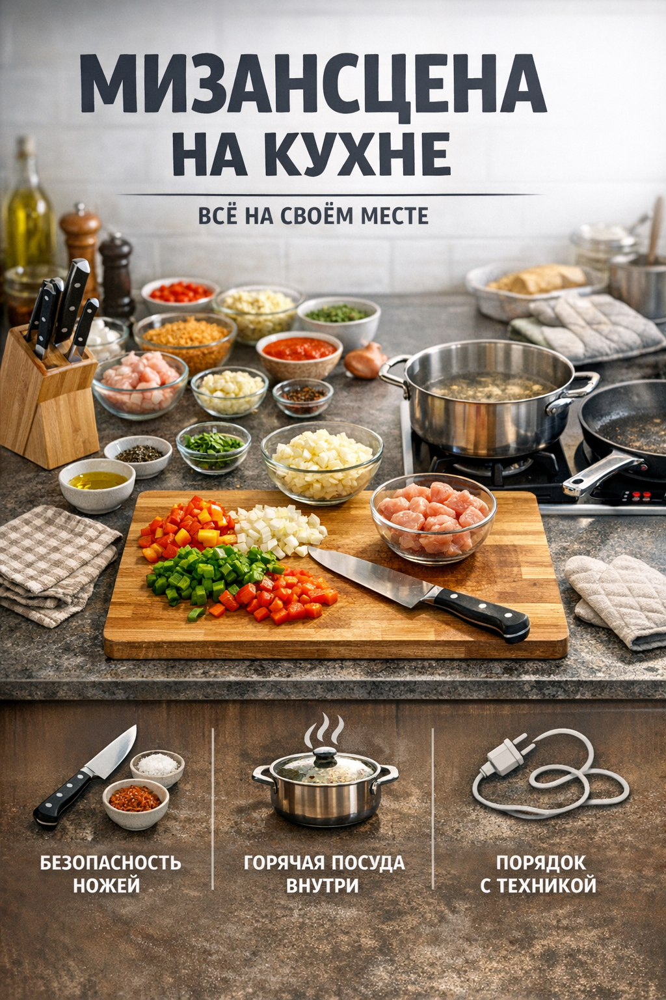

# Организация рабочего места на кухне — принцип мизансцены (mise en place), порядок на столе, безопасное расположение приборов

## Введение

Даже самая простая готовка превращается в хаос, если на кухне всё валяется как попало: нож где-то под towel, доска занята, а кастрюля стоит на краю плиты. В такой обстановке легко устать, ошибиться в рецепте и даже получить травму.

Хорошая новость: порядок на кухне — это не талант, а набор простых привычек. В этой статье разберём:

- что такое принцип **mise en place** (по-русски часто говорят «мизансцена»);
- как навести и поддерживать порядок на рабочем столе;
- как безопасно располагать ножи, горячую посуду и технику.

## Что такое mise en place

Французское выражение *mise en place* переводится как «всё на своём месте». Профессиональные повара готовят именно так: сначала готовят продукты и инструменты, а уже потом включают плиту.

Если коротко, mise en place — это:

- заранее подготовленные и нарезанные продукты;
- чистое и свободное рабочее место;
- нужная посуда и инструменты под рукой, а не где-то «надо поискать».

### Зачем это нужно

Когда ты соблюдаешь принцип mise en place:

- меньше спешки и паники — всё уже готово до начала жарки/варки;
- ниже риск ожогов и порезов — не нужно одновременно резать, искать крышку и мешать кашу;
- легче соблюдать рецепт — ничего не забывается и не подгорает, пока ты ищешь очередной ингредиент.

## Подготовка рабочего места

Перед тем как включить плиту, сделай несколько шагов:

1. **Освободи стол.** Убери всё лишнее: упаковки, гаджеты, учебники, зарядки.
2. **Протри поверхность.** Чистый стол — это и гигиена, и безопасность (ничего не скользит).
3. **Достань только то, что понадобится.** Нож, доска, кастрюля, сковорода, нужные ложки, миски.
4. **Подготовь продукты.** Помой, почисть, нарежь, разложи по мискам или тарелкам.
5. **Проверь мусорное ведро.** Хорошо, если до конца готовки его не придётся искать и переносить.

Так ты из «хаотичной кухни» делаешь маленькое рабочее место, понятное и предсказуемое.

## Зонирование: где что должно лежать

Даже на маленькой кухне можно разделить пространство на несколько условных зон.

Пример простого зонирования:

- **Зона подготовки.** Стол или часть столешницы, где стоит разделочная доска и лежат ножи.
- **Зона термообработки.** Плита и пространство вокруг неё, где стоят кастрюли и сковороды.
- **Зона временного хранения.** Место для чистых тарелок, контейнеров и уже готовой еды.

Старайся, чтобы:

- в зоне подготовки не было горячей посуды и проводов от техники;
- возле плиты не стояли пакеты, полотенца и другие легко воспламеняющиеся вещи;
- проход к раковине и мусору был свободен.

## Порядок на столе во время готовки

Даже если ты всё хорошо разложил в начале, во время готовки всё быстро растворяется в беспорядке. Важно поддерживать порядок по ходу.

### Простые правила

- **«Чистый стол — спокойная голова».** Старайся убирать упаковки, огрызки и очистки сразу.
- **Используй одну-две миски под отходы.** Так не придётся бегать к мусорке с каждой очисткой.
- **Старайся мыть посуду по ходу.** Например, пока что-то тушится или варится.
- **Не загромождай доску.** Лучше перекидывать уже нарезанное в миску или кастрюлю, а не держать всё на доске.

### Пример последовательности

1. Выбираешь рецепт и читаешь его до конца.
2. Достаёшь нужные продукты и посуду.
3. Моешь и нарезаешь всё заранее.
4. Раскладываешь нарезанное по мискам/тарелкам.
5. Только после этого включаешь плиту и начинаешь жарить/варить.

Так меньше риск, что что-то подгорит, пока ты доготавливаешь остальное.

## Безопасное расположение ножей

Нож — главный инструмент на кухне, но и главный источник травм. Правильное расположение сильно снижает риски.

Что важно:

- **Ножи лежат только на столе или в подставке.** Не оставляй их в раковине или в рандомной кастрюле с водой.
- **Лезвие — от себя.** Если кладёшь нож на стол, поворачивай лезвие от края стола.
- **Не держи нож и что-то ещё в одной руке.** Сначала убери или положи нож, потом бери посуду, телефон и т.п.
- **Передай ручкой вперёд.** Если даёшь нож другому человеку, поворачивай к нему ручкой, а не лезвием.

Храни ножи так, чтобы не лезть рукой в «ящик-сюрприз» с кучей острых лезвий.

## Безопасное расположение горячей посуды

Горячая посуда и кипящая жидкость — то, что чаще всего приводит к ожогам.

Запомни несколько правил:

- **Ручки кастрюль и сковородок поворачивай внутрь.** Тогда за них сложнее случайно зацепиться одеждой или рукой.
- **Не ставь горячее на край стола.** Всегда оставляй несколько сантиметров до края.
- **Не закрывай горячую посуду полотенцем.** Можно забыть, что внутри горячо, и обжечься.
- **Используй прихватки или сухие полотенца.** Мокрые прихватки могут «обжечь паром».

Если в доме есть дети или домашние животные, особенно важно не оставлять горячее на низких поверхностях или в проходах.

## Безопасное расположение техники и проводов

Кухонная техника (чайник, микроволновка, блендер и др.) удобна, но тоже требует аккуратности.

- **Провода не должны висеть над краем стола.** За них легко зацепиться и стянуть технику на себя.
- **Техника стоит на ровной и сухой поверхности.** Никаких луж, капель воды и наклонов.
- **Не включай несколько мощных приборов в один тройник.** Это может перегрузить сеть.
- **Держи технику подальше от раковины.** Вода и электричество — опасное сочетание.

После использования техники лучше сразу вытирать брызги и крошки вокруг неё, чтобы они не превращались в липкий слой «навсегда».

## Как превратить порядок в привычку

Разово убрать кухню можно за час. Гораздо важнее сделать так, чтобы порядок держался сам собой.

Помогают такие привычки:

- «**Сделал — убрал.**» Закончил с ножом — помыл и убрал, а не бросил где попало.
- «**Каждой вещи — своё место.**» Ножи всегда там-то, доски там-то, специи в одном уголке.
- «**Маленькие действия по пути.**» Идёшь к раковине — захвати пару кружек. Ждёшь, пока закипит вода — протри стол.

Сначала это требует усилий, но уже через несколько готовок начинаешь автоматически раскладывать всё удобнее и безопаснее.

## Заключение

Организованное рабочее место на кухне — это не про «идеальную картинку из интернета», а про комфорт и безопасность в реальной жизни. Принцип mise en place помогает заранее подготовить всё нужное, порядок на столе делает готовку спокойнее, а продуманное расположение ножей, горячей посуды и техники снижает риск травм.

Если сделать эти правила частью повседневной готовки, кухня перестаёт быть местом хаоса и превращается в понятное и безопасное рабочее пространство.

---
Автор: Венков Кирилл

*LLM — GPT-5.1 (GitHub Copilot)*

