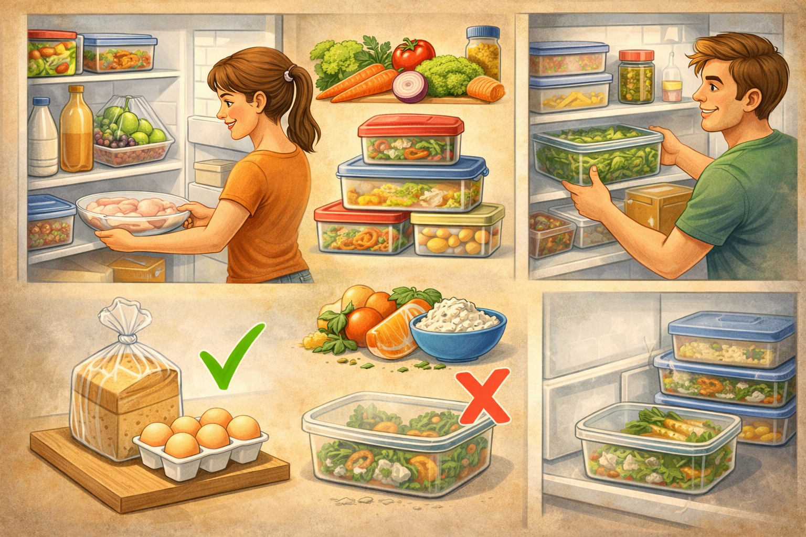

# Безопасное хранение продуктов: как холодильник может спасти тебя от отравления

Ты можешь покупать самые свежие продукты, но если хранить их неправильно, они быстро станут опасными. Большинство бытовых пищевых отравлений случается не из-за "плохого магазина", а из-за ошибок дома: не та полка, слишком теплая температура, просроченные остатки еды и неправильное соседство сырых и готовых продуктов.

---

## 🤔 Почему это важно?

Бактерии размножаются особенно быстро в так называемой "опасной зоне температур" примерно от +5 до +60 градусов. Если еда долго находится в этом диапазоне, риск отравления резко растет.

> > *Пример:* Ты приготовил курицу вечером, оставил кастрюлю на плите "до утра", а утром убрал в холодильник. На вкус может быть нормально, но за ночь в теплой среде бактерии уже успели размножиться.

Даже если продукт выглядит нормально и не пахнет "кислым", он может быть небезопасным.

---

## 🌡️ Температурные зоны холодильника: что куда класть

Один холодильник внутри может иметь разные температуры. Поэтому место хранения так же важно, как и сам факт хранения в холоде.

| Зона холодильника | Примерная температура | Что хранить |
|---|---|---|
| **Нижняя полка (самая холодная)** | от 0 до +2 градусов | Сырое мясо, сырую рыбу, фарш (в закрытых контейнерах) |
| **Средние полки** | от +2 до +4 градусов | Готовые блюда, колбасы, сыр, творог, йогурты |
| **Верхние полки** | от +4 до +6 градусов | Продукты с коротким сроком после вскрытия, десерты, остатки ужина |
| **Ящики для овощей и фруктов** | от +6 до +8 градусов | Овощи, зелень, фрукты (с учетом совместимости) |
| **Дверца холодильника** | от +6 до +10 градусов | Соусы, напитки, джемы, масло |

> [!WARNING]
> Не храни в дверце молоко, сырой фарш и другие быстро портящиеся продукты. Это самая теплая и нестабильная зона, потому что дверца постоянно открывается.

---

## 🧼 Как избежать опасного соседства продуктов

Одна из самых частых ошибок: сырое мясо лежит над салатом или готовой едой. Если сок с сырого продукта случайно капнет вниз, произойдет перекрестное загрязнение.

Основные правила:
1. Сырое мясо, рыбу и птицу держи только в герметичных контейнерах.
2. Готовую еду всегда ставь отдельно от сырой.
3. Используй разные доски и ножи для сырого мяса и готовых продуктов.
4. После контакта с сырым мясом мой руки с мылом не менее 20 секунд.

---

## ⏳ Сроки годности: как не попасть в ловушку "на вид нормально"

На упаковке обычно есть две важные вещи: общий срок годности и условия хранения. После вскрытия срок часто становится намного короче.

### 🗂️ Примеры безопасных сроков в холодильнике

| Продукт | Безопасный срок хранения |
|---|---|
| Готовый суп | до 48 часов |
| Готовая курица или мясо | до 48 часов |
| Отварной рис | до 24 часов |
| Открытое молоко | обычно 2-3 дня (смотри этикетку) |
| Торт с кремом | до 48 часов |
| Нарезанные овощи | 24-48 часов |

> [!IMPORTANT]
> Правило "сначала старое, потом новое": ставь недавно купленные продукты назад, а те, у которых срок ближе к концу, вперед. Так меньше шансов забыть еду до состояния "ой, уже поздно".

---

## 🚫 Частые ошибки (и как их избежать)

| Ошибка | Чем это опасно | Как сделать правильно |
|---|---|---|
| **Оставлять готовую еду на столе на всю ночь** | Быстрый рост бактерий при комнатной температуре | Остуди блюдо и убери в холодильник в течение 2 часов |
| **Класть горячую кастрюлю сразу в холодильник** | Температура внутри холодильника повышается, страдают другие продукты | Раздели еду на порции, слегка остуди и потом убери |
| **Ориентироваться только на запах** | Некоторые опасные бактерии не меняют запах и вкус | Проверяй дату, условия хранения и время после вскрытия |
| **Переполнять холодильник** | Воздух плохо циркулирует, продукты охлаждаются неравномерно | Оставляй свободное пространство между контейнерами |

---

## 🗑️ Как понять, что продукт лучше выбросить

Лучше не рисковать, если есть хотя бы один из признаков:
- вздутие упаковки,
- липкая или скользкая поверхность,
- непривычный кислый или гнилостный запах,
- изменение цвета, плесень,
- сомнения по сроку хранения после вскрытия.

Если сомневаешься, работает простое правило: **сомневаешься - выбрасывай**.

---

## 🚑 Что делать при подозрении на пищевое отравление

Симптомы могут включать: тошноту, рвоту, боль в животе, диарею, слабость, повышение температуры.

Порядок действий:
1. Прекрати есть подозрительный продукт.
2. Пей воду небольшими порциями, чтобы избежать обезвоживания.
3. Не принимай антибиотики без назначения врача.
4. При сильной рвоте, крови в стуле, высокой температуре или ухудшении состояния сразу звони в **103** или **112**.

> [!CAUTION]
> Для детей, пожилых людей и людей с хроническими болезнями даже легкие симптомы могут быть опасными. В этих случаях лучше не откладывать обращение к врачу.

---

## ✅ Мини-чек-лист на каждый день

1. Проверь температуру холодильника: целевой диапазон для основной камеры от 0 до +4 градусов.
2. Убери сырые продукты вниз, готовые - выше.
3. Подпиши контейнеры с готовой едой датой приготовления.
4. Раз в неделю делай ревизию полок и выбрасывай сомнительные продукты.
5. Протирай полки и контейнеры, чтобы не копилось загрязнение.

---

## 💬 Запомни

Безопасность еды - это не "паранойя", а базовый бытовой навык взрослого человека. Правильная полка, правильная температура и внимание к срокам годности защищают тебя лучше любых "лайфхаков".

> **Холодильник не лечит испорченную еду. Он только замедляет порчу.**

## 📚 Почитай также

- [Статью про пожарную безопасность на кухне](./kitchen_fire_safety.md)
- [Статью про безопасную работу с ножами](./knife_safety.md)
- [Статью про 10 блюд, которые должен уметь готовить каждый](./10_must_know_recipes.md)
- [Статью про базовые техники тепловой обработки](./cooking_techniques.md)
- [Статью про то, как читать рецепт и не ошибиться](./how_to_read_recipe.md)
- [Статью про минимальный набор кухонного инвентаря](./minimum_set_of_kitchen_utensils.md)
- [Статью про организацию рабочего места на кухне](./organizing_workspace_in_kitchen.md)
- [Статью про безопасное использование кухонной техники](./safe_use_of_kitchen_appliances.md)

---
**Авторы:** Шиширин Владислав  
**Слов:** 767  
**Дата генерации:** 2026-03-19  
**Сервис генерации:** GPT-5.3-Codex
