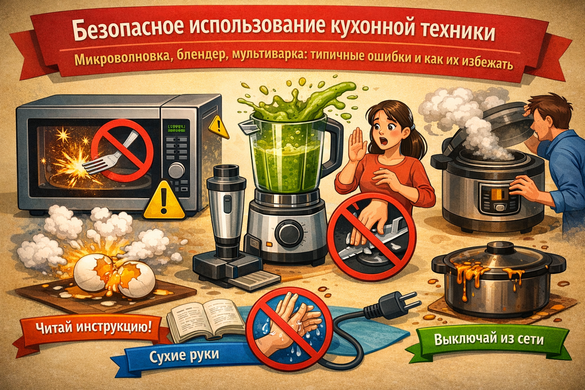

# Безопасное использование кухонной техники — микроволновка, блендер, мультиварка: типичные ошибки и как их избежать

## Введение

Кухонная техника сильно упрощает жизнь: разогреть еду за минуту, взбить смузи, приготовить кашу без постоянного помешивания. Но если пользоваться устройствами невнимательно, они могут стать источником ожогов, порезов, задымления и даже пожара.

В этой статье разберём:

- как безопасно пользоваться **микроволновкой**;
- какие правила важны при работе с **блендером**;
- о чём не забывать при использовании **мультиварки**;
- какие типичные ошибки совершают новички и как их избежать.

## Общие правила безопасности для любой техники

Прежде чем разбирать каждое устройство отдельно, важно помнить несколько общих принципов:

- **Читай инструкцию.** Даже если техника кажется «понятной», у разных моделей есть свои особенности.
- **Сухие руки и сухая поверхность.** Не включай приборы мокрыми руками и не ставь их в лужи воды.
- **Не закрывай вентиляционные отверстия.** Техника должна «дышать», иначе может перегреться.
- **Не оставляй включённые приборы без присмотра**, особенно если в них что-то готовится.
- **Не тяни за провод.** Всегда бери прибор за корпус или вилку, а не дёргай за шнур.

Дальше перейдём к конкретным устройствам.

## Микроволновка: быстро, но с умом

Микроволновая печь разогревает продукты с помощью электромагнитных волн. Это удобно, но требует аккуратности.

### Основные правила

- Используй **только подходящую посуду**: стекло, керамику, специальный пластик с пометкой, что он подходит для микроволновки.
- **Не ставь в микроволновку металл**: фольгу, металлические тарелки, кружки с золотым ободком, вилки и ложки.
- При разогреве жидкостей **не заполняй ёмкость до краёв** и лучше оставляй ложку или палочку (если это разрешено инструкцией), чтобы снизить риск «вскипания».
- Используй **крышки или колпаки** для разогрева — так еда не разбрызгивается по всей камере.
- После разогрева **осторожно открывай дверцу** и не подставляй лицо прямо к выходящему пару.

### Типичные ошибки

- Разогрев яиц в скорлупе — они могут взорваться.
- Долгое разогревание маленького объёма еды — она пересыхает и может начать дымиться.
- Использование одноразовых контейнеров без отметки для микроволновки — пластик может деформироваться и выделять вредные вещества.

## Блендер: всё смешать, но не пораниться

Блендер помогает измельчать, взбивать и смешивать продукты. Но его ножи очень острые, а мотор — довольно мощный.

### Основные правила

- **Никогда не суй пальцы внутрь чаши или стакана блендера**, пока он включён в розетку.
- Всегда **выключай блендер из сети**, прежде чем мыть ножи или доставать застрявшие кусочки.
- Не заполняй ёмкость «под завязку» — оставляй место, чтобы продуктам было куда двигаться.
- Для горячих супов и соусов давай им **немного остыть** перед измельчением и не закрывай стакан герметично — горячий пар может сорвать крышку.
- Убедись, что **крышка плотно закрыта**, прежде чем включить блендер.

### Типичные ошибки

- Включение блендера с открытой крышкой — содержимое разлетается по кухне (и может обжечь, если смесь горячая).
- Попытка вытащить застрявший кусок еды пальцами при включённой вилке.
- Мытьё ножей, держась за острые лезвия, а не за основание.

## Мультиварка: «само готовится», но правила всё равно есть

Мультиварка умеет варить, тушить, готовить на пару и даже печь. Кажется, нужно только нажать кнопку — и всё. Но, чтобы готовка была безопасной, важно соблюдать несколько условий.

### Основные правила

- Ставь мультиварку на **ровную и устойчивую поверхность**, подальше от края стола.
- Не накрывай её полотенцами, коробками и другими вещами — выходящий пар должен свободно выходить.
- Не заполняй чашу выше указанной **максимальной отметки**.
- Следи, чтобы **шнур не висел** и за него нельзя было случайно зацепиться.
- После окончания программы **осторожно открывай крышку**, отводя лицо в сторону, чтобы не обжечься паром.

### Типичные ошибки

- Открывание крышки сразу после окончания программы — сильный поток пара может обжечь лицо и руки.
- Попытка перемещать мультиварку, когда внутри горячая жидкость.
- Пренебрежение очисткой клапана пара и внутренней поверхности крышки — из-за этого техника может работать неправильно.

## Таблица типичных ошибок и как их избежать

| Прибор        | Ошибка                                         | Чем опасно                                 | Как избежать                                |
|---------------|------------------------------------------------|--------------------------------------------|---------------------------------------------|
| Микроволновка | Металлическая посуда или фольга внутри        | Искры, риск повреждения печи или пожара   | Использовать только подходящую посуду       |
| Микроволновка | Разогрев яйца в скорлупе                      | Взрыв яйца, ожоги, грязная камера         | Не разогревать цельные яйца                 |
| Блендер       | Лезвия трогают пальцами при включённой вилке  | Глубокие порезы                            | Всегда отключать от сети перед чисткой      |
| Блендер       | Измельчение очень горячей смеси в закрытой ёмкости | Выброс содержимого, ожоги             | Дать остыть, не заполнять до краёв          |
| Мультиварка   | Открытие крышки сразу после готовки           | Сильный пар, ожоги лица и рук             | Открывать аккуратно, отводя лицо в сторону  |
| Мультиварка   | Переполнение чаши выше отметки                | Выкипание, подгорание, задымление         | Соблюдать указанный уровень заполнения      |

## Что делать, если что-то пошло не так

Иногда ошибки всё же случаются. Важно знать базовые шаги:

- Если техника **подозрительно пахнет горелым** или идёт дым — сразу выключи её и выдерни вилку из розетки.
- Если внутри что-то загорелось, **не открывай дверцу микроволновки сразу** — иногда лучше просто обесточить печь и дать огню погаснуть из-за отсутствия воздуха (но в реальной опасной ситуации нужно вызывать взрослых и пожарных).
- При любом **ожоге или порезе** сначала останови действие (убери руку, выключи прибор), а потом уже обрабатывай травму и при необходимости обращайся за медицинской помощью.

## Заключение

Микроволновка, блендер и мультиварка — отличные помощники на кухне, если пользоваться ими с уважением и вниманием. Чтение инструкции, сухие руки, аккуратное обращение с ножами и горячим паром, а также привычка вовремя выключать приборы помогают избежать большинства типичных ошибок.

Когда безопасность становится привычкой, техника действительно начинает «упрощать жизнь», а не создавать новые проблемы.

---
Автор: Венков Кирилл

*LLM — GPT-5.1 (GitHub Copilot)*

