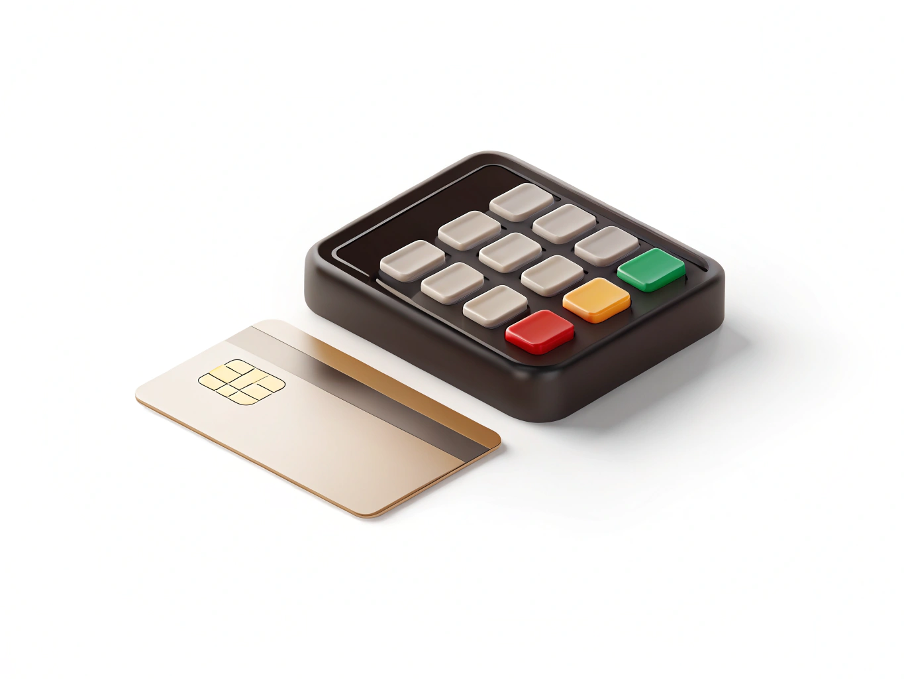

# Банковская карта

> **Коротко:** банковская карта - это способ платить без [наличных](./cash.md).

## Почему это удобно
- Не нужно носить много купюр и монет.
- Можно видеть историю покупок.
- Легче замечать и обсуждать [расходы](./expense.md) вместе с родителями.

## Как пользоваться безопасно
- Никому не сообщай PIN-код и данные карты.
- Не передавай карту другим людям.
- Подключи уведомления о покупках.

## Пример
После каждой покупки приходит сообщение, и ты можешь сразу записать [расход](./expense.md).

> **Запомни:** карта удобна, если пользоваться ею внимательно и никому не раскрывать её секретные данные.

## Что почитать дальше
- [Наличные](./cash.md)
- [Чек](./receipt.md)
- [Расход](./expense.md)
- [Бюджет](./budget.md)

---
Авторы: Алимов Ирфан Рифатович, Венгер Ирина Витальевна, Моисеев Кирилл Всеволодович, Тараскаев Давид Михайлович, Шмотова Александра Игоревна;  
GitHub ответственный: @kloshka;
Визуал: @irf4n4ik;
*Ресурсы: GigaChat/YandexGPT, ручная редактура и проверка команды 6.1*

