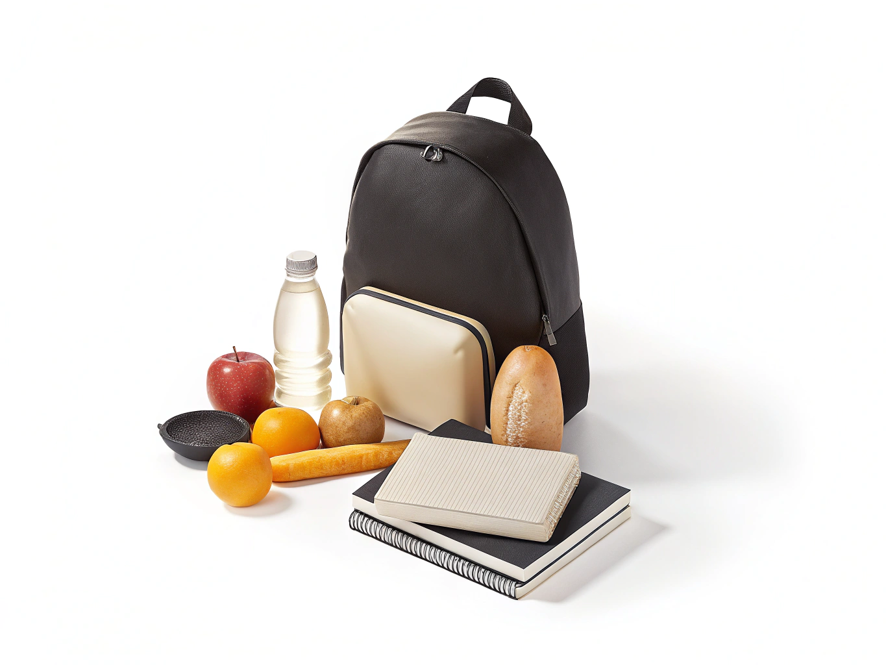

# Потребность

> **Коротко:** потребность - это то, что действительно нужно.

## Что важно знать
Потребность помогает тебе жить, учиться, быть здоровым и в безопасности.

## Примеры
- Еда и вода.
- Одежда по сезону.
- Школьные принадлежности.

## Почему это важно
Когда ты сначала закрываешь потребности, [бюджет](./budget.md) становится устойчивее и денег хватает на важное.

> **Запомни:** сначала важное, потом приятное - это одно из главных правил разумных трат.

## Что почитать дальше
- [Желание](./want.md)
- [Бюджет](./budget.md)
- [Расход](./expense.md)

---
Авторы: Алимов Ирфан Рифатович, Венгер Ирина Витальевна, Моисеев Кирилл Всеволодович, Тараскаев Давид Михайлович, Шмотова Александра Игоревна;  
GitHub ответственный: @kloshka;
Визуал: @irf4n4ik;
*Ресурсы: GigaChat/YandexGPT, ручная редактура и проверка команды 6.1*

