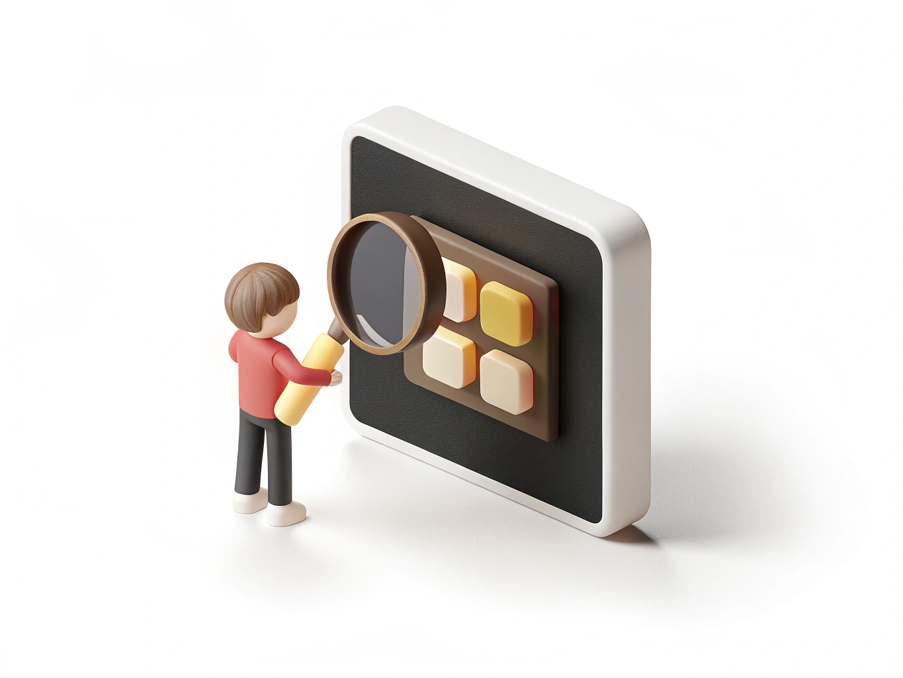

# Качество

> **Коротко:** качество - это насколько вещь надежная, удобная и долговечная.

## Почему качество важно
Иногда более дешёвая вещь быстро ломается. Тогда приходится покупать снова, и [расход](./expense.md) становится больше.

## Как действовать
- Смотри материал и сборку.
- Читай отзывы вместе со взрослыми.
- Сравнивай срок службы.

## Пример
Рюкзак подороже может прослужить два года, а дешевый - только один сезон.

> **Запомни:** иногда лучше один раз купить более качественную вещь, чем потом платить дважды.

## Что почитать дальше
- [Сравнение](./comparison.md)
- [Цена](./price.md)
- [Расход](./expense.md)
- [Потребность](./need.md)

---
Авторы: Алимов Ирфан Рифатович, Венгер Ирина Витальевна, Моисеев Кирилл Всеволодович, Тараскаев Давид Михайлович, Шмотова Александра Игоревна;  
GitHub ответственный: @kloshka;
Визуал: @irf4n4ik;
*Ресурсы: GigaChat/YandexGPT, ручная редактура и проверка команды 6.1*

