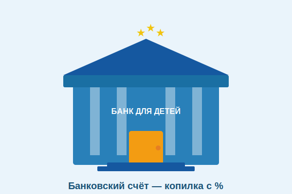

# Банковский счёт: безопасное хранение денег



[Копилка](piggy_bank.md) — отличное начало. Но когда суммы становятся больше, пора познакомиться с **банком**. Банк — это не просто место, где хранят деньги. Это инструмент, который помогает деньгам расти!

---

## 1. Что такое банк и банковский счёт

**Банк** — это организация, которая хранит деньги клиентов, выдаёт кредиты и помогает проводить платежи.

**Банковский счёт** — это твой личный «ящик» в банке, где хранятся твои деньги в цифровом виде. У каждого счёта есть уникальный номер.

---

## 2. Виды банковских счётов

### Текущий счёт (расчётный)
- Для повседневных трат
- Деньги можно снять в любой момент
- Проценты минимальные или нулевые

### Сберегательный счёт (вклад)
- Для накоплений
- Банк начисляет **проценты** — то есть платит тебе за хранение денег
- Обычно нельзя снять раньше срока без потери процентов

### Детские вклады
Многие российские банки предлагают специальные счета для детей:
- Сбербанк: «Сберегательный счёт» (можно открыть с 14 лет)
- Тинькофф: карта для детей «Tinkoff Junior» (с 7 лет)
- ВТБ: детский вклад

---

## 3. Как работает банковский вклад

Представь: ты кладёшь 1 000 ₽ под **10% годовых**.

```
Положил:      1 000 ₽
Через год:    1 000 + 10% = 1 100 ₽
Через 2 года: 1 100 + 10% = 1 210 ₽
Через 5 лет:  ≈ 1 611 ₽  (+61%!)
```

Твои деньги **растут сами по себе** — это сила [процентов](interest.md)!

---

## 4. Как открыть счёт ребёнку

По российским законам:
- С **14 лет** — можно открыть счёт самостоятельно (с согласия родителей)
- **До 14 лет** — счёт открывают родители, но ты можешь пользоваться картой

Шаги:
1. Вместе с родителями выбери банк (сравни проценты по вкладам)
2. Прийти в офис или открыть онлайн
3. Принести паспорт родителя и свидетельство о рождении
4. Получить карту или реквизиты счёта

---

## 5. Безопасность в банке

Один из главных плюсов банка — **безопасность**:

- **Страхование вкладов** — в России вклады до **1,4 миллиона рублей** застрахованы государством. Даже если банк обанкротится, тебе вернут деньги!
- Карты защищены **PIN-кодом** и технологией 3D Secure
- Все операции отслеживаются и записываются

> ⚠️ Важно: никогда не сообщай PIN-код или CVV-код карты посторонним — даже тем, кто представляется сотрудником банка!

---

## 6. Банк vs. Копилка

| | Копилка | Банковский счёт |
|--|---------|-----------------|
| Где хранятся деньги | Дома | В банке |
| Безопасность | Низкая (могут украсть) | Высокая |
| Проценты | Нет | Да! |
| Удобство | Просто | Чуть сложнее |
| Подходит для | Маленьких сумм | Крупных накоплений |

---

## 7. Интересные факты

- Первый в мире банк появился в **Италии в 1157 году** — Банк Венеции.
- В России сейчас более **300 банков**, но крупнейшие — Сбербанк, ВТБ, Газпромбанк.
- Слово «банк» происходит от итальянского *banca* — **скамья**, потому что средневековые менялы сидели на скамейках и проводили операции прямо на улице.

---

*Похожие темы: [Копилка](piggy_bank.md) | [Проценты](interest.md) | [Сбережения](saving.md) | [Инфляция](inflation.md)*

---
Автор: Команда «Как копить на цель»

*Использованные нейросети: Claude (Anthropic) для генерации текста*
