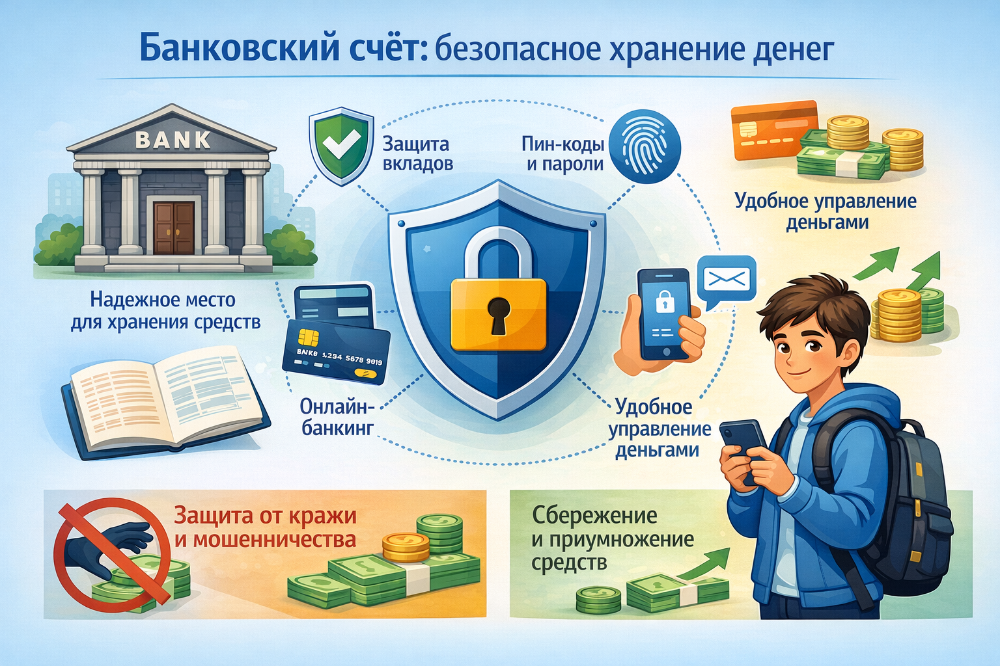

# Банковский счёт: безопасное хранение [денег](../../../8.2_future/choosing_a_career_path/articles/salary.md)



[Копилка](piggy_bank.md) — отличное начало. Но когда суммы становятся больше, пора познакомиться с **банком**. Банк — это не просто место, где хранят [деньги](../../../2.1_society/cause_and_effect_relationships/articles/economic_chains.md). Это инструмент, который помогает [деньгам](../../../8.2_future/choosing_a_career_path/articles/salary.md) расти!

---

## 1. Что такое банк и банковский счёт

**Банк** — это [организация](../../../4.1_rules_of_study/how_to_learn_effectively/articles/learning_environment.md), которая хранит деньги клиентов, выдаёт кредиты и помогает проводить платежи.

**Банковский счёт** — это твой личный «ящик» в банке, где хранятся твои деньги в цифровом виде. У каждого счёта есть уникальный номер.

---

## 2. [Виды](../../../3.1_healthy_lifestyle/pervaya_pomoshch/ushibi_porezy_ozhogi/08_porezy_sadiny_vidy.md) банковских счётов

### Текущий счёт (расчётный)
- Для повседневных трат
- Деньги можно снять в любой момент
- [Проценты](../../../6.2_money_and_finance/personal_budget/credit.md) минимальные или нулевые

### Сберегательный счёт (вклад)
- Для накоплений
- Банк начисляет **проценты** — то есть платит тебе за хранение денег
- Обычно [нельзя](../../../3.1_healthy_lifestyle/pervaya_pomoshch/ushibi_porezy_ozhogi/07_ushib_chego_nelzya.md) снять раньше срока без потери процентов

### Детские вклады
Многие российские банки предлагают специальные счета для детей:
- Сбербанк: «Сберегательный счёт» (можно открыть с 14 лет)
- Тинькофф: [карта](../../../5.1_technology_and_digital_literacy/information and media literacy/карта_компетенций_по_возрастам.md) для детей «Tinkoff Junior» (с 7 лет)
- ВТБ: детский вклад

---

## 3. Как работает банковский вклад

Представь: ты кладёшь 1 000 ₽ под **10% годовых**.

```
Положил:      1 000 ₽
Через год:    1 000 + 10% = 1 100 ₽
Через 2 года: 1 100 + 10% = 1 210 ₽
Через 5 лет:  ≈ 1 611 ₽  (+61%!)
```

Твои деньги **растут сами по себе** — это [сила](../../../1.2_natural_sciences/physics_in_everyday_life/Q11023.md) [процентов](interest.md)!

---

## 4. Как открыть счёт ребёнку

По российским законам:
- С **14 лет** — можно открыть счёт самостоятельно (с согласия родителей)
- **До 14 лет** — счёт открывают [родители](../../../../8.1_self_understanding/articles/family_influence.md), но ты можешь пользоваться картой

[Шаги](../../../7.2 Media, leisure and hobbies/Computer games/articles/dream_team/composer.md):
1. Вместе с родителями выбери банк (сравни проценты по вкладам)
2. Прийти в [офис](../../../8.2_future/choosing_a_career_path/articles/office.md) или открыть [онлайн](../../../3.2 healthy lifestyle/how to act in a dangerous situation/articles/internet-safety.md)
3. Принести паспорт родителя и свидетельство о рождении
4. Получить карту или реквизиты счёта

---

## 5. [Безопасность](../../../1.2_natural_sciences/neurobiology_for_teens/articles/17_hugs_oxytocin.md) в банке

Один из главных плюсов банка — **безопасность**:

- **Страхование вкладов** — в России вклады до **1,4 миллиона рублей** застрахованы государством. Даже если банк обанкротится, тебе вернут деньги!
- Карты защищены **PIN-кодом** и технологией 3D Secure
- Все операции отслеживаются и записываются

> ⚠️ Важно: никогда не сообщай PIN-код или CVV-код карты посторонним — даже тем, кто представляется сотрудником банка!

---

## 6. Банк vs. [Копилка](../../../6.1_Independent_living_and_daily_living_skills/reasonable_spending/articles/savings.md)

| | Копилка | Банковский счёт |
|--|---------|-----------------|
| Где хранятся деньги | Дома | В банке |
| Безопасность | Низкая (могут украсть) | Высокая |
| Проценты | Нет | Да! |
| [Удобство](../../../6.1_Independent_living_and_daily_living_skills/reasonable_spending/articles/quality.md) | Просто | Чуть сложнее |
| Подходит для | Маленьких сумм | Крупных накоплений |

---

## 7. Интересные [факты](../../../1.2_natural_sciences/physics_in_everyday_life/Q17737.md)

- Первый в мире банк появился в **Италии в 1157 году** — Банк Венеции.
- В России сейчас более **300 банков**, но крупнейшие — Сбербанк, ВТБ, Газпромбанк.
- Слово «банк» происходит от итальянского *banca* — **скамья**, потому что средневековые менялы сидели на скамейках и проводили операции прямо на улице.

---

*Похожие темы: [Копилка](piggy_bank.md) | [Проценты](interest.md) | [Сбережения](saving.md) | [Инфляция](inflation.md)*

---

## Читай также из других разделов

- [Пароли и двухфакторная защита](../../../5.1_technology_and_digital_literacy/information%20and%20media%20literacy/articles/пароли_и_двухфакторная_защита.md) — раздел 5.1 «[Медиаграмотность](../../../4.2_thinking_and_working_information/critical_thinking/articles/manipulation_recognition.md)»
- [Приватность и цифровой след](../../../5.1_technology_and_digital_literacy/information%20and%20media%20literacy/articles/приватность_и_цифровой_след.md) — раздел 5.1 «Медиаграмотность»

---
[Автор](../../../4.2_thinking_and_working_information/how_to_search_information/articles/copypaste.md): [Команда](../../../4.1_rules_of_study/how_to_learn_effectively/articles/peer_learning.md) «[Как копить](piggy_bank.md) на [цель](../../../1.2_natural_sciences/why_science_help_understand_world/research_work.md)»

*Использованные [нейросети](../../../2.1_society/cause_and_effect_relationships/articles/ai_causality.md): Claude (Anthropic) для генерации текста*
