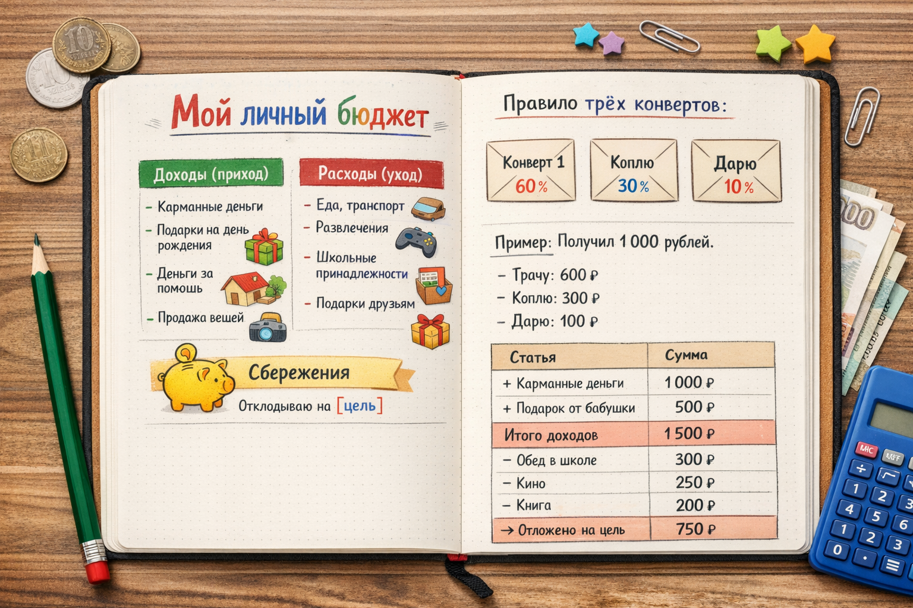

# [Бюджет](../../../6.1_Independent_living_and_daily_living_skills/reasonable_spending/articles/budget.md): как вести учёт [доходов](../../../8.2_future/choosing_a_career_path/articles/salary.md) и расходов



Ты когда-нибудь замечал, что [деньги](../../../2.1_society/cause_and_effect_relationships/articles/economic_chains.md) как будто «исчезают»? Вот были карманные, и вдруг их нет — а на что потратил, непонятно. Чтобы такого не происходило, нужен **бюджет**. Это простой и очень полезный инструмент управления [деньгами](../../../8.2_future/choosing_a_career_path/articles/salary.md)!

---

## 1. Что такое бюджет

**Бюджет** — это [план](../../../7.2 Media, leisure and hobbies/Computer games/articles/genres_and_worlds/strategy.md) доходов и расходов на определённый [период](../../../1.2_natural_sciences/physics_in_everyday_life/Q11652.md) (обычно на месяц). Он помогает понять, сколько [денег](../../../8.2_future/choosing_a_career_path/articles/salary.md) приходит, сколько уходит и сколько можно отложить на [цель](goal.md).

Бюджет есть у всех: у семей, у школ, у городов и даже у государства. Государственный бюджет России называется **федеральным** — в нём расписаны [доходы](../../../6.2_money_and_finance/personal_budget/index.md) (налоги) и [расходы](../../../6.1_Independent_living_and_daily_living_skills/reasonable_spending/articles/expense.md) (больницы, школы, дороги) на целый год.

---

## 2. Из чего состоит бюджет

Любой бюджет состоит из двух частей:

### Доходы (деньги, которые приходят)
- [Карманные деньги](../../../6.1_Independent_living_and_daily_living_skills/reasonable_spending/articles/income.md) от родителей
- Подарки на день рождения
- Деньги за [помощь](../../../3.1_healthy_lifestyle/pervaya_pomoshch/ushibi_porezy_ozhogi/10_krovotechenie_chto_delat.md) по дому или соседям
- Продажа ненужных вещей

### Расходы (деньги, которые уходят)
- [Еда](../../../3.1. healthy lifestyle/Sleep, nutrition, and adolescent energy/articles/stress_and_food.md), [транспорт](../../../1.2_natural_sciences/physics_in_everyday_life/Q1751973.md)
- [Развлечения](../../../6.1_Independent_living_and_daily_living_skills/reasonable_spending/articles/want.md) ([кино](../../../7.2 Media, leisure and hobbies /what_you_can_read_and_watch_to_develop_your_taste/articles/z1.md), игры)
- Школьные принадлежности
- Подарки друзьям

### [Сбережения](../../../6.1_Independent_living_and_daily_living_skills/reasonable_spending/articles/savings.md)
- То, что остаётся после расходов и откладывается на [цель](goal.md)

---

## 3. [Правило](../../../1.2_natural_sciences/why_science_help_understand_world/patterns.md) трёх конвертов

Один из самых простых способов вести бюджет — **правило трёх конвертов**. При получении денег сразу раздели их:

```
📩 Конверт 1 — «Трачу»  (60% от суммы)
📩 Конверт 2 — «Коплю»  (30% от суммы)
📩 Конверт 3 — «Дарю»   (10% от суммы)
```

> **Пример:** Получил 1 000 рублей на день рождения.
> - Трачу: 600 рублей
> - Коплю: 300 рублей
> - Дарю: 100 рублей

---

## 4. Как составить [личный бюджет](../../../6.1_Independent_living_and_daily_living_skills/reasonable_spending/articles/budget.md): [шаг](../../../1.2_natural_sciences/physics_in_everyday_life/Q36253.md) за шагом

**Шаг 1.** Запиши все [источники дохода](income.md) за месяц.

**Шаг 2.** Запиши все планируемые расходы.

**Шаг 3.** Вычти расходы из доходов.

**Шаг 4.** Остаток отложи в копилку на [цель](goal.md).

**Шаг 5.** В конце месяца сверь план с реальностью.

| Статья | [Сумма](../../../6.1_Independent_living_and_daily_living_skills/reasonable_spending/articles/receipt.md) |
|--------|-------|
| + Карманные деньги | 1 000 ₽ |
| + Подарок от бабушки | [500](../../../5.1_technology_and_digital_literacy/how_internet_works/articles/http_https/http_https.md) ₽ |
| **[Итого](../../../1.2_natural_sciences/physics_in_everyday_life/Q182453.md) доходов** | **1 500 ₽** |
| − Обед в школе | 300 ₽ |
| − Кино | 250 ₽ |
| − Книга | [200](../../../5.1_technology_and_digital_literacy/how_internet_works/articles/http_https/http_https.md) ₽ |
| **Итого расходов** | **750 ₽** |
| → **Отложено на [цель](../../../1.2_natural_sciences/why_science_help_understand_world/research_work.md)** | **750 ₽** |

---

## 5. Бюджет и [приложения](../../../4.1_rules_of_study/how_to_learn_effectively/articles/digital_tools.md)

Сегодня вести бюджет помогают специальные **приложения** на телефоне. Они автоматически считают расходы, строят графики и напоминают о бюджете. Многие банки в России (Сбер, Тинькофф, ВТБ) встроили такие [инструменты](../../../1.2_natural_sciences/physics_in_everyday_life/Q36253.md) прямо в своё [мобильное приложение](../../../7.1_art/modern_technological_art/articles/4.2_ar_monumentalism.md).

---

## 6. Интересные [факты](../../../1.2_natural_sciences/physics_in_everyday_life/Q17737.md)

- Слово «бюджет» происходит от старофранцузского *bougette* — **маленький кожаный кошелёк**.
- Государственный бюджет России принимается Государственной Думой сразу на **три года вперёд**.
- По исследованиям, люди, которые ведут бюджет, [откладывают](saving.md) в среднем на **20% больше**, чем те, кто этого не делает.

---

*Похожие темы: [Доходы](income.md) | [Расходы](expenses.md) | [Сбережения](saving.md) | [Финансовый план](planning.md)*

---
[Автор](../../../4.2_thinking_and_working_information/how_to_search_information/articles/copypaste.md): [Команда](../../../4.1_rules_of_study/how_to_learn_effectively/articles/peer_learning.md) «[Как копить](piggy_bank.md) на цель»

*Использованные [нейросети](../../../2.1_society/cause_and_effect_relationships/articles/ai_causality.md): Claude (Anthropic) для генерации текста*
