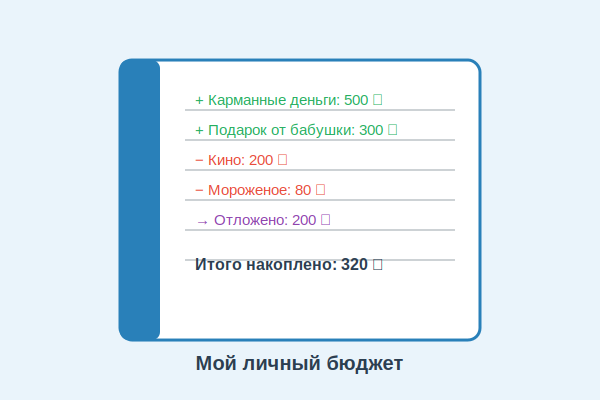

# Бюджет: как вести учёт доходов и расходов



Ты когда-нибудь замечал, что деньги как будто «исчезают»? Вот были карманные, и вдруг их нет — а на что потратил, непонятно. Чтобы такого не происходило, нужен **бюджет**. Это простой и очень полезный инструмент управления деньгами!

---

## 1. Что такое бюджет

**Бюджет** — это план доходов и расходов на определённый период (обычно на месяц). Он помогает понять, сколько денег приходит, сколько уходит и сколько можно отложить на [цель](goal.md).

Бюджет есть у всех: у семей, у школ, у городов и даже у государства. Государственный бюджет России называется **федеральным** — в нём расписаны доходы (налоги) и расходы (больницы, школы, дороги) на целый год.

---

## 2. Из чего состоит бюджет

Любой бюджет состоит из двух частей:

### Доходы (деньги, которые приходят)
- Карманные деньги от родителей
- Подарки на день рождения
- Деньги за помощь по дому или соседям
- Продажа ненужных вещей

### Расходы (деньги, которые уходят)
- Еда, транспорт
- Развлечения (кино, игры)
- Школьные принадлежности
- Подарки друзьям

### Сбережения
- То, что остаётся после расходов и откладывается на [цель](goal.md)

---

## 3. Правило трёх конвертов

Один из самых простых способов вести бюджет — **правило трёх конвертов**. При получении денег сразу раздели их:

```
📩 Конверт 1 — «Трачу»  (60% от суммы)
📩 Конверт 2 — «Коплю»  (30% от суммы)
📩 Конверт 3 — «Дарю»   (10% от суммы)
```

> **Пример:** Получил 1 000 рублей на день рождения.
> - Трачу: 600 рублей
> - Коплю: 300 рублей
> - Дарю: 100 рублей

---

## 4. Как составить личный бюджет: шаг за шагом

**Шаг 1.** Запиши все источники дохода за месяц.

**Шаг 2.** Запиши все планируемые расходы.

**Шаг 3.** Вычти расходы из доходов.

**Шаг 4.** Остаток отложи в копилку на [цель](goal.md).

**Шаг 5.** В конце месяца сверь план с реальностью.

| Статья | Сумма |
|--------|-------|
| + Карманные деньги | 1 000 ₽ |
| + Подарок от бабушки | 500 ₽ |
| **Итого доходов** | **1 500 ₽** |
| − Обед в школе | 300 ₽ |
| − Кино | 250 ₽ |
| − Книга | 200 ₽ |
| **Итого расходов** | **750 ₽** |
| → **Отложено на цель** | **750 ₽** |

---

## 5. Бюджет и приложения

Сегодня вести бюджет помогают специальные **приложения** на телефоне. Они автоматически считают расходы, строят графики и напоминают о бюджете. Многие банки в России (Сбер, Тинькофф, ВТБ) встроили такие инструменты прямо в своё мобильное приложение.

---

## 6. Интересные факты

- Слово «бюджет» происходит от старофранцузского *bougette* — **маленький кожаный кошелёк**.
- Государственный бюджет России принимается Государственной Думой сразу на **три года вперёд**.
- По исследованиям, люди, которые ведут бюджет, [откладывают](saving.md) в среднем на **20% больше**, чем те, кто этого не делает.

---

*Похожие темы: [Доходы](income.md) | [Расходы](expenses.md) | [Сбережения](saving.md) | [Финансовый план](planning.md)*

---
Автор: Команда «Как копить на цель»

*Использованные нейросети: Claude (Anthropic) для генерации текста*
