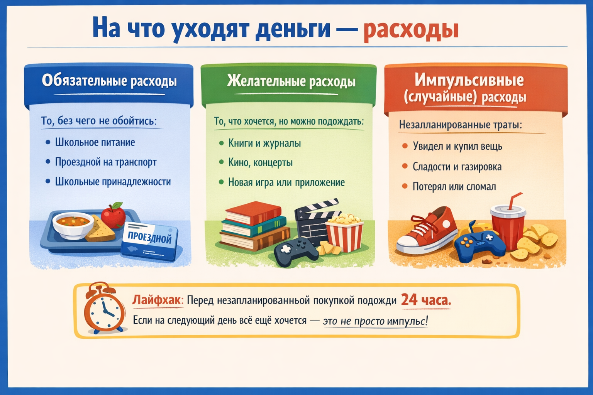

# Расходы: на что уходят деньги

Деньги умеют «исчезать» очень быстро. Мороженое здесь, стикеры там, случайная покупка в магазине — и вот карманных денег как не бывало. Чтобы деньги не «испарялись», нужно понимать: куда они уходят. Для этого существует понятие **расходов**.

---

## 1. Что такое расходы

**Расходы** — это все деньги, которые ты тратишь. Расходы — это противоположность [доходов](income.md). Если доходы — деньги, которые приходят, то расходы — деньги, которые уходят.

Умение контролировать расходы — важнейший навык [финансовой грамотности](financial_literacy.md). Ведь даже с большим доходом можно остаться без денег, если тратить без разбору!

---

## 2. Виды расходов

### Обязательные расходы
Это то, без чего не обойтись. Их нужно планировать в первую очередь:
- Школьное питание
- Проездной на транспорт
- Школьные принадлежности

### Желательные расходы
Это то, что улучшает жизнь, но при необходимости можно подождать:
- Книги и журналы
- Кино, концерты
- Новая игра или приложение

### Импульсивные (случайные) расходы
Это незапланированные траты — часто под влиянием эмоций:
- Увидел красивую вещь в магазине и купил
- Купил сладости, хотя не планировал
- Потерял или сломал вещь (пришлось купить новую)

> **Лайфхак:** Перед незапланированной покупкой подожди **24 часа**. Если на следующий день всё ещё хочется — это не просто импульс!

---

## 3. Таблица расходов за месяц

| Категория | Статья | Сумма |
|-----------|--------|-------|
| Обязательные | Обед в школе | 400 ₽ |
| Обязательные | Тетради и ручки | 150 ₽ |
| Желательные | Кино | 250 ₽ |
| Желательные | Книга | 200 ₽ |
| Импульсивные | Газировка и чипсы | 180 ₽ |
| Импульсивные | Случайная игрушка | 120 ₽ |
| **Итого** | | **1 300 ₽** |

---

## 4. Как сократить расходы (не отказывая себе во всём)

Экономить — не значит страдать! Вот умные способы:

1. **Список перед покупкой** — идя в магазин, пиши список и строго его придерживайся
2. **Сравнивай цены** — один и тот же товар может стоить по-разному в разных местах
3. **Жди скидок** — если покупка не срочная, подожди акцию или распродажу
4. **Обменивайся** — договорись с друзьями обмениваться книгами, играми
5. **Делай сам** — иногда дешевле сделать что-то своими руками (подарок, украшение)

---

## 5. Расходы и цель

Каждый раз, когда хочешь потратить деньги, спроси себя:

> «Это важнее моей [цели](goal.md)?»

Если ответ «нет» — лучше положи эти деньги в [копилку](piggy_bank.md). Не нужно отказывать себе во **всём** — но осознанные расходы помогают быстрее достигать мечты.

---

## 6. Интересные факты

- Учёные выяснили, что люди тратят **в среднем на 15–20% больше**, когда платят картой, а не наличными — потому что карта не так «ощущается» как реальные деньги.
- Маркетологи специально ставят товары на уровне глаз и пишут «СКИДКА!», чтобы вызвать **импульсивные покупки**.
- Чашка кофе каждый день в год = несколько десятков тысяч рублей — именно поэтому финансисты говорят о «**эффекте латте**».

---

*Похожие темы: [Доходы](income.md) | [Бюджет](budget.md) | [Потребности и желания](needs_vs_wants.md) | [Финансовый план](planning.md)*

---

## Читай также из других разделов

- [Чем полезный досуг отличается от бесполезного](../../../../7.2_leisure/useful_and_interesting_leisure/articles/useful_vs_useless_leisure.md) — раздел 7.2 «Досуг»
- [Эмоциональные триггеры в контенте](../../../../5.1_technology_and_digital_literacy/information%20and%20media%20literacy/articles/эмоциональные_триггеры_в_контенте.md) — раздел 5.1 «Медиаграмотность»

---
Автор: Команда «Как копить на цель»

*Использованные нейросети: Claude (Anthropic) для генерации текста*
