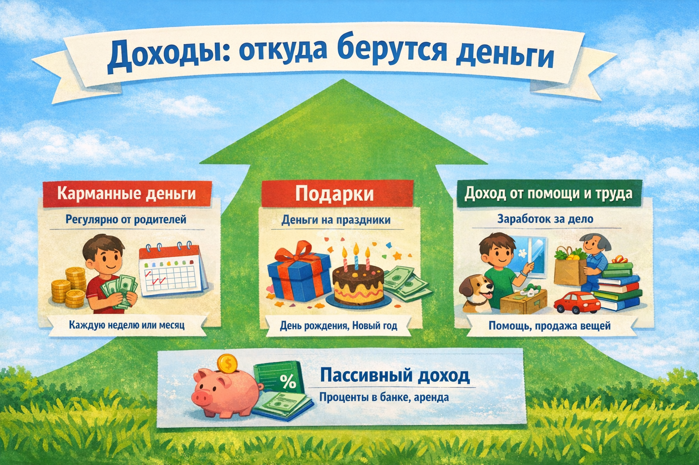

# Доходы: откуда берутся деньги



Чтобы что-то купить или накопить — нужны деньги. А чтобы были деньги, нужен **доход**. Доход — это все деньги, которые к тебе приходят. Давай разберёмся, откуда они берутся и как их увеличить!

---

## 1. Что такое доход

**Доход** — это деньги или другие ценности, которые человек получает за определённый период. Доходы могут быть регулярными (каждый месяц) или разовыми (один раз).

Для взрослых главный источник дохода — **зарплата** (деньги за работу). Для тебя — это, скорее всего, карманные деньги и подарки!

---

## 2. Источники дохода для детей

### Карманные деньги
Это самый стабильный источник — деньги, которые родители дают регулярно (каждую неделю или месяц). Главный плюс: **предсказуемость** — ты знаешь, сколько придёт и когда.

### Подарки
Деньги на день рождения, Новый год или другие праздники от родных. Это **разовый** источник, но иногда очень значительный!

### Доход от помощи и труда
- Помочь родителям по дому сверх обычного (помыть окна, убрать в гараже)
- Помочь соседям (выгулять собаку, купить продукты)
- Продать ненужные вещи (старые игрушки, книги)
- Сделать и продать что-то своими руками (поделки, рисунки)

### Пассивный доход
Это деньги, которые приходят **без твоего активного участия**:
- [Проценты](interest.md) по банковскому вкладу
- Деньги от сдачи чего-либо в аренду

---

## 3. Как считать свой доход

Возьми блокнот или телефон и записывай **все** поступления денег в течение месяца:

```
📅 Май:
1 мая   — карманные деньги     500 ₽
5 мая   — помог соседу         200 ₽
15 мая  — продал старую книгу  100 ₽
20 мая  — подарок от тёти      1 000 ₽
────────────────────────────────────
Итого доходов за май:         1 800 ₽
```

---

## 4. Активный и пассивный доход

| Тип дохода | Описание | Пример |
|-----------|----------|--------|
| **Активный** | Получаешь деньги за конкретные действия | Карманные, помощь |
| **Пассивный** | Деньги поступают сами | Проценты в банке |

Богатые люди стремятся создавать **пассивный доход** — чтобы деньги работали, пока ты занимаешься другими делами. Первый шаг к этому — положить [сбережения](saving.md) в [банк](bank_account.md).

---

## 5. Как увеличить доход

Вот несколько идей для детей:

1. **Попроси справедливые карманные деньги** — объясни родителям, на что они тебе нужны и как ты планируешь их использовать
2. **Развивай навыки** — умеешь рисовать, играть на инструменте, программировать? Может, кто-то заплатит за урок!
3. **Помогай за вознаграждение** — договорись с родителями: за дополнительную работу по дому — дополнительные деньги
4. **Продавай то, что не нужно** — есть ненужные игрушки или вещи? Продай на Авито или на школьной ярмарке

---

## 6. Доходы в жизни взрослых

Когда вырастешь, твои доходы могут включать:
- **Зарплату** (основная работа)
- **Фриланс** (разовые проекты)
- **Бизнес** (свой магазин или сервис)
- **Инвестиции** (деньги, вложенные в акции или недвижимость)
- **Пенсию** (в старости)

Чем раньше начнёшь понимать, откуда берутся деньги, тем лучше будешь управлять своими финансами в будущем!

---

*Похожие темы: [Расходы](expenses.md) | [Бюджет](budget.md) | [Сбережения](saving.md)*

---
Автор: Команда «Как копить на цель»

*Использованные нейросети: Claude (Anthropic) для генерации текста*
