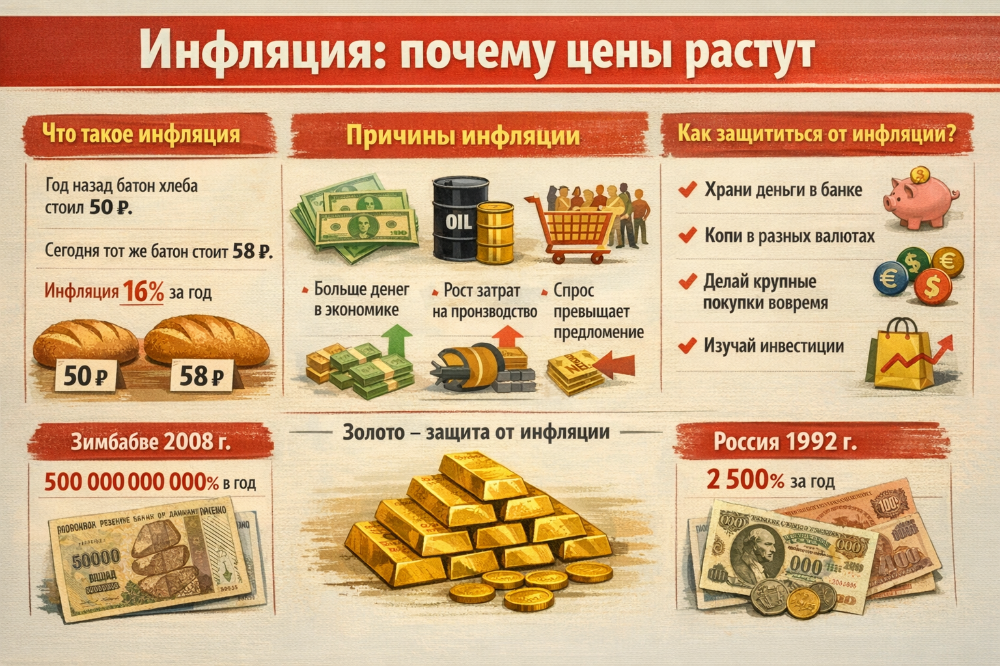

# [Инфляция](../../../2.1_society/cause_and_effect_relationships/articles/economic_chains.md): почему цены растут



Ты когда-нибудь слышал, как бабушка говорит: «Раньше на эти [деньги](../../../2.1_society/cause_and_effect_relationships/articles/economic_chains.md) можно было купить в два раза больше»? Это и есть **инфляция** — постепенное [обесценивание](../../../2.2_history/world_economy_on_fingers/articles/devalvatsiya.md) [денег](../../../8.2_future/choosing_a_career_path/articles/salary.md). Разберёмся, что это такое и почему важно учитывать инфляцию при [накоплениях](saving.md).

---

## 1. Что такое инфляция

**Инфляция** — это [рост](../../../3.1. healthy lifestyle/Sleep, nutrition, and adolescent energy/articles/micronutrients_and_teenagers.md) общего уровня цен на товары и [услуги](../../../8.1_self-understanding/HowToFindYourStrengths/articles/talent_monetization.md). Когда есть инфляция, на ту же сумму денег можно купить **меньше**, чем раньше.

Пример:
> Год назад батон хлеба стоил 50 ₽.
> Сегодня тот же батон стоит 58 ₽.
> Это значит, инфляция на хлеб составила **16%** за год.

---

## 2. Почему возникает инфляция

Инфляция возникает по нескольким причинам:

| [Причина](../../../2.1_society/cause_and_effect_relationships/articles/causality_base.md) | [Объяснение](../../../4.1_rules_of_study/how_to_learn_effectively/articles/teaching_others.md) |
|---------|-----------|
| **Больше денег в экономике** | Если денег становится много, их ценность падает |
| **Рост производственных затрат** | Подорожало [топливо](../../../2.2_history/world_economy_on_fingers/articles/neft_v_mirovoy_ekonomike.md) → подорожал хлеб |
| **[Спрос](../../../2.1_society/cause_and_effect_relationships/articles/economic_chains.md) превышает предложение** | Все хотят купить, а товара мало |
| **[Ожидания](../../../1.2_natural_sciences/neurobiology_for_teens/articles/27_brain_predicts.md)** | Люди думают, что цены вырастут, и начинают скупать — цены растут |

---

## 3. Как измеряют инфляцию

Специалисты Центрального банка России регулярно замеряют цены на **«потребительскую корзину»** — набор типичных товаров и услуг ([продукты](../../../3.1. healthy lifestyle/Sleep, nutrition, and adolescent energy/articles/healthy_school_snacks.md), [транспорт](../../../1.2_natural_sciences/physics_in_everyday_life/Q1751973.md), коммунальные услуги).

[Результат](../../../1.2_natural_sciences/why_science_help_understand_world/experimental_science.md) публикуется как **[индекс потребительских цен](../../../2.2_history/world_economy_on_fingers/articles/inflyatsiya_deflyatsiya_i_nulevaya_inflyatsiya.md) (ИПЦ)**. В России [цель](../../../1.2_natural_sciences/why_science_help_understand_world/research_work.md) Центробанка — удерживать инфляцию около **4% в год**.

---

## 4. Инфляция и [накопления](../../../6.1_Independent_living_and_daily_living_skills/reasonable_spending/articles/savings.md)

Вот важный момент: если твои деньги просто лежат дома и не приносят [процентов](interest.md), они **теряют [стоимость](../../../6.1_Independent_living_and_daily_living_skills/reasonable_spending/articles/price.md)** из-за инфляции!

```
Сегодня: 10 000 ₽ могут купить 100 единиц товара
Через год (инфляция 10%): те же 10 000 ₽ = только 91 единица
```

Именно поэтому важно хранить [сбережения](saving.md) в [банке](bank_account.md), где [проценты](../../../6.2_money_and_finance/personal_budget/credit.md) хотя бы частично компенсируют инфляцию.

---

## 5. Хорошая и плохая инфляция

| | Умеренная инфляция | Высокая инфляция |
|--|-------------------|-----------------|
| **[Уровень](../../../../8.1_entertainment/articles/gamification.md)** | 2–5% в год | >10% в год |
| **Эффект** | Стимулирует экономику | Обесценивает деньги |
| **Пример** | Большинство развитых стран | Некоторые кризисные периоды |

Небольшая инфляция — **нормально** и даже полезно. Очень высокая — опасна: люди торопятся потратить деньги, пока они не подешевели.

---

## 6. Как защититься от инфляции

1. **Храни деньги в банке** — [вклад](bank_account.md) с процентами частично компенсирует инфляцию
2. **Копи в нескольких валютах** — если [рубль](../../../2.2_history/world_economy_on_fingers/articles/devalvatsiya.md) обесценивается, другие валюты могут быть стабильнее
3. **Не затягивай крупные покупки** — если [цена](../../../6.1_Independent_living_and_daily_living_skills/reasonable_spending/articles/price.md) может вырасти, лучше купить раньше
4. **Изучай [инвестиции](../../../2.2_history/world_economy_on_fingers/articles/aziatskie_tigry.md)** (в будущем) — [акции](../../../6.2_money_and_finance/personal_budget/investments.md) исторически обгоняют инфляцию

---

## 7. Интересные [факты](../../../1.2_natural_sciences/physics_in_everyday_life/Q17737.md)

- Самая высокая инфляция в истории была в **Зимбабве в 2008 году** — около [500](../../../5.1_technology_and_digital_literacy/how_internet_works/articles/http_https/http_https.md) миллиардов процентов в год. Цены удваивались каждые 24 часа!
- В России самая высокая инфляция была в **1992 году** — около 2 500% за год. Именно тогда многие люди потеряли все свои [сбережения](saving.md).
- **Золото** уже тысячи лет считается защитой от инфляции — его ценность не исчезает с годами.

---

## 8. При накоплении учитывай инфляцию!

Если копишь на дорогую покупку долго (больше года), помни: к моменту [достижения](../../../4.1_rules_of_study/how_to_learn_effectively/articles/gamification.md) [цели](goal.md) она может стоить **дороже**. Например, если велосипед сейчас стоит 5 000 ₽, через год при инфляции 10% он будет стоить **5 500 ₽**.

Совет: добавь к своей [цели](../../../3.1_healthy_lifestyle/pervaya_pomoshch/ushibi_porezy_ozhogi/02_celi_pervoy_pomoshchi.md) **10–15% запаса** на инфляцию!

---

*Похожие темы: [Деньги](money.md) | [Банковский счёт](bank_account.md) | [Проценты](interest.md) | [Сбережения](saving.md)*

---

## Читай также из других разделов

- [Экономические цепочки](../../../2.1_society/cause_and_effect_relationships/articles/economic_chains.md) — раздел 2.1 «[Общество](../../../2.1_society/cause_and_effect_relationships/articles/why_rules_work.md)»
- [Работа с данными и статистикой](../../../4.2_thinking_and_working_information/critical_thinking/articles/data_and_statistics.md) — раздел 4.2 «[Критическое мышление](../../../1.2_natural_sciences/neurobiology_for_teens/articles/25_cognitive_biases.md)»

---
[Автор](../../../4.2_thinking_and_working_information/how_to_search_information/articles/copypaste.md): [Команда](../../../4.1_rules_of_study/how_to_learn_effectively/articles/peer_learning.md) «[Как копить](piggy_bank.md) на цель»

*Использованные [нейросети](../../../2.1_society/cause_and_effect_relationships/articles/ai_causality.md): Claude (Anthropic) для генерации текста*
