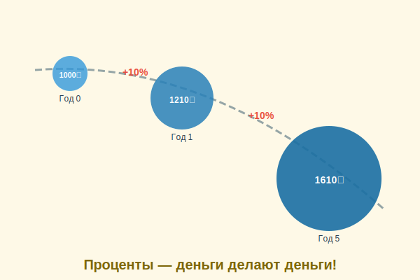

# Проценты: как деньги делают деньги



Что если бы твои деньги могли сами зарабатывать деньги, пока ты спишь? Звучит как сказка — но это реальность! Именно так работают **проценты**. Это один из самых важных принципов в [финансовой грамотности](financial_literacy.md).

---

## 1. Что такое процент

**Процент** — это определённая доля от числа. Слово происходит от латинского *«pro centum»* — «на сто».

Например: **10% от 1 000 ₽** — это 100 ₽ (одна десятая часть).

В финансах проценты бывают двух видов:
- **Проценты по вкладу** — банк платит тебе за то, что ты храните у него деньги
- **Проценты по кредиту** — ты платишь банку за то, что брал у него в долг

---

## 2. Простые проценты

При **простых процентах** банк каждый год начисляет одинаковую сумму.

> Положил 1 000 ₽ под 10% годовых.
> - Год 1: 1 000 × 10% = +100 ₽ → итого 1 100 ₽
> - Год 2: 1 000 × 10% = +100 ₽ → итого 1 200 ₽
> - Год 5: итого 1 500 ₽

---

## 3. Сложные проценты — магия роста!

При **сложных процентах** проценты начисляются не только на первоначальную сумму, но и на уже накопленные проценты. Это создаёт **экспоненциальный рост**!

> Положил 1 000 ₽ под 10% годовых (сложные %):
> - Год 1: 1 000 × 1,10 = 1 100 ₽
> - Год 2: 1 100 × 1,10 = 1 210 ₽
> - Год 3: 1 210 × 1,10 = 1 331 ₽
> - Год 5: ≈ 1 611 ₽
> - Год 10: ≈ 2 594 ₽
> - Год 20: ≈ 6 727 ₽

За 20 лет твои 1 000 рублей превратились почти в **7 000 рублей** — без каких-либо дополнительных вложений!

---

## 4. Правило 72

Есть простой способ узнать, через сколько лет деньги удвоятся:

```
Количество лет = 72 ÷ процентная ставка
```

Примеры:
- При 10% годовых: 72 ÷ 10 = **7,2 года**
- При 8% годовых: 72 ÷ 8 = **9 лет**
- При 6% годовых: 72 ÷ 6 = **12 лет**

---

## 5. Время — главный друг сложных процентов

| Возраст начала | Ежемесячный вклад | Сумма к 65 годам (при 8% годовых) |
|----------------|-------------------|-----------------------------------|
| 15 лет | 1 000 ₽ | ~5,5 миллиона ₽ |
| 25 лет | 1 000 ₽ | ~2,4 миллиона ₽ |
| 35 лет | 1 000 ₽ | ~1 миллион ₽ |

Начать копить в 15 лет **в 5,5 раз выгоднее**, чем в 35! Поэтому говорят: «Лучшее время начать было вчера. Второе лучшее — сегодня».

---

## 6. Проценты — это не только хорошо

Если ты **берёшь деньги в долг** (кредит), тебе тоже начисляются проценты — но уже против тебя! Долг растёт так же быстро, как и [сбережения](saving.md).

> ⚠️ Именно поэтому важно **сначала копить**, а не брать кредиты на то, что можно накопить!

---

## 7. Интересные факты

- Альберт Эйнштейн называл **сложный процент** «восьмым чудом света» и говорил: «Кто понимает его — зарабатывает, кто не понимает — платит».
- При ставке 20% (как некоторые кредиты) долг удваивается всего за **3,6 года**.
- Исторически фондовый рынок США давал в среднем около **10% годовых** за последние 100 лет.

---

*Похожие темы: [Банковский счёт](bank_account.md) | [Сбережения](saving.md) | [Инфляция](inflation.md) | [Финансовая грамотность](financial_literacy.md)*

---
Автор: Команда «Как копить на цель»

*Использованные нейросети: Claude (Anthropic) для генерации текста*
