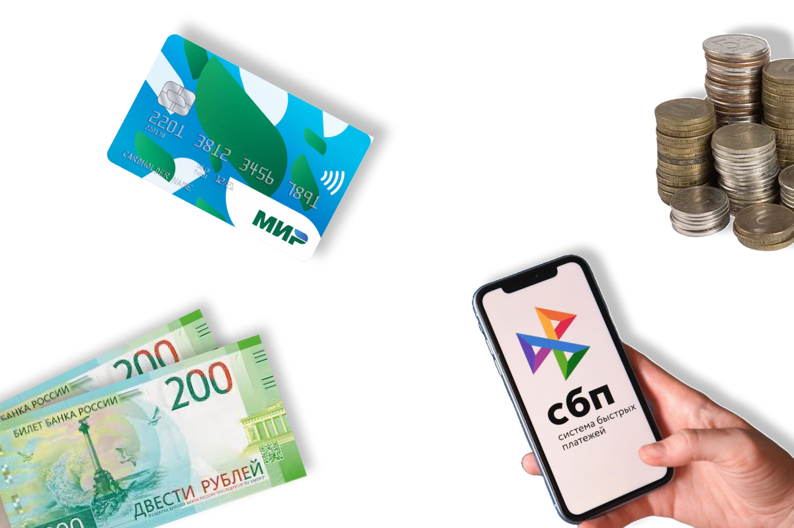

# Что такое [деньги](../../../2.1_society/cause_and_effect_relationships/articles/economic_chains.md)

Деньги окружают нас повсюду: ими платят в магазине, переводят через телефон, кладут на карточку. Но что такое деньги на самом деле? Почему бумажка с цифрой «100» можно обменять на пять мороженых? Разберёмся!

---

## 1. Что такое деньги

**Деньги** — это особый товар, который люди используют как посредника при обмене. Проще говоря, это **удобный способ договориться о цене** любой вещи или [услуги](../../../8.1_self-understanding/HowToFindYourStrengths/articles/talent_monetization.md).

Представь: в далёкие времена люди обменивались напрямую — отдавал мешок пшеницы, получал пару [сапог](../../../7.1_art/musical_instruments/articles/bassoon.md). Но что делать, если сапожнику не нужна пшеница? Вот тут и пришли на [помощь](../../../3.1_healthy_lifestyle/pervaya_pomoshch/ushibi_porezy_ozhogi/10_krovotechenie_chto_delat.md) деньги — ими можно заплатить за что угодно!

---

## 2. Из чего сделаны деньги

Деньги бывают разных видов:

| Вид [денег](../../../8.2_future/choosing_a_career_path/articles/salary.md) | Описание | Пример |
|-----------|----------|--------|
| **[Монеты](../../../6.1_Independent_living_and_daily_living_skills/reasonable_spending/articles/cash.md)** | Металлические [кружки](../../../7.2 Media, leisure and hobbies /useful_and_interesting_leisure/articles/clubs_and_sections.md) | 1, 2, 5, 10 рублей |
| **Банкноты** | Бумажные купюры | 100, [500](../../../5.1_technology_and_digital_literacy/how_internet_works/articles/http_https/http_https.md), 1000 рублей |
| **Безналичные** | Числа на счёте в банке | [Банковская карта](../../../6.1_Independent_living_and_daily_living_skills/reasonable_spending/articles/bank_card.md) |
| **Электронные** | Цифровые кошельки | СБП, онлайн-переводы |

Сегодня большинство денег существует **не в виде бумаги**, а в виде цифр в компьютерах банков!

---

## 3. Три главных свойства денег

Чтобы быть «настоящими» [деньгами](../../../8.2_future/choosing_a_career_path/articles/salary.md), они должны:

1. **Быть средством обмена** — принимать их должны все
2. **Измерять [стоимость](../../../6.1_Independent_living_and_daily_living_skills/reasonable_spending/articles/price.md)** — показывать, сколько что-то стоит
3. **Сохранять ценность** — не портиться со временем (в отличие от продуктов)

---

## 4. [Откуда берутся деньги](income.md)

Деньги **выпускает государство** через [Центральный банк](../../../2.2_history/world_economy_on_fingers/articles/valyutnyy_kurs.md). В России этим занимается [Банк России](../../../2.2_history/world_economy_on_fingers/articles/rossiyskiy_rubl.md). Он решает, сколько денег нужно стране, и следит, чтобы их не было слишком много и не слишком мало.

> Слишком много денег — цены растут (это называется [инфляция](inflation.md)).
> Слишком мало — экономика замирает.

---

## 5. Деньги в разных странах

У каждой страны — своя валюта:
- 🇷🇺 Россия — **[рубль](../../../2.2_history/world_economy_on_fingers/articles/devalvatsiya.md) (₽)**
- 🇺🇸 США — **[доллар](../../../2.2_history/world_economy_on_fingers/articles/dollar_ssha.md) ($)**
- 🇪🇺 Европа — **[евро](../../../2.2_history/world_economy_on_fingers/articles/rezervnaya_valyuta.md) (€)**
- 🇯🇵 Япония — **[иена](../../../2.2_history/world_economy_on_fingers/articles/rezervnaya_valyuta.md) (¥)**

Когда путешествуешь за границу, рубли нужно **обменять** на местную валюту.

---

## 6. Интересные [факты](../../../1.2_natural_sciences/physics_in_everyday_life/Q17737.md) о [деньгах](../../../8.2_future/choosing_a_career_path/articles/salary.md)

- Первые монеты появились около **2 700 лет назад** в Лидии (современная [Турция](../../../2.2_society/history/articles/Catherine_II_of_Russia.md)).
- [Бумажные деньги](../../../6.1_Independent_living_and_daily_living_skills/reasonable_spending/articles/cash.md) придумали в **Китае** примерно 1 000 лет назад.
- Самая старая монета в мире стоит больше **2 миллионов долларов** на аукционе.
- Банкноты делают не из обычной бумаги, а из **хлопка и льна** — поэтому они прочнее.
- В 2009 году появились первые **криптовалюты** — полностью цифровые деньги без бумаги и металла.

---

## 7. Деньги и ты

Деньги — это инструмент. Как молоток: им можно построить дом, а можно случайно ударить по пальцу. Умение **правильно обращаться с деньгами** называется [финансовой грамотностью](financial_literacy.md).

---

*Похожие темы: [Доходы](income.md) | [Расходы](expenses.md) | [Инфляция](inflation.md) | [Финансовая грамотность](financial_literacy.md)*

---
[Автор](../../../4.2_thinking_and_working_information/how_to_search_information/articles/copypaste.md): [Команда](../../../4.1_rules_of_study/how_to_learn_effectively/articles/peer_learning.md) «[Как копить](piggy_bank.md) на [цель](../../../1.2_natural_sciences/why_science_help_understand_world/research_work.md)»

*Использованные [нейросети](../../../2.1_society/cause_and_effect_relationships/articles/ai_causality.md): Claude (Anthropic) для генерации текста*
