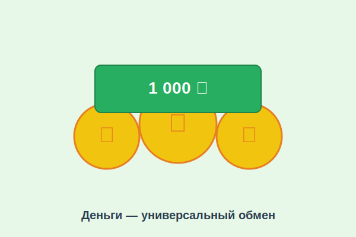

# Что такое деньги

Деньги окружают нас повсюду: ими платят в магазине, переводят через телефон, кладут на карточку. Но что такое деньги на самом деле? Почему бумажка с цифрой «100» можно обменять на пять мороженых? Разберёмся!

---

## 1. Что такое деньги

**Деньги** — это особый товар, который люди используют как посредника при обмене. Проще говоря, это **удобный способ договориться о цене** любой вещи или услуги.

Представь: в далёкие времена люди обменивались напрямую — отдавал мешок пшеницы, получал пару сапог. Но что делать, если сапожнику не нужна пшеница? Вот тут и пришли на помощь деньги — ими можно заплатить за что угодно!

---

## 2. Из чего сделаны деньги

Деньги бывают разных видов:

| Вид денег | Описание | Пример |
|-----------|----------|--------|
| **Монеты** | Металлические кружки | 1, 2, 5, 10 рублей |
| **Банкноты** | Бумажные купюры | 100, 500, 1000 рублей |
| **Безналичные** | Числа на счёте в банке | Банковская карта |
| **Электронные** | Цифровые кошельки | СБП, онлайн-переводы |

Сегодня большинство денег существует **не в виде бумаги**, а в виде цифр в компьютерах банков!

---

## 3. Три главных свойства денег

Чтобы быть «настоящими» деньгами, они должны:

1. **Быть средством обмена** — принимать их должны все
2. **Измерять стоимость** — показывать, сколько что-то стоит
3. **Сохранять ценность** — не портиться со временем (в отличие от продуктов)

---

## 4. Откуда берутся деньги

Деньги **выпускает государство** через Центральный банк. В России этим занимается Банк России. Он решает, сколько денег нужно стране, и следит, чтобы их не было слишком много и не слишком мало.

> Слишком много денег — цены растут (это называется [инфляция](inflation.md)).
> Слишком мало — экономика замирает.

---

## 5. Деньги в разных странах

У каждой страны — своя валюта:
- 🇷🇺 Россия — **рубль (₽)**
- 🇺🇸 США — **доллар ($)**
- 🇪🇺 Европа — **евро (€)**
- 🇯🇵 Япония — **иена (¥)**

Когда путешествуешь за границу, рубли нужно **обменять** на местную валюту.

---

## 6. Интересные факты о деньгах

- Первые монеты появились около **2 700 лет назад** в Лидии (современная Турция).
- Бумажные деньги придумали в **Китае** примерно 1 000 лет назад.
- Самая старая монета в мире стоит больше **2 миллионов долларов** на аукционе.
- Банкноты делают не из обычной бумаги, а из **хлопка и льна** — поэтому они прочнее.
- В 2009 году появились первые **криптовалюты** — полностью цифровые деньги без бумаги и металла.

---

## 7. Деньги и ты

Деньги — это инструмент. Как молоток: им можно построить дом, а можно случайно ударить по пальцу. Умение **правильно обращаться с деньгами** называется [финансовой грамотностью](financial_literacy.md).

---

*Похожие темы: [Доходы](income.md) | [Расходы](expenses.md) | [Инфляция](inflation.md) | [Финансовая грамотность](financial_literacy.md)*

---
Автор: Команда «Как копить на цель»

*Использованные нейросети: Claude (Anthropic) для генерации текста*
