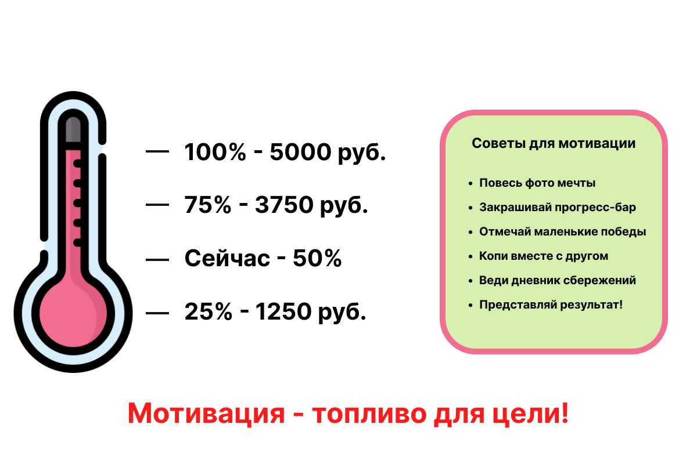

# Мотивация: как не бросить копить



Ты начал копить, прошло две недели — и вдруг захотелось потратить всё на мороженое. Или забыл отложить деньги в этом месяце. Знакомо? Это нормально! Самое сложное в накоплении — **не начать, а продолжить**. И тут нужна мотивация!

---

## 1. Что такое мотивация

**Мотивация** — это внутреннее желание действовать. Это топливо, которое заставляет тебя продолжать двигаться к [цели](goal.md), даже когда трудно.

Без мотивации даже самый хороший [финансовый план](planning.md) превратится в пыль. Поэтому важно не только составить план, но и поддерживать желание его выполнять.

---

## 2. Почему мотивация пропадает?

Вот главные «враги» мотивации:

- **Цель кажется слишком далёкой** — «ещё целых 8 месяцев копить...»
- **Нет видимого прогресса** — не понятно, сколько уже накоплено
- **Соблазны вокруг** — реклама, друзья, витрины
- **Забывчивость** — просто забыл отложить
- **Случайные расходы** — сломалось что-то, пришлось потратить

---

## 3. Инструменты мотивации

### Визуализация цели
Напечатай или нарисуй **картинку** того, что хочешь купить. Повесь рядом с [копилкой](piggy_bank.md). Каждый день смотри и представляй, как уже держишь это в руках!

### Прогресс-бар
Нарисуй на листке «термометр»:
```
🌡️ Велосипед: 6 000 ₽
▓▓▓▓▓▓░░░░░░  = 3 000 ₽ накоплено (50%)
```
Каждый раз, когда откладываешь деньги, **закрашивай ещё одну клеточку**. Видеть, как заполняется термометр — очень приятно!

### Дневник сбережений
Веди простой журнал:
```
📅 Дата     | Отложил | Итого
1 дек      | 300 ₽   | 300 ₽
8 дек      | 200 ₽   | 500 ₽
15 дек     | 300 ₽   | 800 ₽
```

### Маленькие награды
За каждые 25% пути к цели придумай себе маленький приз — не дорогой, но приятный. Например, разрешить себе что-то вкусное или посмотреть любимый сериал.

---

## 4. Правило двух недель

Если хочется потратить деньги из копилки на что-то незапланированное — **подожди 14 дней**.

Если через 14 дней желание не исчезло — возможно, это важная [потребность](needs_vs_wants.md). Если прошло — это был импульс.

---

## 5. Копить вместе — веселее!

Попробуй копить **вместе с другом** или попроси родителей «поддерживать» тебя:

- Расскажи о своей цели — это создаёт **обязательство**
- Попроси друга тоже поставить цель — соревнование мотивирует
- Попроси родителей иногда спрашивать: «Как твои накопления?»

Социальная ответственность — мощный инструмент мотивации!

---

## 6. Что делать, если сорвался

Потратил деньги из копилки? Не беда! Это не конец:

1. **Не кори себя** — все иногда срываются
2. **Разберись, почему** — что соблазнило?
3. **Придумай защиту** — как предотвратить в следующий раз?
4. **Продолжай с того места, где остановился** — не «начинай заново», а просто продолжай

---

## 7. Интересные факты

- Психологи доказали: **визуализация** цели увеличивает вероятность её достижения на 42%.
- Техника «маленьких шагов» работает лучше, чем грандиозные планы. Лучше копить по **100 ₽ каждую неделю** без пропусков, чем планировать 1 000 ₽ в месяц и забывать.
- Нейробиологи выяснили, что когда мы достигаем маленькой цели, мозг выделяет **дофамин** — гормон радости. Именно поэтому маленькие победы так важны!

---

*Похожие темы: [Цель](goal.md) | [SMART-цели](smart_goal.md) | [Финансовый план](planning.md) | [Копилка](piggy_bank.md)*

---

## Читай также из других разделов

- [Как не бросить хобби через неделю](../../../7.2%20Media,%20leisure%20and%20hobbies/Computer%20games/useful_and_interesting_leisure/articles/how_not_to_quit_hobby.md) — раздел 7.2 «Досуг»
- [Мотивация и память](../../../4.1_rules_of_study/how_to_memorize/articles/motivaciya.md) — раздел «Как запоминать»

---
Автор: Команда «Как копить на цель»

*Использованные нейросети: Claude (Anthropic) для генерации текста*
